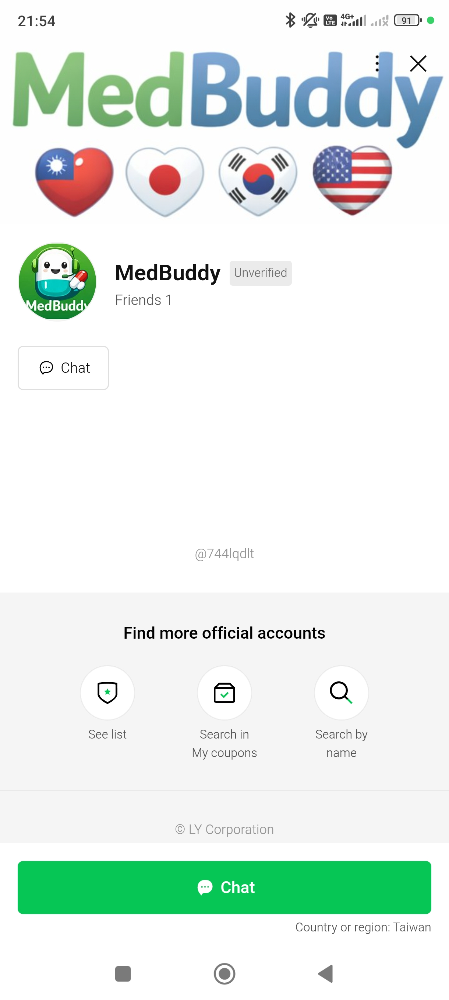
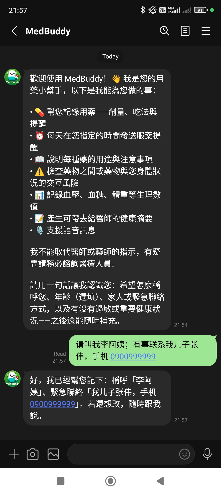
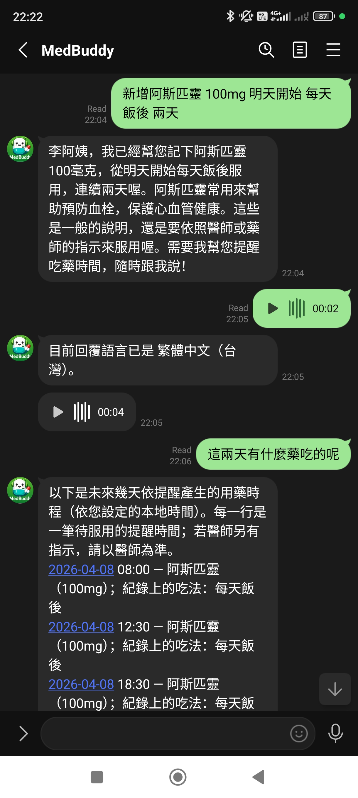
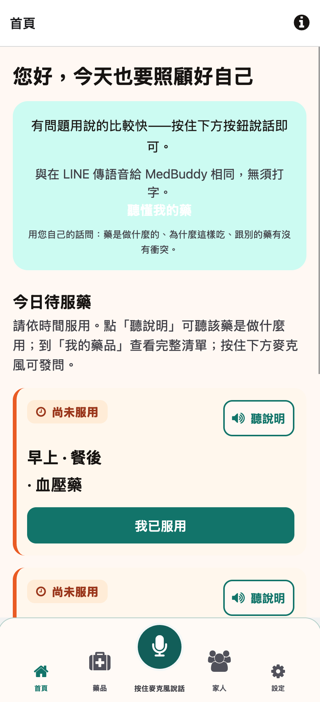
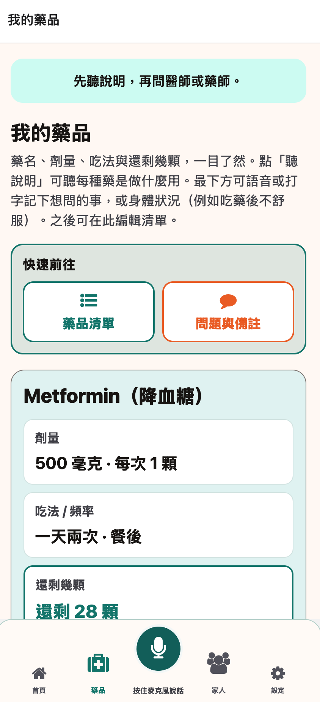
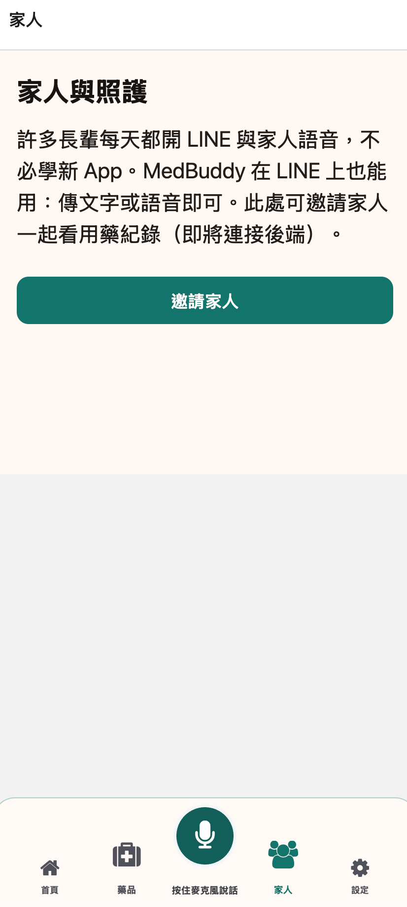

<p align="center">
  <a href="https://github.com/israkir/medbuddy">
    
  </a>
</p>

<h1 align="center">MedBuddy</h1>

<h3 align="center">Patient-facing medication companion — LINE messaging, voice, dose reminders, and HTTP API</h3>

<p align="center">
  <a href="https://www.python.org/downloads/"></a>
  <a href="https://github.com/psf/black"></a>
  <a href="https://github.com/astral-sh/ruff"></a>
  <a href="https://github.com/israkir/medbuddy/actions/workflows/ci.yml"></a>
</p>

---

**MedBuddy** is a medication companion monorepo: a **FastAPI** backend (LINE + HTTP API) with a reference **Expo** client for future mobile work.

> **Disclaimer:** This is a software prototype. It is **not** a substitute for professional medical advice, diagnosis, or treatment.

## Prerequisites

- [GNU Make](https://www.gnu.org/software/make/) — `make` / `make help` at the repo root
- **Backend:** Python **3.11+**
- **Frontend (optional):** Node.js 18+ and npm

---

## Quick start

**Backend** (mock mode — no API keys):

```bash
make be-install
make be-dev-mock
make be-test
```

**Frontend** (Expo):

```bash
make fe-install
make fe-dev
```

**Docker** (mock API): `make be-compose` → http://localhost:8000

For real LINE, LLM, Supabase, and other services, use [`apps/backend/.env.example`](apps/backend/.env.example) and **[`apps/backend/README.md`](apps/backend/README.md#mock-vs-real-integrations)**.

---

## Where to read next

Start with **[`docs/index.md`](docs/index.md)** — every major doc, **reading paths by role** (backend, product, security, ops, mobile), and a **quick lookup** (API, env vars, reminders, privacy, LLM inputs, and more).

| If you want… | Open |
|--------------|------|
| System design, API reference, deployment | [`docs/tdd.md`](docs/tdd.md) (brief), [`docs/tdd-extended.md`](docs/tdd-extended.md) (full) |
| What the product does (feature catalog) | [`docs/features.md`](docs/features.md) |
| User flows and example utterances | [`docs/use-cases.md`](docs/use-cases.md) |
| Dose reminders, arq/Redis, reconcile cron | [`docs/reminders.md`](docs/reminders.md) |
| PII / LLM boundaries | [`docs/privacy.md`](docs/privacy.md), [`docs/llm-context.md`](docs/llm-context.md) |
| Backend env, package layout, deploy | [`apps/backend/README.md`](apps/backend/README.md) |
| Expo app (reference / future client) | [`docs/frontend-expo.md`](docs/frontend-expo.md) → [`apps/frontend/README.md`](apps/frontend/README.md) |
| Project Q&A (Q1–Q55: pipeline, voice, adherence, caches) | [`docs/qna.md`](docs/qna.md) |
| Production checklist | [`TODO.md`](TODO.md) |
| Change history | [`CHANGELOG.md`](CHANGELOG.md) |

---

### LINE messaging

Today’s patient-facing experience is built around **LINE**: chat with the medication helper, voice notes, and dose reminders delivered on the channel. Below are a few views of that flow.

<p align="center">
  
  &nbsp;
  
  &nbsp;
  
</p>

<p align="center"><a href="docs/features.md#11-line-messaging-api">More LINE screenshots</a> in the feature catalog (§1.1).</p>

### Reference Expo client — future / B2B2C surface

The repo today centers on LINE and the HTTP API; the **Expo client** is a reference for future mobile work, not part of the current pilot. The screens below are **concept-only** mockups—not screenshots of a production app.

<p align="center">
  
  &nbsp;
  
  &nbsp;
  
</p>

---

## Contributing

1. **`make pre-commit-install`** after backend setup
2. **`make be-check`** (backend) or **`make fe-check`** (frontend)
3. Document behavior changes in [`CHANGELOG.md`](CHANGELOG.md) and keep secrets in `.env` (see each app’s `.env.example`)

Pull requests are welcome.
