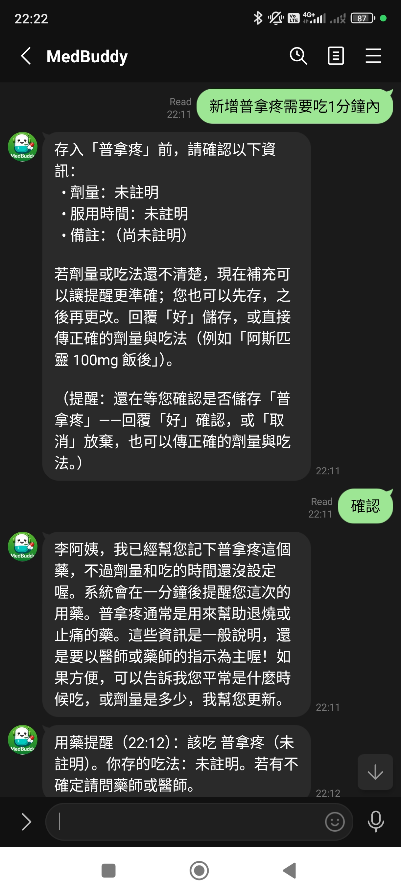
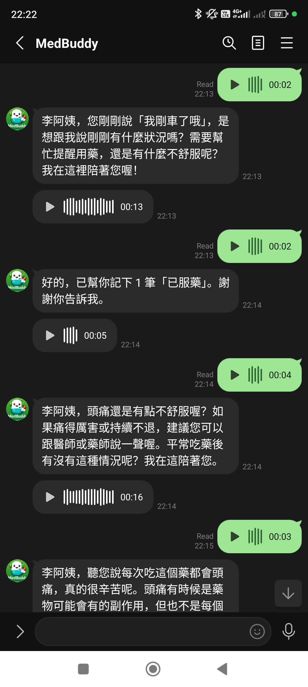
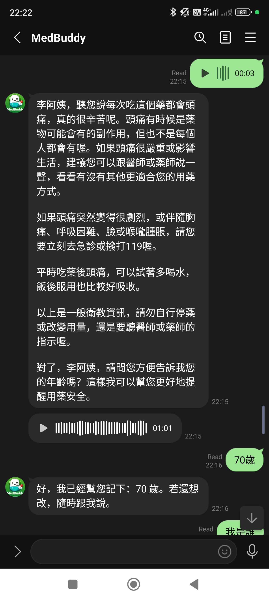
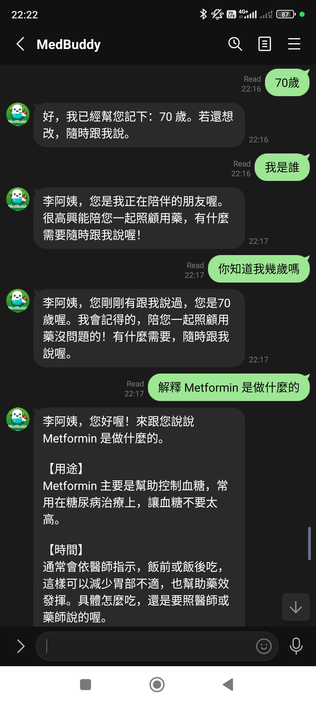
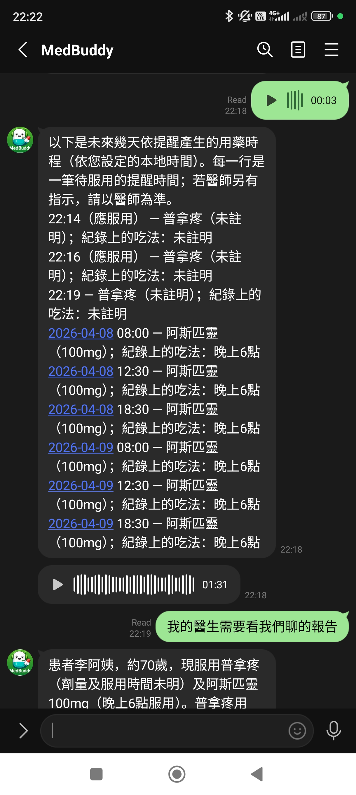
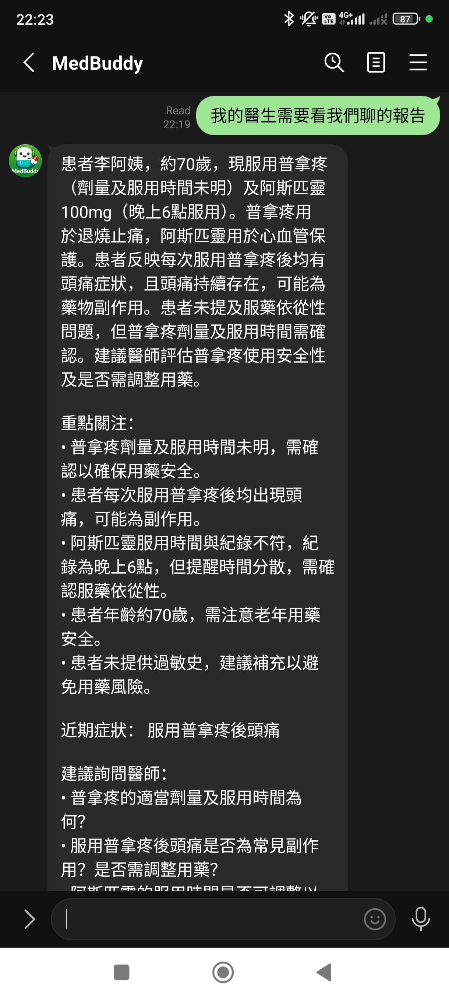

# MedBuddy — Feature catalog

This document is the **capability catalog**: what the product does, who it is for, and how it is implemented. It follows a consistent **feature-spec** shape so product and engineering can align on scope, behavior, and constraints.

**Disclaimer:** MedBuddy is a software prototype. It is **not** a substitute for professional medical advice, diagnosis, or treatment.

**Related docs**

| Document | Purpose |
|----------|---------|
| [`use-cases.md`](use-cases.md) | Narrated user flows, example utterances, and step-by-step handling |
| [`reminders.md`](reminders.md) | LINE dose reminder scheduling, workers, and ops |
| [`privacy.md`](privacy.md) | PII boundaries and LLM data shaping |
| [`frontend-expo.md`](frontend-expo.md) | **Reference / future:** Expo app only — not mixed with primary LINE + backend features |

---

## How each feature is described

| Field | Meaning |
|-------|---------|
| **Summary** | One sentence: what this capability does |
| **User value** | Problem solved or outcome for the user |
| **Capabilities** | Observable behaviors and boundaries (acceptance-style) |
| **Implementation** | How the codebase delivers it (components, pipelines) |
| **Configuration** | Env vars, flags, or deployment notes when relevant |
| **Limitations** | Explicit non-goals or prototype constraints for this slice |

Sections below use these fields where they add clarity; small or purely operational items may use a compact table only.

---

## 1. Delivery channels

### 1.1 LINE Messaging API

**Summary:** Receive LINE events (follow, text, voice), authenticate the webhook, and run the shared assistant pipeline for text and transcribed voice.

**User value:** Primary user-facing channel: chat and voice in LINE (voice transcribed via STT), with the same assistant core as the HTTP API.

**Capabilities**

- Webhook endpoint accepts verified LINE events when `LINE_CHANNEL_SECRET` is set; mock mode may skip signature verification (see backend README).
- New followers: **`get_or_create_user`**, then LINE **`get_user_profile`** — if **`language`** maps to `en` or `zh-TW`, **`patch_user_profile`** updates **`locale`** — then a deterministic **welcome** from i18n (`line.follow_welcome`). This path does **not** call `run_assistant_text_turn`. If the profile call fails, behavior falls back to the stored default locale (`zh-TW`).
- Text messages map LINE `userId` → `user_key` → `run_assistant_text_turn(user_key, user_text)` → **LINE** reply payload.
- **Voice** messages: download audio → STT (Google Speech-to-Text V2 or mock) → same assistant pipeline on the transcript. Outbound modality is controlled by **`MEDBUDDY_LINE_VOICE_REPLIES`** (default **`audio_inbound`**): **`off`** = text only; **`audio_inbound`** = text plus **m4a** when the user sent voice; **`always`** = text plus **m4a** for every assistant reply. Audio URLs use **`GET /v1/line/media/audio/{id}`** (requires **`PUBLIC_BASE_URL`** as HTTPS in production so LINE can fetch the file). TTS uses **Google Cloud Text-to-Speech** with the same ADC/project as STT; **ffmpeg** converts to m4a where needed (see repo `Dockerfile`). In full **mock** mode, TTS/STT may be stubbed.

**Implementation**

- `channels/line/` webhook + `channels/line/orchestrator.py` (STT, `run_assistant_text_turn`, optional TTS batch reply).
- `line-bot-sdk`: `WebhookParser` / `SignatureValidator`, `AsyncMessagingApi` / `AsyncMessagingApiBlob` for replies and blob download.

  
  &nbsp;
  
  &nbsp;
  

  
  &nbsp;
  
  &nbsp;
  

  
  &nbsp;
  
  &nbsp;
  

**Configuration**

- `LINE_CHANNEL_SECRET`, `LINE_CHANNEL_ACCESS_TOKEN`, `PUBLIC_BASE_URL`, `MEDBUDDY_LINE_VOICE_REPLIES`, Google STT/TTS (ADC + `GOOGLE_SPEECH_PROJECT_ID`, etc.) as in [`apps/backend/README.md`](../apps/backend/README.md).

---

### 1.2 Standalone HTTP API (`/v1/app`)

**Summary:** REST surface for **non-LINE** HTTP clients: health, service info, profile, onboarding, assistant chat, and structured health summary.

**User value:** Same assistant and persistence as LINE without the Messaging API — for integrations, tests, and optional mobile or web clients.

**Capabilities**

- All routes require `X-App-User-Id` (4–128 chars). When `MEDBUDDY_MOBILE_BEARER_TOKEN` is set and mocks are not forcing open access, clients send `Authorization: Bearer <token>`.
- **`GET /v1/app/health`** — JSON health for mobile probes.
- **`GET /v1/app/info`** — Non-secret service metadata.
- **`GET /v1/app/me`** — `app_user_id` and profile: `preferred_name`, `age_years`, `gender`, `emergency_contacts` (list), `health_notes`, **`locale`** (`en` \| `zh-TW`, default `zh-TW`), **`timezone`** (IANA, default `Asia/Taipei`), `onboarding_completed_at`. Until onboarding is completed, optional **`X-MedBuddy-Locale`** or **`Accept-Language`** may sync **`locale`** to the client (see [`tdd-extended.md`](tdd-extended.md) §7 **`GET /v1/app/me`**).
- **`POST /v1/app/onboarding`** — Persists onboarding via `UserDataPort.save_onboarding_profile`; required `preferred_name`; optional demographics, emergency contact, health notes, optional IANA **`timezone`**, optional **`locale`** (standalone app typically sends device language choice).
- **`POST /v1/app/messages`** — Body `text` (1–8000 chars); resolves auth → `run_assistant_text_turn` → `{"reply":"…","metadata":{}}` (optional keys such as **`simulated_emergency_notification`**).
- **`POST /v1/app/messages/voice`** — Multipart **`file`** (short recording); **STT** with user **`locale`** → same assistant turn on transcript → `{"reply":"…","transcript":"…","metadata":{}}` (reply audio left to the client, e.g. **expo-speech**).
- **`GET /v1/app/summary`** — Structured doctor-ready summary via `GenerateHealthSummaryTool`.

**Implementation**

- Routes in `channels/api/routes.py`; wired through the same assistant entrypoint as LINE text.

**Reference client**

- The repo includes an **Expo** app that consumes this API — documented separately as a **future / reference product**: [`frontend-expo.md`](frontend-expo.md).

---

### 1.3 Global and operations routes

**Summary:** Liveness and cron-style reminder reconciliation.

**User value:** Health checks and reminder reconciliation without exposing assistant logic on extra paths.

**Capabilities**

- **`GET /health`** — Plain-text liveness for load balancers and Compose.
- **`POST /internal/reminders/reconcile`** — When `MEDBUDDY_CRON_SECRET` matches header `X-Cron-Secret`, re-enqueues reminder jobs for due, unsent, not-taken `dose_events`.

---

## 2. Agent layer (hexagonal + LLM tool orchestration)

**Summary:** `MedicationAgent` runs **`interpret_user_turn`** for **fast routing** (emergency, off_topic after hooks, logging), then **`run_tool_agent_loop`** so the model selects **named tools** via **`LLMPort.complete_chat_with_tools`** (multi-step; OpenAI native tools / Gemini structured steps). The orchestrator prepends **redacted prior** user/assistant turns (cap **`MEDBUDDY_AGENT_ORCHESTRATOR_HISTORY_TURNS`**, default 12; `0` disables) so follow-ups are contextualized. Handlers live in `agents/tools/` and return `ToolResult`; the turn result is **`AgentTurnResult`** (`reply` + optional **`metadata`**).

**User value:** Multi-step tasks (e.g. bulk clear + sync), safer separation of routing vs tool arguments, same hexagonal ports.

**Capabilities**

- Business logic depends on `protocols/` ports; `container.py` wires mock or real adapters at startup—no direct imports from `integrations/` in domain code.
- Tools return `ToolResult` (text + optional structured payload); orchestrator merges **`metadata`** (e.g. simulated caregiver notification) into **`AgentTurnResult`**.

**Implementation**

| Tool / orchestrator API | Role | Location |
|---------------------------|------|----------|
| `run_tool_agent_loop` | Multi-round **`complete_chat_with_tools`**; injects **prior redacted** thread (`orchestrator_prior_messages`) then executes tools by name | `agents/orchestrator.py` |
| `AGENT_TOOLS_*` | Model-visible tool names & schemas | `llm/agent_tool_definitions.py` |
| `ListMedicationsTool`, … | Same typed tools as before; invoked by **name** from the orchestrator | `agents/tools/*.py` |
| Bulk / journal / notify | `remove_all_medications`, `disable_reminders`, `export_health_journal`, `simulate_notify_emergency_contact`, **`update_profile`** | Wired in `orchestrator.py` → tools / `extract_profile_patch` |

**`Intent`** from **`interpret_user_turn`** is used for **emergency**, **`off_topic`**, and structured logging only.

---

## 3. Shared assistant pipeline

**Summary:** `run_assistant_text_turn` (`application/assistant_turn.py`) returns **`AgentTurnResult`** and is the single core for LINE text/voice (post-STT), `POST /v1/app/messages`, and `POST /v1/app/messages/voice` (post-STT).

**User value:** One pipeline so behavior and safety rules stay consistent across channels.

**Capabilities**

- Structured **turn interpretation** via **`LLMPort.interpret_user_turn`** (Gemini, OpenAI, or `MockLLM` in tests): yields **`TurnInterpretation`** for **gates** and logging (emergency, off_topic). It still receives **recent redacted dialogue** so short replies are not misclassified without context.
- **User message persistence:** The **raw** user line is appended to `conversation_turns` early in the turn (then downstream logic runs).
- Replies and LLM scaffold copy use the user’s **`effective_user_locale`** (`patients.locale`): `compose_reply`, medication-added flow, explain/interaction/side-effect fallbacks, and structured interaction analysis are locale-aware—not only the process default `MEDBUDDY_LOCALE`.
- **Handling order in `MedicationAgent`** (matches code): **structured locale / reply-language change** (`try_locale_change_reply`) → **pending add-medication confirmation** → **pending dose disambiguation** → **pending reminder-horizon** → **`emergency`** fixed i18n reply (no LLM body) → **intent hooks** → **`off_topic`** fixed refusal → **`run_tool_agent_loop`** (passes **recent conversation turns** into **`complete_chat_with_tools`** so follow-ups are not isolated utterances; tools include **`update_profile`**, **`confirm_dose`** with structured args, bulk remove, reminder disable, journal export, simulated notify, …) → **`_maybe_append_pending_reminder`** → append assistant turn → return **`AgentTurnResult`**.
- **`report_side_effects`**, **`explain_medication`**, **`interaction_check`**: drug grounding + composed reply paths; **`report_side_effects`** is for *currently experiencing* a symptom attributed to a med (distinct from hypothetical explain questions).
- Drug snippet **prefetch** in the main turn applies to `explain_medication`, `interaction_check`, and (after a successful save) `add_medication` only.
- For `explain_medication` and `interaction_check`, locale-specific **companion** instructions bias replies toward purpose, timing rationale, and cautions—without replacing clinician advice. Structured interaction lines use i18n keys under **`interaction.*`** (severity labels, recommendation prefix).

**Limitations**

- Tools that are not explain / interaction / post-add acknowledgment do not get automatic drug API prefetch in the main turn unless their handler requests it.

### 3.1 Pending conversational state (not intents)

These short-circuit **before** hooks / **`run_tool_agent_loop`** when storage says the user is answering an earlier assistant question:

| State | Set by | Resolved by | User-visible behavior |
|-------|--------|-------------|------------------------|
| **Add-medication confirmation** | `AddMedicationTool` when `medication_draft_needs_add_confirmation` | `try_resolve_pending_medication_add_confirmation` | Conversational preview of draft fields (`medication.add_confirm_prompt`); user may reply **yes** / **no** (and locales’ equivalents) or send a **corrected** message; TTL from `dose_clarification_ttl_seconds`. Non-yes/no messages fall through so the user can ask a side question while pending stays active. |
| **Dose clarification** | `ConfirmDoseTool` when multiple pending dose candidates match | `try_resolve_pending_dose_clarification` | User picks option index or “all”; marks `dose_events` accordingly. |
| **Reminder horizon** | After save when `needs_horizon_confirmation` on the draft | `try_resolve_pending_reminder_horizon` | User sends a **day count** (or week phrasing); metadata patched and reminders re-synced. |

If the user starts a **new** turn while add-confirm or horizon is still open, the agent may **append** a one-line reminder (`medication.add_confirm_pending_reminder`, `reminder.horizon_still_needed`) so context is not lost.

### 3.2 Emergency-contact capture from chat (pre-orchestrator)

Between the **`emergency`** intent gate and **`run_tool_agent_loop`**, **`try_resolve_emergency_contact_from_message`** (`application/profile/emergency_contact_resolve.py`) intercepts turns that carry a Taiwan mobile (`09xxxxxxxx`) plus relationship cues (`兒子`, `wife`, `緊急聯絡`, …) **or** that follow an assistant prompt asking for an emergency contact. The line is run through **`extract_profile_patch`** and persisted to the **`emergency_contacts`** table before the tool loop, so misclassified additions like “my son David, 0900111111” are **not** treated as an `add_medication` draft. The resolver also strips fields like `preferred_name` from the patch when the message is clearly listing a contact (so “David” is not silently saved as the user's preferred name).

### 3.3 Profile-completion nudge (post-reply footer)

When onboarding-style profile fields (`preferred_name`, `age_years`, `gender`, `emergency_contacts`, `health_notes`) are still missing, **`append_profile_completion_nudge_if_due`** (`application/profile/profile_completion_nudge.py`) may append a short **`profile.completion_nudge_footer`** line to the orchestrator reply every **`MEDBUDDY_PROFILE_COMPLETION_NUDGE_EVERY_N_USER_TURNS`** user messages (default **12**, **`0`** disables). The cadence is staggered per user via a stable `user_key` hash so two users do not both see the footer on the same turn count. The nudge runs only on the main orchestrator path — it is suppressed for locale switches, pending-state resolvers, the emergency intent fast path, and the emergency-contact capture branch.

---

## 4. Assistant behaviors (catalog)

Scenario IDs align with **`Intent`** / tool names in `medbuddy.models.domain` where applicable; orchestration uses **tool names** in `llm/agent_tool_definitions.py`.

### 4.1 `list_medications`

| Field | Content |
|-------|---------|
| **Summary** | Return the user’s saved medication list with i18n framing. |
| **User value** | Quick inventory without LLM hallucination on list contents. |
| **Capabilities** | No LLM compose for the list body; data from `UserDataPort.list_medications` plus i18n intro / empty state. Reply body is formatted with `format_patient_medication_context`: unknown dose or schedule is shown as the localized **`medication.unspecified`** label, and if any row is incomplete the assistant appends **`medication.list_hint_fill_dose_schedule`**. Display may use `build_patient_context_for_chat_display` for full stored lines in user-facing copy—that string is not for external LLM APIs (see `privacy.md`). |

### 4.2 `upcoming_doses`

| Field | Content |
|-------|---------|
| **Summary** | Return pending **scheduled** doses from **`dose_events`**, soonest first, in the user’s local timezone. |
| **User value** | Answers “what’s next / later / today” from the same materialized calendar that drives LINE reminders—not inferred only from free-text **`schedule`**. |
| **Capabilities** | **`ListUpcomingDosesTool`**: `sync_upcoming_dose_events`, then `list_upcoming_dose_events` for a ~**7-day** window from **local midnight** (pending rows: `taken_at` and `missed_at` null). User reply is i18n lines under **`medication.upcoming_*`**. |

### 4.3 `add_medication`

| Field | Content |
|-------|---------|
| **Summary** | Parse natural language into a medication row; either **confirm then save** or **save immediately** when the draft is complete and passes guardrails. |
| **User value** | Add drugs with schedule in chat without a structured form; incomplete or risky extractions are confirmed before persisting. |
| **Capabilities** | Extraction via `LLMPort.extract_medication_draft` → `MedicationDraft`. Missing drug name → `MedicationExtractionError` → i18n `medication.add_incomplete`. When `medication_draft_needs_add_confirmation` (placeholder dose/schedule, missing user-evidence for dose+schedule in the utterance, horizon confirmation, etc.): store **`MedicationAddConfirmationPending`**, reply with prose **`medication.add_confirm_prompt`** (no DB row yet). **Yes** path persists via `persist_medication_add_from_draft` (sync reminders, optional **`ReminderHorizonPending`** if `needs_horizon_confirmation`). **Saved** path: reload list, `DrugDataPort` snippets for the **new** drug, `compose_medication_added_reply` with patient context (health notes may be included for contraindication-aware copy). **When the patient already has at least one other medication on file**, the same structured pipeline as **`interaction_check`** runs next: **`LLMPort.check_interactions_structured`** with a localized synthetic prompt (`medication.post_add_interaction_user_query`, drug name substituted), full updated list, the same patient block, and the new drug’s grounding; the formatted result is appended after **`medication.post_add_interaction_bridge`**, then the usual just-in-time education lines. **First medication on an empty list** skips this extra call. Failures in the scan are logged and do not block the save. Fallback i18n `medication.added` on compose failure. |
| **Implementation** | Successful add/update/removal triggers `sync_and_enqueue_reminders` when wired (§8). |

### 4.4 `remove_medication`

| Field | Content |
|-------|---------|
| **Summary** | Resolve and delete a tracked medication by name. |
| **User value** | Stop tracking a drug without navigating settings. |
| **Capabilities** | Resolve row (LLM JSON or mock match) → `delete_medication` → i18n confirmation or not-found. Reminder rebuild when configured (same hook as add). |

### 4.5 `update_medication`

| Field | Content |
|-------|---------|
| **Summary** | Patch an existing medication (name, dose, schedule, instructions) after structured resolution. |
| **User value** | Fix typos or regimen changes without deleting and re-adding the row. |
| **Capabilities** | **`UpdateMedicationTool`**: **`resolve_medication_update`** → **`patch_medication`**. User-visible ack uses **`medication.updated`** when saved **instructions** are empty, and **`medication.updated_with_note`** when a non-empty instruction string remains; dose/schedule lines use **`medication.unspecified`** as the localized placeholder label. If **dosage** or **schedule** was in the patch, append **`medication.update_reminder_followup`**. Then **`sync_and_enqueue_reminders`** when configured (same hook as add/remove). |

### 4.6 `explain_medication`

| Field | Content |
|-------|---------|
| **Summary** | Answer what a drug is for and related comprehension questions with optional reference grounding and reply caching. |
| **User value** | Understand medications in context of their list, with less repeated LLM cost when cached. |
| **Capabilities** | Supabase: if `drug_personalization_cache` has a fresh row for `(user, query_fingerprint)` (fingerprint includes hash of current med list in de-identified form), return cached text, append turns, skip remote fetch and LLM. Else: `DrugDataPort` + `CachingDrugData` → `drug_reference_cache` (TTL `MEDBUDDY_DRUG_REFERENCE_CACHE_TTL_HOURS`). **`ExplainMedicationTool`**: `compose_reply` with persona, LLM-safe patient context, grounding, history. After compose: upsert personalization; `llm_meta.source` reflects `openfda` / `tfda` / model as applicable. |

### 4.7 `interaction_check`

| Field | Content |
|-------|---------|
| **Summary** | Drug–drug or combination cautions using the same pipeline as explain with interaction-focused prompting. |
| **User value** | Surface interaction concerns grounded on references where available. |
| **Capabilities** | Personalization hit → OpenFDA (etc.) grounding from the user’s query → primary path **`check_interactions_structured`** (severity-graded output, formatted with **`interaction.*`** keys) → optional personalization cache save; **`compose_reply`** fallback when the adapter has no structured method. **`persist_medication_add_from_draft`** invokes the same structured method for a **post-add cross-check** when the list has **2+** medications (see §4.3). |

### 4.8 `update_profile`

| Field | Content |
|-------|---------|
| **Summary** | Update profile fields from conversational text. |
| **User value** | Correct name, emergency contact, or notes without a separate settings API for every field. |
| **Capabilities** | **`update_profile` tool** → **`LLMPort.extract_profile_patch`** → **`apply_profile_update_from_extracted_patch`** → **`UserDataPort.patch_user_profile`**. |

### 4.9 `confirm_dose`

| Field | Content |
|-------|---------|
| **Summary** | Orchestrator invokes **`confirm_dose`** with structured arguments (**`record_pending_dose_as_taken`**, **`dose_adherence_note`**). |
| **User value** | Lightweight “I took it” (or a follow-up note on a dose already taken) without a LINE postback UI—without recording intake from ambiguous symptom-only lines. |
| **Capabilities** | **`ConfirmDoseTool`** applies those flags from **tool arguments** (sets **`taken_at`** / merges notes per `UserDataPort`). May set **dose clarification pending** when multiple candidates match. Replies: i18n **`medication.confirm_dose_*`** when the tool runs successfully. |

### 4.10 `report_side_effects`

| Field | Content |
|-------|---------|
| **Summary** | User reports a **current** symptom they attribute to a medication. |
| **User value** | Empathetic, safety-aware guidance grounded on registry text; red-flag escalation language; not a substitute for urgent care when `emergency` applies. |
| **Capabilities** | **`ReportSideEffectsTool`**: `patient_context_for_llm` + drug grounding + `compose_reply`-style companion path with side-effect-focused prompting (see `agents/tools/side_effects.py`). Distinct from **`explain_medication`** (hypothetical) and **`confirm_dose`** (adherence). |

### 4.11 `emergency`

| Field | Content |
|-------|---------|
| **Summary** | Classifier routes life-threatening or emergency phrasing to a **fixed** localized message. |
| **User value** | Fast, deterministic safety response without LLM latency. |
| **Capabilities** | **`MedicationAgent`** returns **`agent.emergency`** immediately (after pending-state resolvers and user-turn append). No tool or `compose_reply` body generation. **When at least one emergency contact is on file**, the same branch additionally appends the simulated outreach line used by the orchestrator **`simulate_notify_emergency_contact`** tool (i18n key `agent.emergency_with_saved_contact`) and returns **`metadata.simulated_emergency_notification = true`** so the app can surface a banner; copy avoids asking the user to add a contact "for next time." Multiple emergency contacts are supported per patient — every contact on file is listed in the simulated notify line via **`emergency_contacts_hint_all`**, and only the most recently saved contact is marked **`is_primary = true`** (older entries are demoted automatically on each save). |

### 4.12 `log_vital` / `request_summary` / `general_question`

| Field | Content |
|-------|---------|
| **Summary** | Vitals in text, doctor-ready summary in chat (`request_summary` uses **`GenerateHealthSummaryTool`**), or general medication-adjacent chat. |
| **User value** | Same assistant persona without forcing everything into medication CRUD. |
| **Capabilities** | **`request_summary`** uses the health-summary tool. **`log_vital`** and general chat: chosen by the orchestrator model; **`log_vital`** uses **`LogVitalTool`**; open questions may use **`compose_reply`** inside tools when applicable. No automatic drug API prefetch unless the tool path requests it. |

### 4.13 Just-in-time medication understanding cues

| Field | Content |
|-------|---------|
| **Summary** | Add short, contextual education cues after medication changes and occasional reminders so users understand what each medicine is for without increasing baseline chat friction. |
| **User value** | Reinforces medication purpose at the moment of action (save/update/reminder), which supports adherence and helps users ask better follow-up questions. |
| **Capabilities** | Progressive disclosure: default cue is one sentence; deeper guidance is opt-in via a short CTA. Reuses existing explain/interaction/side-effect tool paths rather than adding a separate education mode. |
| **Event hooks** | **`add_medication` success:** append purpose cue + optional CTA. **`update_medication` success:** append cue when medication name, dose, schedule, or reminder metadata changes. **`list_medications`:** optional compact purpose tag per item when reference summary is already available; otherwise keep list concise and prompt for on-demand explanation. **Reminder delivery:** primary reminder remains short; optional refresher CTA can be appended only when cadence gate passes. |
| **Cadence controls** | Purpose cue is shown on every successful add/update by default. Reminder refresher CTA is rate-limited per user+medication and disabled when a recent explain/interaction turn already occurred. Suggested default: at most once per medication every 3-7 days. |
| **Safety boundaries** | Copy stays non-diagnostic and keeps existing boundary language (not replacing clinician/pharmacist advice). If grounding is weak or missing, response must say uncertainty directly and suggest pharmacist/doctor confirmation. |
| **Bilingual microcopy templates** | **Add/update cue (EN):** `Saved. <med_name> is commonly used for <plain_purpose>.` **CTA (EN):** `Want a quick note on common side effects or interaction cautions?` **Boundary (EN):** `This is general information and does not replace your doctor or pharmacist's instructions.` **Add/update cue (zh-TW):** `已更新。<med_name> 常用於 <plain_purpose>。` **CTA (zh-TW):** `要我補充常見副作用或交互作用重點嗎？` **Boundary (zh-TW):** `這是一般用藥資訊，不能取代醫師或藥師指示。` **Reminder refresher (EN):** `Need a quick refresher on what this medicine is for?` **Reminder refresher (zh-TW):** `需要我快速提醒這個藥是做什麼用的嗎？` |

---

## 5. Privacy and LLM data shaping

**Summary:** Pattern-based redaction and layered patient context so LLM calls minimize unnecessary PII while the UI can still show full list copy where intended.

**User value:** Reduces accidental leakage to model providers; keeps UX honest about what is stored.

**Capabilities**

| Concern | Behavior |
|---------|----------|
| Redaction | Before `interpret_user_turn`, **`complete_chat_with_tools`** user lines, `compose_reply`, medication extract/remove, and profile/locale structured extractions: `redact_pii_text` / `redact_conversation_turns_for_llm` (emails, typical phone shapes, long digit runs). **Recent-turn context** for classification is redacted the same way. Pattern-based, not full PHI scrubbing. |
| Patient context for LLM | `patient_context_for_llm` (calls `sync_upcoming_dose_events` + `list_upcoming_dose_events`, then `build_patient_context_for_llm` with appended block) — same de-identified profile signals and medication lines as before, plus **clock-ordered pending `dose_events`** for ~7 days from local midnight; not raw `health_notes`, raw emergency contact values, exact `age_years`. |
| Patient context for display | `build_patient_context_for_chat_display` — full snippet for user-facing list replies only. |
| Storage | Conversation rows may store original user text; copies sent to the LLM adapter are redacted. |
| Cache fingerprinting | De-identified context (and redacted query where applicable); stored personalized text may still be sensitive. |

**Related:** [`privacy.md`](privacy.md).

---

## 6. Persistence and caching (Supabase)

**Summary:** Optional Postgres-backed users, medications, conversations, drug caches, and dose events when Supabase is configured.

**User value:** Durable state across restarts, shared caches for drug reference and personalization, foundation for reminders.

**Capabilities**

When `SUPABASE_URL` and `SUPABASE_SERVICE_KEY` are set and the `supabase` extra is installed, `UserDataPort` and `ConversationStorePort` use Postgres (schema `apps/backend/supabase/schema.sql`). The backend connects with the **service-role key** (`SUPABASE_SERVICE_KEY`); `anon`/`authenticated` grants have been revoked.

| Layer | Tables / behavior | Role |
|-------|-------------------|------|
| Patients & profile | `patients` | `external_user_id`, onboarding fields, `gender`, **`locale`**, `timezone`, `onboarding_completed_at`, `pending_agent_clarification`, etc. |
| Emergency contacts | `emergency_contacts` | Per-patient list of contacts with `channel_type`, `channel_value`, `is_primary`; replaces legacy single-text field. |
| Medications | `medications` | Per-patient list for assistant and reminders. |
| Conversation | `conversation_turns` | Recent dialogue; `created_at` for turn time. |
| Drug reference | `drug_reference_cache` | Shared snippets: `source`, `query_key`, label fields, TTL `expires_at`. |
| Personalization | `drug_personalization_cache` | Per-patient cached explain/interaction replies; unique `(patient_id, query_fingerprint)`; TTL `MEDBUDDY_DRUG_PERSONALIZATION_CACHE_TTL_HOURS`. |
| Dose reminders | `dose_events` | Scheduled instants, optional `taken_at`, `reminder_sent_at`, optional **`reminder_nudge_count`** / **`last_nudge_at`** for follow-up LINE nudges. |

**Limitations**

- Without Supabase: in-memory `MockUserData` / mock conversation store; `CachingDrugData` and `SupabaseDrugCaches` are not wired.

**Related:** [`use-cases.md`](use-cases.md#caching--data-when-supabase-is-configured), [`reminders.md`](reminders.md).

---

## 7. Integrations

**Summary:** Pluggable providers for LINE, LLM, STT, drug data, and background jobs.

**User value:** Deploy with different vendors or full mocks for development and CI.

**Capabilities**

| Integration | Role |
|-------------|------|
| LINE | Webhook + push (reply and reminder worker). |
| LLM | `LLM_PROVIDER` selects `GeminiLLM` (`google-genai`, default `gemini-2.5-flash`) or `OpenAILLM` (Chat Completions, default `gpt-4.1-mini`). Same `LLMPort` for `interpret_user_turn`, **`complete_chat_with_tools`**, compose, extraction. |
| Google Speech-to-Text | STT for LINE voice and `/v1/app/messages/voice`. |
| Google Text-to-Speech | Optional LINE outbound **m4a** when `MEDBUDDY_LINE_VOICE_REPLIES` is not `off`. |
| OpenFDA HTTP | Drug label snippets for grounding and reference cache. |
| TFDA | Placeholder — `fetch_tfda_snippet` returns `None` until a real client exists. |
| Redis + arq | Deferred `send_reminder_for_dose` jobs when `REDIS_URL` is set and `[reminders]` is installed. |

**Configuration**

- `MEDBUDDY_INTEGRATION` and per-env tokens drive `build_app_services` in `container.py`. On Render (`RENDER=true`), `load_settings()` forces `production` mode regardless of env.

---

## 8. LINE dose reminders (prototype)

**Summary:** After medication list changes, materialize future `dose_events`, push LINE reminders near due times, optionally chain **follow-up nudges**, and record **chat-based** adherence when the **`confirm_dose`** tool runs (§4.9).

**User value:** Lightweight adherence nudges without requiring the user to open the app; optional extra pushes if a dose is still not marked taken.

**Capabilities**

| Topic | Behavior |
|-------|----------|
| Trigger | Successful **`add_medication`**, **`update_medication`**, **`remove_medication`**, **`remove_all_medications`**, or **`disable_reminders`** (when reminders are cleared) via orchestrator tools (LINE webhook or **`POST /v1/app/messages`**). |
| Extraction | On add, the LLM can return structured **reminder preferences** (e.g. first reminder in N minutes, daily horizon days, whether to fan daily rows, optional local time). Stored under **`medications.raw_metadata.reminder`** and consumed when building `dose_events` (e.g. “in 5 minutes” → a single upcoming instant without fanning the full horizon). Env defaults `MEDBUDDY_REMINDER_*` apply when fields are unset. |
| Scheduling | `UserDataPort.sync_upcoming_dose_events` replaces future `dose_events` per medication **`raw_metadata.reminder`**: **`daily_local_hhmm_list`** (multiple instants per day) or **`daily_local_hhmm`**, else fallback `MEDBUDDY_REMINDER_DEFAULT_LOCAL_TIME` (`09:00`), in **`patients.timezone`**, horizon `MEDBUDDY_REMINDER_HORIZON_DAYS` (default 14, cap 90). The free-text **`schedule`** field is **display/copy**; clock instants come from structured reminder prefs populated from LLM extraction on add (and related flows), not from parsing the schedule string alone. |
| Delivery | With Redis, `enqueue_reminder_jobs` schedules arq `send_reminder_for_dose` with `_defer_until = scheduled_at`. Worker runs `deliver_dose_reminder` → LINE `push_message`, then `reminder_sent_at`. |
| Nudges (optional) | If **`MEDBUDDY_REMINDER_NUDGE_INTERVALS_MINUTES`** is non-empty (comma-separated minutes), after the primary push the worker may enqueue **`send_reminder_nudge`** jobs for follow-up LINE pushes until intervals are exhausted, the user marks doses taken, or the local day of the scheduled dose ends. Copy: **`reminder.line_push_nudge`**. |
| Chat adherence | Orchestrator **`confirm_dose`** tool — when arguments indicate intake (e.g. “I took it” / 「吃了」), **`dose_events.taken_at`** is set without LINE postback (see §4.9). |
| Copy | Primary: **`reminder.line_push`** (`zh-TW`, `en`); welcome and pushes respect **`patients.locale`** (LINE follow may seed locale from LINE profile **`language`** first). |
| Education CTA (optional) | When just-in-time education is enabled, reminder copy may append a short refresher CTA only if cadence gate passes (per user+medication cooldown, no duplicate on same local day, suppressed after recent explain/interaction turn). |
| Scope | LINE push only for LINE `userId` keys; no local notifications for standalone HTTP-app users in this slice. No Flex cards or “mark taken” postback in v1. |
| Reconcile | `POST /internal/reminders/reconcile` with `X-Cron-Secret`. |

**Limitations**

- LINE-only users keep default timezone until changed in DB; standalone onboarding sets `timezone`.
- Updating reminder preferences from a **follow-up chat message** after add is not implemented yet.

**Related:** [`reminders.md`](reminders.md).

---

## 9. Reference mobile client (Expo) — future product

**Summary:** The monorepo includes an **Expo (React Native)** app under `apps/frontend/` as a **reference implementation** and **candidate future product**.

**User value:** (Future) native iOS/Android UX on top of `/v1/app`; offline-first mocks for development.

**Scope in this catalog**

- **Not** listed alongside LINE or backend features above — see the dedicated reference: **[`frontend-expo.md`](frontend-expo.md)** for screens, env vars, mock vs API, voice upload + on-device TTS, and relationship to dose reminders.
- Day-to-day commands: [`apps/frontend/README.md`](../apps/frontend/README.md).

  
  &nbsp;
  
  &nbsp;
  

---

## 10. Observability and quality

**Summary:** Structured logging for operations without logging raw user content; Makefile and automation for dev workflow.

**User value:** Safer logs in shared environments; repeatable local and CI workflows.

**Capabilities**

| Topic | Behavior |
|-------|----------|
| Logging | `LOG_LEVEL` (default `INFO`) for `medbuddy.*` and `uvicorn.error`. Webhook/orchestrator logs structured INFO (event types, steps, reply sizes) without raw user message text. |
| Assistant turn logs | `run_assistant_text_turn` logs `user_key`, `med_count`, per-medication flat lines (`id`, name, dosage, schedule, `instructions`). |
| Just-in-time education telemetry | Track: `education_cue_shown` (source: add/update/list/reminder), `education_cta_shown`, `education_cta_clicked` (follow-up explain/interaction within 1 turn), `education_cadence_suppressed` (cooldown hit), `education_grounding_available` (yes/no), and `education_fallback_uncertain` (explicit low-confidence copy used). |
| Outcome metrics | Monitor pre/post by cohort: explain+interaction follow-up rate after add/update, confirm-dose rate within 24h of reminder, missed-dose rate, and negative-sentiment/off-topic signals after reminder CTA insertion. |
| Guardrail thresholds | Initial rollout target: +10% relative increase in explain/interactions after med changes, no >2% absolute drop in reminder confirmation, no >1% absolute rise in negative feedback signals. |
| Repo automation | Root Makefile (`be-*`, `fe-*`), pre-commit, `CHANGELOG.md` for notable changes. |

---

## 11. Extensibility

**Summary:** Intent hooks can short-circuit with a string before **`run_tool_agent_loop`**.

**User value:** Pilot features (e.g. doctor-facing summaries) without forking LINE routing.

**Capabilities**

- Registered hooks may return a string before the orchestrator. See `extensibility/intent_hooks.py`.

---

## 12. Explicit non-goals (current codebase)

These are **not** backlog items or deferred features — they are deliberate exclusions that protect the product's positioning and safety posture.

| Non-goal | Notes |
|----------|--------|
| Clinical diagnosis or prescribing guidance | Prompts push back; fixed safety reply for emergency wording; not a substitute for professionals. |
| Autonomous dose changes by AI | The assistant suggests; the user confirms. Held even at Tier 3. |
| AI symptom-checker / triage | Babylon / Ada territory; regulatory minefield; directly contradicts “never diagnostic.” |
| Pharmacy referral fees or ad-supported answers | Patient trust is the moat — monetising the answer destroys it. Explicitly deck-excluded. |
| Generic chronic-care coaching | Dilutes into Livongo / Omada lookalike; deck positions explicitly against this wedge. |
| Ungoverned arbitrary agent expansion | Tool surface is **registered and reviewed** (`agent_tool_definitions`, orchestrator wiring). Not an unconstrained ReAct shop; new tools are explicit code changes. |
| Full TFDA API in production HTTP | Stub returns empty; mocks may fake TFDA. Growth-phase item when legally and technically viable. |
| Rich LINE reminder UI | No Flex cards, carousel, or postback “mark taken” on the reminder message in v1. |
| Reference Expo hold-to-talk → backend STT | Wired to **`POST /v1/app/messages/voice`**; see [`frontend-expo.md`](frontend-expo.md). **LINE** voice uses STT and replies as **text** by default, with optional **text + audio** when `MEDBUDDY_LINE_VOICE_REPLIES` is enabled. Expo spoken replies remain **on-device** (expo-speech). |

---

## 13. Engineering technical roadmap

These are backend hardening items identified in the codebase robustness review that are documented here as future direction. None of them are started; each has a named unlock condition.

### 13.1 Full observability stack (O1)

**What:** Prometheus-compatible `/metrics` endpoint, OpenTelemetry instrumentation on the full request path, and structured alert rules.

**Why deferred:** The logging foundation (structured logs, `request_id` correlation, PHI redaction filter) was established in the robustness sprints. The `/metrics` + OTel layer is a meaningful additional dependency surface and is best added when the first staging environment with a real Prometheus/Grafana stack is provisioned.

**Scope when built:**
- `GET /metrics` (Prometheus exposition format) via `prometheus-fastapi-instrumentator` or equivalent
- OpenTelemetry SDK: `SpanProcessor` on LLM calls, drug-registry fetches, LINE push, and arq job delivery — using the `request_id` contextvar already threaded through all paths (see `core/request_id.py`)
- Dashboards: p95/p99 assistant-turn latency, LLM call error rate, drug-grounding hit rate, reminder delivery rate, conversation retention purge count
- Alert rules: p99 > 8 s, LLM error rate > 5 %, reminder delivery < 95 %

**Gate:** First staging or production environment with Prometheus/Grafana or CloudWatch + X-Ray configured.

---

### 13.2 Conversation memory compression

**What:** When `conversation_turns` exceeds the agent history cap, use an LLM call to produce a rolling summary that preserves key facts (medication decisions, confirmed allergies, stated preferences) without sending the full raw history.

**Why deferred:** Hard-capped truncation (`MEDBUDDY_AGENT_ORCHESTRATOR_HISTORY_TURNS`, default 12) is sufficient for the pilot cohort. Compression adds an extra LLM call per turn on long-running conversations and requires careful prompt design to avoid hallucinating facts.

**Gate:** Pilot data shows users with > 50 conversation turns or measurable loss of context coherence in longer sessions.

---

### 13.3 Semantic / embedding-based drug cache keys

**What:** Replace normalized exact-text fingerprints in `drug_reference_cache` and `drug_personalization_cache` with embedding-distance keys so paraphrased queries ("What is metformin for?" vs. "Explain metformin") share cached results.

**Why deferred:** Exact-key normalization is fast and free. Embedding lookup requires a vector store or cosine-similarity query, adds latency, and needs privacy analysis (embedding inputs are redacted text, but the embedding model is another external call).

**Gate:** Drug-grounding cache hit rate (logged per turn) falls below 40 % for the pilot cohort's most common queries, indicating exact matching is too narrow.

---

### 13.4 API-surface rate limiting

**What:** Token-bucket per `user_key` on `/v1/app` endpoints and per LINE `userId` on the webhook handler; return `429 Too Many Requests` with a `Retry-After` header.

**Why deferred:** Pilot cohort is small and controlled; a shared Bearer token reduces per-user abuse surface. Rate limiting at the edge (ALB, Render, Nginx) is viable for MVP.

**Gate:** First external integrator DPA signed (OD-2), or organic abuse signals in logs (high burst from a single user key).

---

### 13.5 Dead-letter queue and worker health endpoint

**What:** Route failed arq/SQS reminder jobs to a DLQ with retry metadata; expose `GET /internal/workers/health` for queue depth and last-processed timestamp; add Slack/PagerDuty alert when DLQ depth > 0.

**Why deferred:** The existing reconcile endpoint (`POST /internal/reminders/reconcile`) provides a manual recovery path sufficient for the pilot. A DLQ adds dependency on SQS (MVP infra) and a separate consumer.

**Gate:** Move from Render/arq to AWS SQS (Growth-phase infra shift).

---

### 13.6 Full TFDA API integration

**What:** Replace the `_fetch_tfda_snippet` stub with a real HTTP client to the Taiwan Food and Drug Administration drug database; route TFDA queries for `zh-TW` patients and OpenFDA for `en` patients; merge results in the shared `DrugDataPort` cache.

**Why deferred:** TFDA does not expose a public REST API equivalent to OpenFDA. The stub is a placeholder until a legal/technical path to the data is confirmed.

**Gate:** TFDA data access confirmed as legally and technically viable (noted in features.md §12 non-goals and `prd-extended.md` OD-1).

---

### 13.7 Compliance audit log

**What:** Append-only event log of data-access operations (patient read, medication write, LLM call with de-identified key) to CloudWatch Logs with a 1-year retention policy; foundation for SOC2 Type II and Taiwan regulatory review (OD-1).

**Why deferred:** Pilot is a controlled internal cohort. The structured logs from the robustness sprints (with PHI redaction) are the foundation; a separate audit channel adds storage cost and review process overhead not yet justified at pilot scale.

**Gate:** First institutional partner conversation that asks for a DPA (same trigger as T2.3 API hardening) or OD-1 regulatory classification decision.

---

## 14. Future feature directions

Features are grouped into three tiers gated by market and maturity signals, not by calendar. No tier graduates without its named trigger. Authoritative gate definitions live in [`prd-extended.md §13`](prd-extended.md#13-open-decisions).

### Tier 1 — Adjacent depth (post-Pilot, pre-Growth)

Same buyer (patient / family), same surface (LINE), same safety posture. Each compounds the existing pillars.

| Feature | What it does | Trigger signal |
|---------|-------------|----------------|
| **T1.1 Caregiver Circle** | Read-only family share via second LINE account. Daily/weekly digest; patient-initiated invite with explicit, revocable consent. Never raw chat, never edit rights. | ≥30% of pilot users mention a family member at onboarding, OR elderly retention curve flattens due to self-onboarding friction. |
| **T1.2 Pill / Blister-Pack Photo Recognition** | Vision model returns a candidate drug from a photo (“this looks like Amlodipine 5 mg — add?”). Low-confidence falls back to “ask the pharmacist.” Addresses Asia-specific unlabeled re-packaged blisters (分包). Confirmation flow (`medication_add_confirm_resolve`) unchanged. | ≥20% drop-off at “build the list” step in onboarding funnel, OR users organically send pill photos. |
| **T1.3 Refill horizon & shortage radar** | Track days-of-supply; nudge before run-out. Layer in TFDA / FDA shortage feed when available. Never recommend a specific pharmacy (deck-excluded). | Pilot data shows clusters of consecutive missed doses (suggests run-out, not forgetfulness). |
| **T1.4 Food / herbal / TCM interaction layer** | Extend `interaction_check` to food-drug (grapefruit ↔ statins; vitamin K ↔ warfarin) and TCM/herbal interactions (ginkgo ↔ anticoagulants; ginseng ↔ warfarin). Answers cite public references (NCCIH, MSK About Herbs); disclaimer to consult pharmacist for novel combinations. | Q&A logs show repeated food/supplement questions falling through to `general_question`. |
| **T1.5 “Why am I missing this dose?” reflection** | On recurring miss pattern, ask once what's in the way. Branches: time wrong → offer to shift reminder; side-effect avoidance; ran out. Logs structured reason for visit-prep summary. One probe per pattern per week — never nag. Schedule-shift is suggested, never auto-applied. | Miss rate > expected baseline (1–3/week per persona) and `report_missed_dose` captures no reason. |
| **T1.6 Vitals trend deltas in chat** | `log_vital` already records BP/glucose. Add trend-awareness: “Your morning BP has been 145+ for 5 of 7 days — want to flag this?” Plain-English delta; no clinical thresholds (avoids medical-device classification per OD-1). Language is “you might want to mention this,” never “this is high.” | Median pilot user logs vitals ≥3×/week (data exists to trend on). |

### Tier 2 — Platform & B2B2C levers (first LOI, OD-1 + OD-2 resolved)

| Feature | What it does | Trigger signal |
|---------|-------------|----------------|
| **T2.1 Clinician summary handoff** | One-page PDF or QR-linked URL with meds, recent changes, missed-dose reasons (from T1.5), vitals trend (from T1.6), and patient questions. Patient owns the artifact; no clinic pull without per-patient consent. Activates Revenue Channel 1. | First clinic LOI, OR ≥1 pilot user reports the doctor read the summary in-room. |
| **T2.2 Pharma-sponsored PSP module** | Disease-area overlay (T2D, anticoagulation, post-stroke) funded by a disease-area sponsor — never by an individual brand. Sponsor badge in header only; independent editorial review; no brand name in answers. Activates Revenue Channel 3. | ≥80% grounding rate on a single disease area in pilot (the underwriting bar). |
| **T2.3 Public API hardening** | Per-tenant rate limits, OAuth / signed tokens, DPA template, audit log export. Resolves OD-2. Tenants cannot override safety/persona rules. Activates Revenue Channel 2. | First integrator conversation that asks for a DPA. |
| **T2.4 Polypharmacy / deprescribing flags** | When list crosses 5+ drugs or includes Beers-Criteria / STOPP-START combinations, surface a non-prescriptive flag and optional routing to a partner pharmacy queue. Pharmacist makes any clinical call; no financial referral kickback. | First pharmacy chain partnership signed. |
| **T2.5 Wearable & home-device passive vitals ingest** | Optional passthrough: Apple Health / Google Fit, Omron Connect, CGM streams (Libre/Dexcom). Wearable data never routed through LLM unredacted — only aggregated summaries enter the prompt. APPI/PIPA residency rules apply per region. | ≥30% of T1.6 vitals-trend users are already logging manually. |

### Tier 3 — Frontier bets (Series A+, OD-1 + OD-5 required)

Do not begin engineering on any T3 feature before OD-1 and OD-5 are resolved.

| Feature | What it does | Gate |
|---------|-------------|------|
| **T3.1 NHI PharmaCloud / My Health Bank import** | Import dispensing history from Taiwan's NHI 健保雲端藥歷 via 健保快易通 API. Med list goes from “what the patient remembered” to “what was dispensed in the last 6 months.” Taiwan structural moat — unavailable to US-built competitors. | OD-1 + OD-5 resolved + HPA / NHI pilot program. |
| **T3.2 Insurer / NHI value-based adherence** | Revenue-share or P4P with private insurers (Cathay, Fubon, Nan Shan) or NHI Diabetes P4P. Editorial firewall extends to insurer — they cannot influence answers. | Clean adherence delta measurable from T1.5 + T2.2; OD-1 resolved before signing. |
| **T3.3 KakaoTalk and WhatsApp channel expansion** | Replicate core assistant onto KakaoTalk (Korea) and WhatsApp (SEA → global). One channel adapter + one locale pack + one drug-data source per market. Korea PIPA forces in-country data residency. Mainland China remains out of this expansion line and is treated as a separate product/JV path (WeChat + domestic LLM + on-shore stack). | Taiwan reaches Series A milestones AND country-specific drug-data source accessible. |
| **T3.4 Psychiatric medication adherence specialty** | Scoped vertical for SSRIs, mood stabilizers, antipsychotics, ADHD meds. Suicidal-ideation language must extend the existing fixed-emergency-reply rule — significantly more conservative than current escalation. | Psychiatry clinic partner with signed pilot + documented clinical advisor sign-off + OD-1 resolved. |
| **T3.5 Voice-first elderly mode + smart-speaker bridge** | Voice-only onboarding and reminder confirmation. Bridge to LINE Clova (JP), Google Home (TW/global), SKT NUGU (KR). Confirmations go through the same `run_assistant_text_turn` pipeline — same redaction and emergency handling, no bypass. | OD-3 closed (NG-1 promoted) + Japan market launch readiness. |
| **T3.6 De-identified RWD aggregates** | Aggregate, IRB-reviewed adherence-pattern datasets for academic and pharma R&D. Patient opt-in separate from product consent. Trust metrics must be at zero. **If in doubt, don't.** | Ethics review board constituted + all trust metrics at zero. |

---

## Document map

Index: [`../README.md`](../README#documentation). Design: [`tdd.md`](tdd.md) · [`tdd-extended.md`](tdd-extended.md). Flows: [`use-cases.md`](use-cases.md). LINE dose pushes: [`reminders.md`](reminders.md). PII: [`privacy.md`](privacy.md). **Reference mobile (Expo):** [`frontend-expo.md`](frontend-expo.md). Backend: [`../apps/backend/README.md`](../apps/backend/README.md). Frontend dev: [`../apps/frontend/README.md`](../apps/frontend/README.md). Production checklist: [`../TODO.md`](../TODO.md).
