# MedBuddy — Project Q&A

Questions and answers about the codebase architecture and behavior. For the doc index, see [`index.md`](index.md).

Diagrams use **[Mermaid](https://mermaid.js.org/)** (rendered on GitHub and many Markdown viewers).

---

## Section 1 — Project Overview & Goals

### Q1. In one paragraph, what is MedBuddy and who is it for?

**Answer.** MedBuddy is a patient-facing medication companion aimed at **Taiwan** patients, living where many already are — **LINE** — with the same assistant exposed over **`/v1/app`** for a reference **Expo** client ([`README.md`](../README.md), [`apps/backend/README.md`](../apps/backend/README.md)). Patients chat in **Traditional Chinese** or **English** (text or voice), add medications, get **dose reminders pushed on LINE**, ask drug questions with grounded references (OpenFDA / TFDA), log vitals and health events, and request a **doctor-ready health summary**. It is explicitly a **prototype**, not medical advice ([`README.md`](../README.md) disclaimer).

### Q2. Why two channels (LINE + HTTP API) instead of just one?

**Answer.** The same assistant logic must serve the primary chat surface (LINE) and structured clients (mobile app, integrators, automated tests). [`docs/tdd.md`](tdd.md) §1: *"One assistant core serves LINE (primary UX) and an HTTP API"* — duplicate logic per channel would diverge; one pipeline keeps behavior and safety rules consistent. Concretely, `channels/line/orchestrator.py` and `channels/api/routes.py` both call **`application/assistant_turn.run_assistant_text_turn`**.

### Q3. What is the overall stage strategy? Why Python now, Go later?

**Answer.** Stage framing from [`docs/tdd.md`](tdd.md) §1: **prototype on Python + FastAPI** to validate product behavior fast; **MVP/growth on Go + Fiber** on the same ports/adapters seam. The hexagonal layout (`protocols/` ↔ `integrations/`) is designed so the runtime adapter can swap (FastAPI → Fiber) while domain code stays put. [`docs/go-port-mapping.md`](go-port-mapping.md) is a 1-to-1 file/Protocol → file/interface translation table — the migration is mechanical, not a rewrite.

---

## Section 2 — Repository & Module Structure

### Q4. Walk me through the top-level layout.

**Answer.** Monorepo with two apps plus shared docs:

| Path | Role |
|------|------|
| `apps/backend/` | FastAPI service — **LINE** (`/v1/line/...`) and **mobile API** (`/v1/app/...`); package import `medbuddy` under `src/medbuddy/` |
| `apps/frontend/` | **Expo** reference client (not the LINE pilot channel) — companion chat, onboarding, doctor summary when `EXPO_PUBLIC_USE_MOCK_DATA=false` |
| `docs/` | PRD, TDD, features, privacy, reminders — index at [`docs/index.md`](index.md) |
| `Makefile` | `be-*` backend, `fe-*` frontend |
| `TODO.md` | Production readiness checklist |

Inside `apps/backend/src/medbuddy/` ([`apps/backend/README.md`](../apps/backend/README.md) "Package layout", [`.cursor/rules/backend-standards.mdc`](../.cursor/rules/backend-standards.mdc)):

* `main.py` — FastAPI entrypoint, lifespan, `RequestIdMiddleware`, optional CORS, three routers  
* `channels/{line,api,internal}/` — inbound adapters (HTTP/webhook, cron)  
* `application/` — shared use cases (turn runner, pending resolvers, post-add reply, health events, profile, vitals, patient LLM context)  
* `agents/` — `MedicationAgent` + `orchestrator.run_tool_agent_loop` + tool registry  
* `protocols/` — pure interfaces (one file per port: `llm`, `user_data`, `line`, `speech`, `drugs`, `conversation`, `drug_caches`)  
* `integrations/` — concrete adapters: `llm/{gemini,openai}_llm.py`, `persistence/supabase_*`, `drugs_http.py`, `stt/`, `tts/`, `mocks/`  
* `core/` — cross-cutting utilities (`errors`, `i18n`, `locale`, `timezone`, `logging`, `request_id`)  
* `llm/` — prompts, schemas, tool definitions, intent map  
* `models/domain.py` — frozen dataclasses + enums (`Intent`, `MedicationDraft`, `ConversationTurn`, …)  
* `reminders/` — arq worker, scheduling, deliver, reconcile, chronic resync  
* `privacy/` — PII masking (`redact.py`), log filter (`log_filter.py`)  
* `extensibility/intent_hooks.py` — pilot hook registry  
* `services.py` + `container.py` + `deps.py` — DI dataclass + wiring

### Q5. What enforces the "channels never duplicate LLM logic" rule?

**Answer.** Two mechanisms: (a) the hard rule in [`.cursor/rules/backend-standards.mdc`](../.cursor/rules/backend-standards.mdc) — *"Dependency direction: HTTP handlers → application use cases → protocols ← integrations. Do not import concrete integrations from domain/application layers when a protocol already exists."* (b) Both channels call the same thin bridge in `application/assistant_turn.py`:

```python
async def run_assistant_text_turn(
    svc: AppServices,
    *,
    user_key: str,
    user_text: str,
) -> AgentTurnResult:
    return await _agent.run(svc, user_key=user_key, user_text=user_text)
```

LINE's orchestrator and `POST /v1/app/messages` (and voice → STT → same path) use this — there is no second assistant implementation.

#### Hexagonal component view

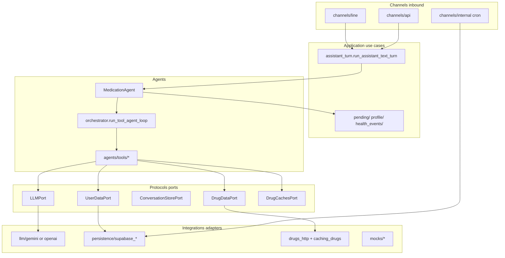

Dependency rule: `channels` and `agents` call `application` + `protocols`; only `container.py` wires `integrations` implementations (**Q7**).

### Q6. What is the Expo app in this repo — is it production?

**Answer.** **No — it is a reference / future client**, not the current pilot surface ([`docs/frontend-expo.md`](frontend-expo.md), root [`README.md`](../README.md)). It is a real Expo + expo-router app: onboarding (`POST /v1/app/onboarding`), companion chat (`POST /v1/app/messages`, `…/messages/voice`), doctor summary (`GET /v1/app/summary`) via [`apps/frontend/lib/companionApi.ts`](../apps/frontend/lib/companionApi.ts) when mock mode is off. Default dev uses local mocks (`make fe-dev`); live API: `make fe-dev-api`. Product screenshots in `assets/screenshots/mobile-*.png` are **concept mockups**, not production store builds.

---

## Section 3 — Hexagonal Architecture (Ports & Adapters)

### Q7. Show me the seam. How do you swap a real LLM for a mock without changing business code?

**Answer.** Three pieces:

1. A `Protocol` in `protocols/llm.py` (`LLMPort`) lists every method the domain needs — `interpret_user_turn`, `complete_chat_with_tools`, `extract_medication_draft`, `compose_reply`, `compose_medication_added_reply`, `compose_medication_added_primary`, `post_add_interaction_crosscheck`, `check_interactions_structured`, `check_drug_condition_interactions`, `extract_health_conditions`, `generate_health_summary`, etc. (see `protocols/llm.py` for the full list).  
2. Real implementations: `integrations/llm/gemini_llm.py`, `openai_llm.py`; test double: `integrations/mocks/llm.py` (`MockLLM`).  
3. `container.build_app_services(settings)` picks one based on `settings.is_mock` and `LLM_PROVIDER`:

```python
def _build_llm(settings: Settings) -> LLMPort:
    if settings.llm_provider.value == "openai":
        ...
        return OpenAILLM(...)
    ...
    return GeminiLLM(...)
```

The agent never imports `GeminiLLM` — it only sees `svc.llm` typed as `LLMPort`.

### Q8. What's in `AppServices` and why a frozen dataclass instead of a global?

**Answer.** `services.py` is the wired graph passed on every request (built in `lifespan`, exposed via `deps.get_services`):

```python
@dataclass
class AppServices:
    line: LineMessagingPort
    stt: SpeechToTextPort
    llm: LLMPort
    drugs: DrugDataPort
    users: UserDataPort
    conversations: ConversationStorePort
    settings: Settings
    line_audio_blobs: LineAudioBlobStorePort
    tts: TextToSpeechPort | None
    drug_caches: DrugCachesPort | None = None
```

Benefits: **testability** (hand-rolled `AppServices` with mocks, no monkey-patching globals); **lifecycle control** (shared `httpx.AsyncClient` in real mode, closed on shutdown — per [`backend-standards.mdc`](../.cursor/rules/backend-standards.mdc) §Performance).

### Q9. How is configuration loaded? Why not pydantic-settings?

**Answer.** A frozen `@dataclass` `Settings` parsed by `load_settings(env)` in `config.py`, cached by `get_settings` (`@lru_cache`). The codebase deliberately dropped Pydantic `BaseSettings` in favor of `python-dotenv` + explicit parsing — invalid config raises `ConfigError` at startup. Reason for Go port: frozen dataclass + `Load(env) → Settings` maps mechanically to a Go struct + loader ([`docs/go-port-mapping.md`](go-port-mapping.md) "Config" table).

### Q10. How does the system know "we're in mock mode"?

**Answer.** Two env vars, with clear precedence in `_integration_mode` (`config.py`):

| Variable | Wins | Values |
| ----- | ----- | ----- |
| `MEDBUDDY_INTEGRATION` | takes precedence | `mock`/`local`/`dev` (→ mock), `real`/`live`/`production` (→ real) |
| `MOCK_EXTERNAL_SERVICES` | legacy fallback | bool when the new var is unset |

Plus a Render safety net: when `RENDER=true`, settings force mocks off, `DEBUG=false`, `MEDBUDDY_INTEGRATION=real` — a mis-set dashboard env cannot re-enable mocks in production ([`apps/backend/README.md`](../apps/backend/README.md)). Local: `make be-dev-mock` / `make be-dev-real`.

---

## Section 4 — One Conversation Pipeline

### Q11. A LINE user types "remind me to take aspirin in 5 minutes". Walk it through.

**Answer.** End-to-end **text-message** path with example **I/O at every boundary**, including **what text is redacted before third-party LLMs** vs what stays **raw** in our database. The same `run_assistant_text_turn` → `MedicationAgent.run` runs for `POST /v1/app/messages` (section J); only the HTTP envelope differs.

**Scenario assumptions:** user `U_line_abc`, locale `en`, **no medications on file**, no `pending_agent_clarification`, not emergency/off-topic. This utterance has **no PII**, so `safe_text` equals `user_text` on every LLM hop below.

**What happens after ~5 minutes:** the backend does **not** place phone calls. `sync_and_enqueue_reminders` materializes a `dose_events` row; arq runs `send_reminder_for_dose` → `deliver_dose_reminder`, which sends a **LINE text push** from the `reminder.line_push` template (section **I**). The user can reply in chat (e.g. confirm dose) — that is a new turn, not an outbound call.

#### End-to-end flow (this scenario)

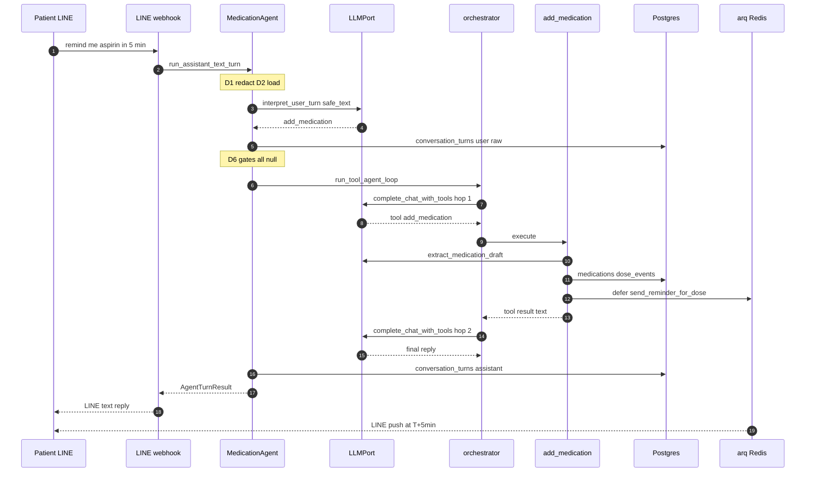

Phases **D1–D9** and redaction detail below; gate/orchestrator split in **Q12–Q13**.

---

#### A. Privacy contract — raw vs redacted vs tokens

`redact_pii_text` (`privacy/redact.py`) masks **emails**, **phone patterns** (incl. Taiwan `09…`), and **digit runs ≥10** with placeholder `[…]`. It does **not** mask short numbers (doses like `500`, `5 minutes`).

| Surface | Text version | Example (aspirin walkthrough) |
|---------|--------------|-------------------------------|
| LINE webhook / `user_text` into agent | **Raw** (patient’s words) | `remind me to take aspirin in 5 minutes` |
| `safe_text` after D1 | **Redacted** copy for LLMs | Same string here (no PII) |
| `conversation_turns` insert (user + assistant) | **Raw** | Stored verbatim for product history |
| `health_issue_events.user_message` | **Raw** (truncated) | Not written for `add_medication` (default allowlist) |
| All `interpret_user_turn` / orchestrator chat / `extract_medication_draft` / compose prompts | **Redacted** `safe_text` + redacted history | See D3, E, F, G |
| `build_patient_context_for_llm` emergency contacts | **Tokenized** (`[EMERGENCY_CONTACT_1]`) + server-side map | Empty map (no contacts on file yet) |
| Pending resolvers, `extract_profile_patch`, `extract_locale_intent` | **Raw** `user_text` | Not on this path (gates return `None`) |
| Orchestrator final reply | **Raw to patient** after token **rehydration** | N/A here (no contact tokens) |

**Variant B — redaction on a different, realistic message** (not part of sections B–K; shows the same `redact_pii_text` rules):

When the user saves an **emergency contact in chat** (gate #6 in **Q13**, `try_resolve_emergency_contact_from_message` → `extract_profile_patch` on **raw** text, then persisted to `patients.emergency_contacts`):

```text
user_text (raw):     My daughter May is my emergency contact, her number is 0912-345-678
safe_text (to LLMs): My daughter May is my emergency contact, her number is […]
conversation_turns:  stores the raw line above
```

If the same user later has a contact on file, **orchestrator** system prompts see `[EMERGENCY_CONTACT_1]` (relationship/channel only); the real number is rehydrated into the **patient-visible** reply on the server, not sent to the model as digits. Short numbers in med chat (`500`, `5 minutes`) stay unmasked.

---

#### B. Channel boundary (LINE → backend)

**In — LINE webhook body (simplified):**

```json
{
  "events": [{
    "type": "message",
    "replyToken": "reply-token-xyz",
    "source": { "userId": "U_line_abc", "type": "user" },
    "message": { "type": "text", "text": "remind me to take aspirin in 5 minutes" }
  }]
}
```

**Steps:** `channels/line/routes.py` verifies `X-Line-Signature` → `handle_line_event` → `_handle_user_message(..., user_text="remind me to take aspirin in 5 minutes", inbound_was_audio=false)`.

**LLM:** none yet.

**Out — after the full pipeline (LINE Messaging API reply):**

```json
{
  "replyToken": "reply-token-xyz",
  "messages": [{ "type": "text", "text": "Got it — I'll remind you to take aspirin (1 pill) in about 5 minutes. Tell me if the dose isn't right." }]
}
```

(Voice reply mode would add a second `audio` message via TTS + `GET /v1/line/media/audio/{id}`.)

---

#### C. Shared entry

```text
run_assistant_text_turn(svc, user_key="U_line_abc", user_text="remind me to take aspirin in 5 minutes")
  → MedicationAgent.run(svc, user_key="U_line_abc", user_text="remind me to take aspirin in 5 minutes")
```

**In:** raw `user_text` (unchanged from LINE). **Out:** `AgentTurnResult(reply=…, metadata=…)` → LINE reply in section B.

---

#### D. `MedicationAgent.run` — phase by phase (I/O + redaction)

| Phase | Text in | Text out / stored | LLM? |
|-------|---------|-------------------|------|
| **D1 Prepare** | `user_text` raw | `safe_text` redacted | No |
| **D2 Load** | — | `user_row`, `medications=[]`, `history=[]` | No |
| **D3 Classify** | `safe_text` + redacted last 4 turns | `IntentClassification` | **LLM #1** |
| **D4 Persist user** | raw `user_text` | DB row `role=user` **raw** | No |
| **D5 Health log** | raw `user_text` | skip (`add_medication` not in default allowlist) | No |
| **D6 Gates** | raw `user_text` for matchers | all `None` → continue | No (locale extract skipped) |
| **D7 Orchestrator** | `user_text` + `safe_text` | tool loop (section E) | **LLM #2–5** |
| **D8 Post-process** | orchestrator `reply` | same + optional nudge strings | No |
| **D9 Persist assistant** | final `reply` | DB row `role=assistant` **raw** (patient-visible) | No |

**D1 — Prepare**

```text
IN  user_text:  remind me to take aspirin in 5 minutes
OUT safe_text:  remind me to take aspirin in 5 minutes    # identical when no PII
LOG redacted_preview= remind me to take aspirin in 5 minutes
```

**D2 — Load context** (parallel reads)

```text
IN  user_key: U_line_abc
OUT user_row:     { "locale": "en", "preferred_name": null, … }
OUT medications:  []
OUT history:      []    # last CONVERSATION_HISTORY_TURNS=5 from DB (raw in store; redacted only when fed to LLMs)
```

**D3 — Classify (LLM #1)**

Provider prompt is built by `format_intent_classification_prompt` — **only redacted text** reaches the model:

```text
…INTENT_CLASSIFICATION_INSTRUCTIONS…

User message:
remind me to take aspirin in 5 minutes
```

(No `Recent conversation` block — empty history.)

**OUT (structured, illustrative):**

```json
{
  "intent": "add_medication",
  "reasoning": "User wants a soon reminder to take aspirin.",
  "record_pending_dose_as_taken": false,
  "dose_adherence_note": null
}
```

Intent is a **routing hint** + adherence slots; the orchestrator still picks tools.

**D4 — Persist user turn**

```text
INSERT conversation_turns (user_key, role='user', content='remind me to take aspirin in 5 minutes')  # RAW
```

**D5 — Health issue log**

```text
maybe_record_health_issue_turn(..., user_text=RAW) → no-op (add_medication not logged by default)
```

**D6 — Early-exit gates** (order in **Q13**)

```text
IN  user_text: RAW (locale / pending resolvers)
IN  intent:    add_medication
OUT each try_*: None → fall through to orchestrator
```

**D7 — Orchestrator** — see section **E** (`run_tool_agent_loop(user_text=raw, safe_text=redacted, …)`).

**D8 — Post-process**

```text
IN  reply from orchestrator
OUT same reply (no pending horizon / med-confirm created this turn; profile nudge may append if gaps)
```

**D9 — Persist assistant + return**

```text
INSERT conversation_turns (role='assistant', content=<final English reply>)   # RAW, patient-visible
RETURN AgentTurnResult(reply=<final>, metadata={})
```

---

#### E. `run_tool_agent_loop` — hop 1 (LLM #2)

**In:** `safe_text`, `history` (raw list; redacted when building messages), `interpretation` from D3.

**Messages sent to `complete_chat_with_tools` (illustrative — system body abbreviated):**

```json
[
  {
    "role": "system",
    "content": "<build_agent_system_prompt en>\n<patient_context_for_llm: locale=en, meds=[], upcoming doses empty, no emergency tokens>\n<policy: one-off reminder → add_medication>"
  },
  {
    "role": "user",
    "content": "remind me to take aspirin in 5 minutes"
  }
]
```

Prior-turn slots are empty here; with history, each prior line would be `redact_conversation_turns_for_llm` first (up to `MEDBUDDY_AGENT_ORCHESTRATOR_HISTORY_TURNS=12` messages).

**OUT — assistant message with tool call:**

```json
{
  "role": "assistant",
  "content": null,
  "tool_calls": [{
    "id": "call_abc",
    "type": "function",
    "function": { "name": "add_medication", "arguments": "{}" }
  }]
}
```

**Server:** `execute_agent_tool("add_medication", …)` passes `ctx.user_text` (**raw**) into `AddMedicationTool`; the tool re-redacts for extraction (section F).

---

#### F. Inside `add_medication` tool

| Step | Input text | Output | LLM? |
|------|------------|--------|------|
| F1 | `safe_text` = redact(`user_text`) | `MedicationDraft` | **LLM #3** |
| F2 | draft | dose default `1 pill` if one-off | No |
| F3 | draft + **raw** `user_text` for confirm heuristics | skip confirm (clear one-off) | No |
| F4 | draft | `persist_medication_add_from_draft` | section G |

**F1 — LLM #3 prompt (excerpt):**

```text
User message:
remind me to take aspirin in 5 minutes
```

(`recent_context` would be redacted `user:` / `assistant:` lines from last 8 turns if history existed.)

**F1 — OUT draft (illustrative):**

```python
MedicationDraft(
  name="aspirin",
  dosage="1 pill",
  schedule="unspecified",
  first_reminder_in_minutes=5,
  materialize_daily_reminders=False,
)
```

**F4 — Tool result** (fed back as `role: tool` in hop 2):

```text
Done — I've set a reminder in about 5 minutes to take aspirin (1 pill). Tell me if you'd like a different dose.
```

---

#### G. Inside `persist_medication_add_from_draft`

| Step | I/O | LLM? |
|------|-----|------|
| G1 | `medications` row + `raw_metadata.reminder` | No |
| G2 | `dose_events` + arq `send_reminder_for_dose` @ T+5min | No |
| G3 | OpenFDA/TFDA HTTP for `aspirin` | No |
| G4 | `compose_medication_added_reply(user_message=safe_text, patient_context=de-identified block)` | **LLM #4** |
| G5 | condition interaction lines | No (no conditions) |

**G4 — LLM #4 prompt tail (redacted user line only):**

```text
…Patient background…
<de-identified profile + med list + upcoming doses>

Reference
<OpenFDA excerpt or “no drug data”>

Saved facts: aspirin | 1 pill | unspecified

User message:
remind me to take aspirin in 5 minutes
```

**G4 — OUT:** composed English acknowledgment (becomes tool message in orchestrator).

---

#### H. Orchestrator hop 2 (LLM #5)

**Messages (abbreviated):** system + user (redacted) + assistant/tool_calls + tool result (patient-facing text from G4).

**OUT — final assistant text (patient-visible, no tokens to rehydrate):**

```text
Got it! I'll remind you in about 5 minutes to take aspirin (1 pill). If the dose isn't right, just tell me.
```

If emergency contacts were on file and the model used `[EMERGENCY_CONTACT_1]`, the server would replace tokens with real numbers **before** D9 (`orchestrator.py` rehydration loop).

**LLM count (this scenario):** **5** — interpret, orchestrator×2, extract_draft, compose_post_add.

---

#### I. Reminder side effect (async LINE text — not a phone call)

After the assistant reply in section **B**, the server has already written `medications` + a `dose_events` row with `scheduled_at ≈ now+5min`. No LLM runs at delivery time.

```text
arq job:     send_reminder_for_dose(dose_event_id, scheduled_at_iso=…)
worker:      deliver_dose_reminder → LINE Messaging API push (text message only)
```

**Example LINE push** (`reminder.line_push`, locale `en`, illustrative local time):

```text
Hi — it's 14:35. Time for aspirin (1 pill). Saved schedule: unspecified. If anything's unclear, ask your pharmacist or clinician.
```

Optional **nudge** (`reminder.line_push_nudge`) is another LINE text if the dose is still not confirmed — still not a voice/phone callback. The user answers in the **same LINE chat** (e.g. “I took it” → `confirm_dose` on a later turn).

---

#### J. Same pipeline on mobile API

**In:**

```http
POST /v1/app/messages
Authorization: Bearer <token>
X-App-User-Id: expo-install-uuid-123
Content-Type: application/json

{"text": "remind me to take aspirin in 5 minutes"}
```

**Out:**

```json
{ "reply": "<same assistant text as LINE>", "metadata": {} }
```

No LINE signature/STT; **D–H identical** inside `MedicationAgent`.

---

#### K. Contrast — follow-up turn (early exit, redaction still on classify)

Previous turn left **med-add confirmation** pending; user replies **`yes`**:

| Step | Text |
|------|------|
| D1 | `safe_text` = `yes` |
| D3 LLM #1 | Prompt uses **redacted** `yes`; often `general_question` |
| D4 DB | Stores **raw** `yes` |
| D6 gate #2 | Matcher uses **raw** `yes` → `persist_medication_add_from_draft` (no orchestrator) |
| LLMs after | compose inside persist only (**no** orchestrator hops) |

See **Q12–Q13** for why gate #2 uses raw stoplists instead of the planner.

### Q12. Why have **fast routing gates** AND a **tool-calling loop**? Why not run everything through the orchestrator?

**Answer.** You *could* route every turn through `run_tool_agent_loop` only — one system, one mental model. MedBuddy deliberately does **not**, because several user messages are not “pick a tool and improvise”; they are **continuations of server-owned state** or **non-negotiable safety copy**. Those get **early exits** (fixed code paths) before the planner runs. Everything else — add med, drug Q&A, interactions, summaries — **should** use the orchestrator (multi-tool, flexible wording).

#### Orchestrator-only vs gates + orchestrator

| | **Orchestrator-only** | **Gates then orchestrator (current)** |
|---|------------------------|----------------------------------------|
| **Strength** | One routing story; easy to add features as new tools | Deterministic where the product must not guess; flexible where language is open-ended |
| **Weakness** | Model may call wrong tool, skip save, or riff on emergencies | Two mechanisms to learn (gates + tools); must keep gate order documented |
| **Cost / latency** | Every turn: `interpret_user_turn` **+** `complete_chat_with_tools` (1–8 hops) | Many turns skip planner entirely after classifier |
| **Safety** | Emergency/off-topic depend on tool choice + prompt obedience | Emergency/off-topic = fixed i18n, no tool call |
| **Pending “yes”** | “好” might become `add_medication`, `off_topic`, or chit-chat | Stoplist + `pending_agent_clarification` JSON → exact save/cancel |
| **Auditability** | Harder to prove what happened on a yes/no | Resolver code + DB pending row = replayable |

**Design rule:** use the **orchestrator** when the user’s intent is **open-ended** or may need **multiple tools** in one turn. Use a **gate** when the server already asked a **specific question** and the reply is a **short answer**, or when policy demands **exact wording** with no tool variance.

**What still runs before any gate:** `interpret_user_turn` (LLM #1) always runs — gates use its `intent` hint but do not trust it alone for pending continuations. See **Q13** for per-gate examples of orchestrator-only failure modes.

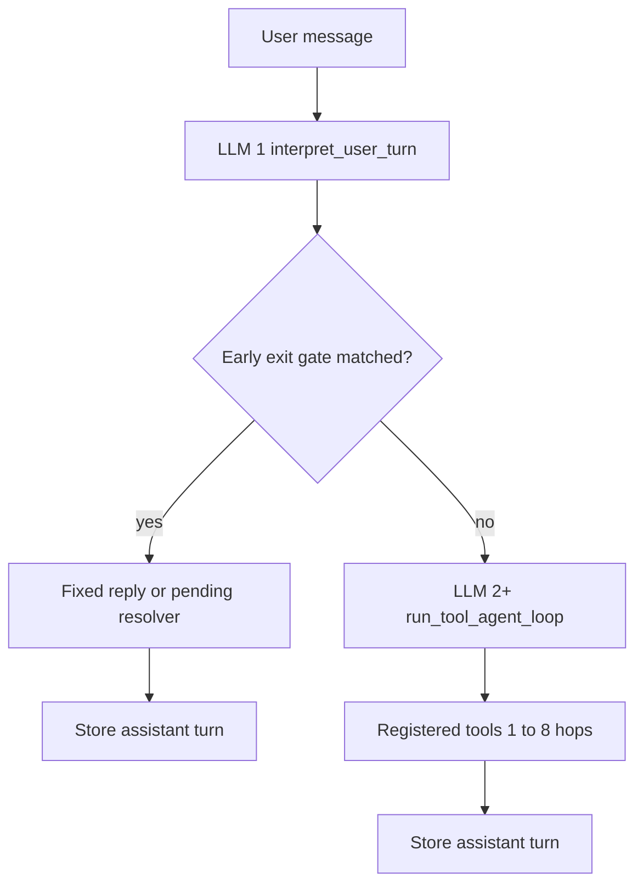

---

### Q13. What are the early exits, how do they work, and why skip the orchestrator?

**Answer.** An **early exit** means `MedicationAgent.run` returns `AgentTurnResult` **without** calling `run_tool_agent_loop`. The orchestrator is **not** invoked — no `complete_chat_with_tools`, no tool dispatch. Gates run **after** the user turn is stored and **after** `interpret_user_turn`, in this **fixed order** (`agents/medication_agent.py`):

| # | Gate | Mechanism | Returns early when |
|---|------|-----------|-------------------|
| 1 | Locale | `try_locale_change_reply` | User asked to switch reply language; persists `patients.locale`. |
| 2 | Med-add confirm | `try_resolve_pending_medication_add_confirmation` | Pending draft exists; reply is yes/no stoplist (`好`, `yes`, …) or cancel; may persist via `persist_medication_add_from_draft`. |
| 3 | Dose clarification | `try_resolve_pending_dose_clarification` | Pending disambiguation (which dose / note); numeric or choice reply; TTL expiry clears pending. |
| 4 | Reminder horizon | `try_resolve_pending_reminder_horizon` | User must pick how many days to materialize reminders for a med. |
| 5 | Emergency | `intent == Intent.EMERGENCY` | Fixed i18n (`agent.emergency` / `agent.emergency_with_saved_contact`); optional `metadata.simulated_emergency_notification`. |
| 6 | Emergency contact | `try_resolve_emergency_contact_from_message` | Parses contact line from chat → `update_profile` path on `patients.emergency_contacts`. |
| 7 | Intent hooks | `try_intent_hooks` | Registered pilot handlers in `extensibility/intent_hooks.py` return a reply string. |
| 8 | Off-topic | `intent == Intent.OFF_TOPIC` | Fixed refusal (`agent.off_topic`). |

**Pattern:** `reply = await try_…()` → if `reply is not None`, append assistant turn and **`return`** — orchestrator never runs.

**Not a full early exit — `UPDATE_PROFILE`:** classifier fires `UPDATE_PROFILE` → `extract_profile_patch` + `patch_user_profile` **before** orchestrator → then `run_tool_agent_loop` with profile tools omitted so the planner cannot undo the save.

**Fall-through:** all gates return `None` → **orchestrator** handles the turn (e.g. “remind me to take aspirin in 5 minutes” in **Q11**).

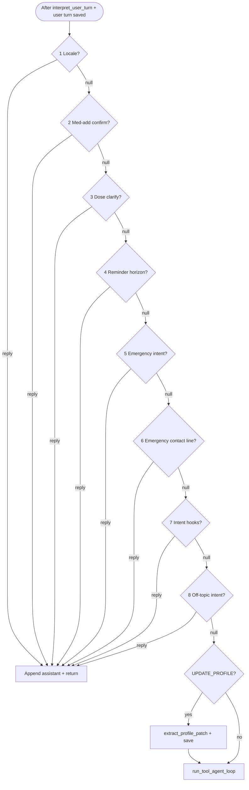

---

#### Per-gate: why the orchestrator is the wrong tool (examples)

**Gate 1 — Locale**

| | Orchestrator-only (risk) | Gate (actual) |
|---|-------------------------|---------------|
| User: `please reply in English` | Might call `update_profile`, `off_topic`, or answer without persisting locale | `extract_locale_intent` → `patch_user_profile({"locale":"en"})` → short ack |
| **Pro gate** | One field, one save, no spurious med tools | |
| **Con orchestrator** | Extra planner hop + tool-selection variance for a 3-word command | |

---

**Gates 2–4 — Pending state** (`patients.pending_agent_clarification`)

Context: assistant **already** asked something specific; user reply is often **one token**.

**Gate 2 — Med-add confirm**

| | Orchestrator-only (risk) | Gate (actual) |
|---|-------------------------|---------------|
| Prior assistant: “Save aspirin 100mg daily — reply yes to confirm?” | | Pending row stores full `MedicationDraft` |
| User: `yes` | Classifier → `general_question`; planner might `explain_medication`, chit-chat, or call `add_medication` again with a **new** draft | Stoplist matches `yes` → `persist_medication_add_from_draft` → done |
| User: `no` | Might still “helpfully” add the drug | Clears pending, cancel copy |
| **Pro gate** | Deterministic save; no duplicate med row; **no orchestrator cost** | |
| **Con gate** | Must maintain pending JSON + resolvers when adding new confirm flows | |

**Gate 3 — Dose clarification**

| | Orchestrator-only (risk) | Gate (actual) |
|---|-------------------------|---------------|
| Assistant: “Which dose — 1 morning or 2 evening?” | | `DoseClarificationPending` with option ids |
| User: `1` | “1” might → `off_topic` or unrelated tool | Maps to option id → `mark_dose_events_taken` |
| **Pro gate** | Adherence actions are **database operations**, not LLM judgment | |

**Gate 4 — Reminder horizon**

| | Orchestrator-only (risk) | Gate (actual) |
|---|-------------------------|---------------|
| User: `14 days` | Might interpret as unrelated; might call `add_medication` | Parses days → updates `raw_metadata.reminder.horizon_days` → `sync_and_enqueue_reminders` |
| User: `forever` | Unreliable without tool | `_is_indefinite_reply` → `set_indefinite` path (**Q19**) |

---

**Gate 5 — Emergency**

| | Orchestrator-only (risk) | Gate (actual) |
|---|-------------------------|---------------|
| User: `chest pain and can't breathe` | Planner might call `simulate_notify_emergency_contact` instead of “call 119/911”; might delay with drug Q&A | `Intent.EMERGENCY` → **fixed** `agent.emergency` i18n immediately; contact on file → extra simulated-notify line + metadata |
| **Pro gate** | **Zero** dependency on model obeying “do not use tool X for true EMS” in system prompt | |
| **Con gate** | Less flexible phrasing (by design) | |

---

**Gate 6 — Emergency contact from chat**

| | Orchestrator-only (risk) | Gate (actual) |
|---|-------------------------|---------------|
| User: `my daughter May, call her at 0912-345-678` | Risk `add_medication` (“May” sounds like a drug); profile tool might no-op | Dedicated parser/resolver → `emergency_contacts` on profile |
| **Pro gate** | Narrow semantics isolated from med catalog tools | |

---

**Gates 7–8 — Hooks & off-topic**

| Gate | Orchestrator-only (risk) | Gate (actual) |
|------|-------------------------|---------------|
| **7 Hooks** | Pilot behavior needs a deploy to change tools | `register_intent_hook` for experiments without touching orchestrator |
| **8 Off-topic** | Model might still engage (“Sure, here's a lasagna recipe…”) | Fixed refusal string; bounded scope |

---

#### When the orchestrator **is** the right choice (no early exit)

These **fall through** all gates — by design:

| User message | Why orchestrator |
|--------------|------------------|
| `remind me to take aspirin in 5 minutes` | May need `add_medication` + composed reply (**Q11**) |
| `what are the side effects of metformin and remove ibuprofen` | **Multiple tools** in one turn |
| `I took my morning pills and feel dizzy` | `report_side_effects` + possible `confirm_dose` — planner merges classifier slots |
| `list my medications` | Simple tool, but wording varies — planner handles natural language |

**Post-orchestrator is not an early exit:** `_maybe_append_pending_reminder` and profile-completion nudge run **after** tools when old pending state still exists — the orchestrator may have already asked the question in its reply.

---

#### Summary: what gates do *not* skip vs what they skip

| Still runs on early exit | Skipped on early exit |
|--------------------------|------------------------|
| `redact_pii_text` for classifier | `run_tool_agent_loop` |
| `interpret_user_turn` (LLM #1) | `complete_chat_with_tools` (LLM #2+) |
| Store **raw** user turn in `conversation_turns` | All 19 registered tools |
| `maybe_record_health_issue_turn` (if intent allowlisted) | |

**Orchestrator “exit” (different idea):** inside the loop, the model returns final text or hits **`_MAX_AGENT_STEPS = 8`** — that is normal completion, not a pre-orchestrator gate.

### Q14. Why "registered tools" instead of free-form ReAct?

**Answer.** From [`docs/tdd.md`](tdd.md) §4: multi-step loops are bounded by the registry and server execution — not arbitrary web/search ReAct. Concretely:

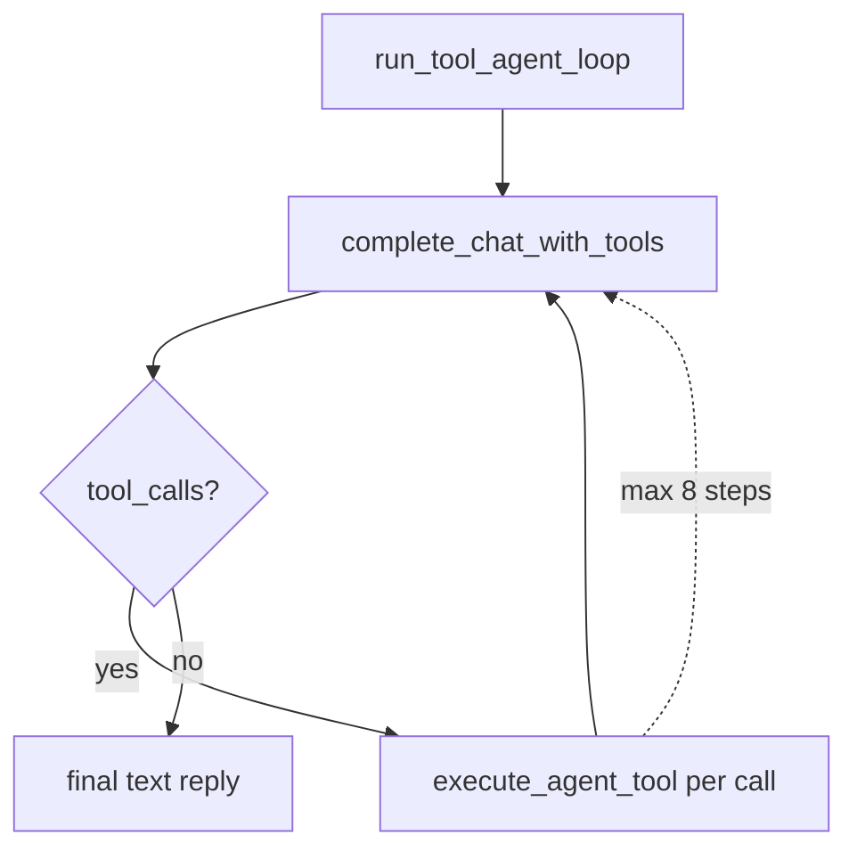

* Each tool: `agents/tools/*.py` with explicit `name`, `description`, `run(**kwargs) -> ToolResult` (`agents/base.py` `AgentTool` protocol).  
* OpenAI-format schemas in `llm/agent_tool_definitions.py` — shared by Gemini and OpenAI adapters.  
* `orchestrator.execute_agent_tool` dispatches on `name`; unknown names → friendly i18n error.  
* `_run_tool_safe` catches tool exceptions so one failure does not crash the turn.  
* `_MAX_AGENT_STEPS = 8` caps cost and runaway loops.

### Q15. How is conversation history fed back to the model? What about privacy?

**Answer.** Two windows, two jobs:

* **Intent classification** — last **4** redacted turns as `"role: content"` (`MedicationAgent._recent_context_for_intent`, `max_turns=4`).  
* **Tool orchestrator** — up to `MEDBUDDY_AGENT_ORCHESTRATOR_HISTORY_TURNS` redacted user/assistant messages (default **12**; `0` disables), via `orchestrator_prior_messages` in `agents/orchestrator.py` — excludes the current user line.

**Storage** keeps raw text (patient sees what they typed). **LLM outbound** uses `redact_pii_text` / `redact_conversation_turns_for_llm` — emails, Taiwan/international phone shapes, 10+ digit runs → `[…]` (`privacy/redact.py`). Trust boundary: [`docs/privacy.md`](privacy.md), [`docs/llm-context.md`](llm-context.md). For the full memory model (not just chat tail), see **Q16**.

### Q16. How does the agent's memory work? Is there long-term recall?

**Answer.** There is **no in-process or vector "memory"** — `MedicationAgent` is stateless; each turn rebuilds context from **Postgres (or mocks)** and env-tuned caps. Think of memory as **layers**:

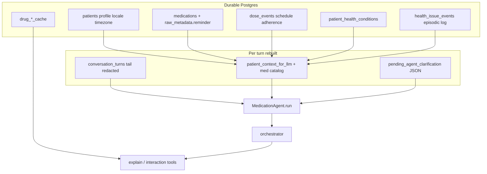

| Layer | What it stores | How the agent uses it |
|-------|----------------|------------------------|
| **Chat transcript** | `conversation_turns` via `ConversationStorePort` | Fetched with `get_recent_turns(user_key, CONVERSATION_HISTORY_TURNS)` — default **5** turns per turn. Fed to intent (last **4** redacted), orchestrator (up to **`MEDBUDDY_AGENT_ORCHESTRATOR_HISTORY_TURNS`**, default **12**), med extraction (**8** redacted lines in `recent_conversation_for_medication_extraction`), health summary tool (**30** turns). **Truncation only** — no rolling LLM summary yet ([`docs/features.md`](features.md) §13.2 defers compression until long-session coherence is a problem). |
| **Structured patient state** | `patients`, `medications`, `dose_events`, `patient_health_conditions`, emergency contacts | Injected every orchestrator hop as **medication catalog JSON** + `patient_context_for_llm` (profile, active conditions, **7-day upcoming doses**, last **12** `health_issue_events` when `include_recent_health_events=True`). This is the durable "what's on file" memory — not the chat log. |
| **Episodic health log** | `health_issue_events` (classifier allowlist + structured vitals) | Written on some intents (`maybe_record_health_issue_turn`); read via patient context block and **`lookup_health_history`** tool; doctor summary uses up to **`MEDBUDDY_HEALTH_ISSUE_SUMMARY_EVENTS_LIMIT`** (default **60**). |
| **Pending conversational state** | `patients.pending_agent_clarification` JSON (med-add confirm, dose disambiguation, reminder horizon) | Acts as **short-term task memory** across turns; resolved by deterministic gates in `application/pending/` before the LLM re-classifies ("好" after "save this med?"). TTL: `MEDBUDDY_DOSE_CLARIFICATION_TTL_SECONDS` (default **900** s). |
| **Drug Q&A cache** | `drug_reference_cache`, `drug_personalization_cache` | Not dialogue memory — see **Q26** for personalization hit/miss, fingerprint, and examples. |

**Retention:** cron `POST /internal/conversations/purge` deletes chat rows older than **`MEDBUDDY_CONVERSATION_RETENTION_DAYS`** (default **90**). Structured meds/profile/events are not purged by that job.

**Within a single turn:** the orchestrator loop keeps **tool call messages** in the in-memory `messages` list until the model returns final text (`_MAX_AGENT_STEPS = 8`) — that is **working memory for one hop**, not persisted across turns.

**Not implemented:** embedding store, RAG over full history, or automatic conversation summarization — follow-ups like "that one" rely on the capped redacted chat tail + catalog/context in the system prompt.

### Q17. What are all 19 orchestrator tools?

**Answer.** Names in `AGENT_TOOLS_OPENAI` (`llm/agent_tool_definitions.py`):

`list_medications`, `list_upcoming_doses`, `add_medication`, `remove_medication`, `remove_all_medications`, `update_medication`, `disable_reminders`, `confirm_dose`, `report_missed_dose`, `explain_medication`, `report_side_effects`, `interaction_check`, `log_vital`, `generate_health_summary`, `export_health_journal`, `simulate_notify_emergency_contact`, `manage_health_conditions`, `update_profile`, `lookup_health_history`.

**Note:** `manage_health_conditions` covers allergies/chronic diagnoses; `update_profile` is for demographics and emergency contacts — not diagnoses. New behavior = tool class + definition entry + `execute_agent_tool` arm.

---

## Section 5 — Reminders Subsystem

### Q18. Walk me through how a reminder reaches the patient on LINE.

**Answer.** Materialize → enqueue → deliver → (optional nudge) → reconcile.

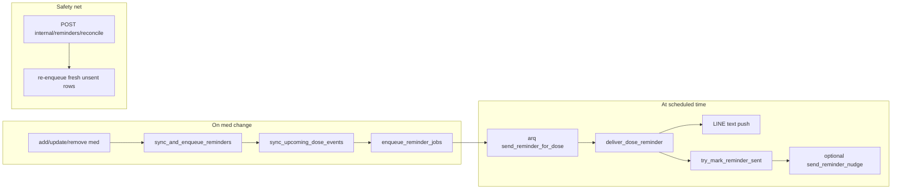

1. **Materialize** — After med add/update/remove, `remove_all_medications`, or `disable_reminders`, `sync_and_enqueue_reminders` calls `users.sync_upcoming_dose_events` using `iter_scheduled_dose_times_utc` (`reminders/dose_schedule.py`) in the patient's IANA timezone (`Asia/Taipei` default).  
2. **Enqueue** — `enqueue_reminder_jobs` registers `send_reminder_for_dose(dose_event_id)` in arq. No `REDIS_URL` → sync only, enqueue skipped (DEBUG).  
3. **Worker** — `arq medbuddy.reminders.worker.WorkerSettings`: `send_reminder_for_dose`, `send_reminder_nudge`, `resync_chronic_meds_cron`. Docker entrypoint can run uvicorn + arq when Redis is set.  
4. **Deliver** — `reminders/deliver.deliver_dose_reminder`: localized push, optional education CTA (sha256 day-bucket cadence), `try_mark_reminder_sent`. On success, schedule nudges per `MEDBUDDY_REMINDER_NUDGE_INTERVALS`.  
5. **Nudges** — `try_increment_reminder_nudge` with `expected_nudge_count` (CAS-style).  
6. **Reconcile** — safety-net cron; see **Q22** for procedures and scenarios.

### Q19. How do chronic / lifelong medications stay reminded?

**Answer.** Chronic meds do **not** materialize infinite `dose_events` in one shot. They use the **same rolling window** as finite meds — by default the next **`MEDBUDDY_REMINDER_HORIZON_DAYS`** days (default **14**, max **90** in settings) — and two **refill** mechanisms keep that window full for as long as the med stays on file. Full reference: [`reminders.md`](reminders.md#chronic--indefinite-duration-medications).

#### What “chronic” means in data

| Layer | Field / flag | Effect |
|-------|----------------|--------|
| LLM extraction | `MedicationExtraction.is_indefinite = true` | User said long-term phrasing (e.g. “take this forever”, “long-term for hypertension”, “長期服用”) |
| Draft builder | `medication_draft_from_extraction` | Forces `needs_horizon_confirmation=false`, `materialize_daily_reminders=true`, drops `reminder_horizon_days` |
| Postgres | `medications.is_indefinite = true` | Row opts into daily cron scan + delivery top-up |
| Patient reply | `llm.added_indefinite` locale | No “remind me for N days?” — copy says daily reminders continue until they stop |

Finite meds with unclear duration still get **`ReminderHorizonPending`** (“how many days?”). Chronic meds **skip** that prompt.

#### Settings (`config.py` defaults)

| Env var | Default | Role |
|---------|---------|------|
| `MEDBUDDY_REMINDER_HORIZON_DAYS` | `14` | Depth of **each** materialization (daily dose rows created per sync) |
| `MEDBUDDY_REMINDER_DEFAULT_LOCAL_TIME` | `09:00` | Local clock time when user did not specify HH:MM (uses `patients.timezone`, default `Asia/Taipei`) |
| `MEDBUDDY_CHRONIC_RESYNC_CRON_HOUR_UTC` | `3` | Daily arq cron hour (UTC) — **03:15 UTC** out of the box |
| `MEDBUDDY_CHRONIC_RESYNC_CRON_MINUTE_UTC` | `15` | Daily arq cron minute (UTC) |
| `MEDBUDDY_CHRONIC_DELIVERY_TOPUP_THRESHOLD` | `3` | After a push, if **fewer than 3** future rows remain for that med → refill now; `0` disables top-up |
| `REDIS_URL` | — | Required for arq enqueue (cron + normal reminders) |

#### Shared refill hook (both paths)

Both mechanisms call **`sync_and_enqueue_reminders`** (`reminders/lifecycle.py`):

1. `sync_upcoming_dose_events` — delete **future** `dose_events` for the patient, insert fresh rows for the next horizon window from each med’s `raw_metadata.reminder` prefs.
2. `enqueue_reminder_jobs` — defer arq `send_reminder_for_dose` jobs per new row.

Past rows (`scheduled_at <= now`) are left intact (adherence history preserved).

---

#### Refill path 1 — Daily arq cron (primary)

**Registered in** `reminders/worker.py` → `WorkerSettings.cron_jobs` → `resync_chronic_meds_cron` (not an HTTP route).

**Schedule example (defaults):** every day at **03:15 UTC** (= 11:15 Taipei, 19:15 US Pacific previous calendar day).

**Procedure** (`reminders/chronic_resync.py` → `resync_all_indefinite_patients`):

1. `list_patients_with_indefinite_medications()` — distinct users with at least one `is_indefinite` med (Supabase: partial index `medications_is_indefinite_idx`).
2. For each `user_key`, `sync_and_enqueue_reminders(svc, user_key)`.
3. Per-user failures are logged; batch continues (one patient does not block others).

**Log line (illustrative):** `chronic_resync: completed patients=42 resynced=41 failed=1`

---

#### Refill path 2 — Delivery-time top-up (safety net)

**Runs inside** `reminders/deliver.deliver_dose_reminder` → `_maybe_topup_chronic_med` **after** a successful LINE push and `try_mark_reminder_sent`.

**Trigger:** `count_future_dose_events(medication_id) < MEDBUDDY_CHRONIC_DELIVERY_TOPUP_THRESHOLD` (default **< 3**).

**Why it exists:** if the daily cron has not run yet (fresh deploy, worker downtime, or the window was consumed faster than expected), the **next** successful delivery still refills upcoming rows so reminders do not silently stop.

**Log lines:** `chronic_topup_triggered` or `chronic_topup_skipped` (when `remaining >= threshold`).

---

#### Scenario A — User adds a long-term blood pressure med (happy path at save)

**In (LINE):** `I need to take lisinopril long-term every morning at 8am`

**After `add_medication` + persist:**

| Store | Example value |
|-------|----------------|
| `medications` row | `name=Lisinopril`, `is_indefinite=true`, `raw_metadata.reminder.daily_local_hhmm=08:00`, `materialize_daily=true` |
| `dose_events` | ~14 future rows at 08:00 **Asia/Taipei** (e.g. `2026-05-16` … `2026-05-29` local mornings → stored UTC) |
| Redis | 14 deferred `send_reminder_for_dose` jobs |

**Out (assistant, English):** confirms med saved + *daily reminders will keep running until you ask to stop* (`llm.added_indefinite`) — **not** “how many days should I remind you?”

**Contrast — finite med:** same user adds “aspirin for 7 days only” → `needs_horizon_confirmation` or explicit `horizon_days=7` → no `is_indefinite`; window ends unless extended.

---

#### Scenario B — Window running low (delivery top-up fires)

**Setup:** `MEDBUDDY_REMINDER_HORIZON_DAYS=14`, top-up threshold **3**. Patient has one chronic med; cron has **not** run today.

| Day | Future `dose_events` left (this med) | Event |
|-----|--------------------------------------|--------|
| 1–11 | 14 → 3 | Normal daily pushes consume the window |
| 12 | **2** remaining | Today’s push succeeds → `_maybe_topup_chronic_med` sees `2 < 3` → **`sync_and_enqueue_reminders`** |
| 12 (after sync) | ~14 again | New arq jobs enqueued; reminders continue without waiting for 03:15 UTC cron |

**Patient experience:** no gap in daily LINE reminders even if the nightly cron is still hours away.

---

#### Scenario C — Nightly cron refills everyone with a chronic med

**03:15 UTC cron** runs for patients `U_a`, `U_b`, `U_c` who each have at least one `is_indefinite` med (even if they also have finite meds).

| Patient | Before cron | After cron |
|---------|-------------|------------|
| `U_a` | 5 future rows (window shrank) | ~14 future rows per med schedule; new Redis jobs for new ids |
| `U_b` | 0 future rows (worker was down 2 days) | Full window restored |
| `U_c` | Only finite meds | **Skipped** — not in `list_patients_with_indefinite_medications()` |

**Note:** `sync_upcoming_dose_events` rebuilds **all** meds for that user, not only the chronic one — finite meds get their horizon refreshed too during that sync.

---

#### Scenario D — User answers “forever” to a pending horizon question

If a **finite** save incorrectly left `needs_horizon_confirmation=true`, the assistant may ask *“how many days should I remind you?”*

**In:** `every day from now on` while `ReminderHorizonPending` is set.

**Resolver** (`application/pending/reminder_horizon_resolve.py`): `_is_indefinite_reply` matches → `merge_medication_raw_metadata(..., set_indefinite=True)` → `sync_and_enqueue_reminders` → i18n `reminder.horizon_confirmed_indefinite`.

**Out:** med flipped to chronic semantics going forward; same rolling-window + refill rules as Scenario A.

---

#### Scenario E — Chronic vs reconcile (different problems)

| Mechanism | Fixes | Does not fix |
|-----------|--------|----------------|
| **Chronic cron + top-up** | **Missing future rows** — schedule ran out ahead | LINE push that failed for a row that still exists |
| **Reconcile** (**Q22**) | **Missed push** for due, unsent rows in last 48h | Creating schedule when horizon was never materialized |

Both respect **`reminder_sent_at`** idempotency — refilling future rows does not re-push already-sent doses.

---

#### Operator checklist

- **`REDIS_URL` + arq worker running** — otherwise sync inserts DB rows but no jobs fire (DEBUG log on API).
- **Do not set `MEDBUDDY_CHRONIC_DELIVERY_TOPUP_THRESHOLD=0`** unless you rely only on the daily cron and accept gaps until it runs.
- **Tune `MEDBUDDY_REMINDER_HORIZON_DAYS`** — larger window = fewer top-up/cron cycles needed per month, more `dose_events` rows per patient.
- **Separate from reconcile cron** — no HTTP call; chronic refill is internal to the arq worker process.

### Q20. Why arq + Redis instead of Celery or in-process scheduling?

**Answer.** arq is async-native and lightweight — fits the FastAPI stack without a separate broker beyond Redis. In-process scheduling loses work on restart and does not scale out; production shape: API service runs uvicorn only, worker service runs the same image with `arq` ([`apps/backend/README.md`](../apps/backend/README.md)).

### Q21. How do you avoid double-pushes on retry?

**Answer.** `try_mark_reminder_sent` returns `True` only if the row actually transitioned to sent. A retry after a successful push gets `False` and logs a warning — no second LINE message. Nudges use the same pattern (`try_increment_reminder_nudge`). Reconcile re-enqueues only rows still in the **48-hour fresh window** with no `reminder_sent_at`, `taken_at`, or `missed_at` — see **Q22**.

### Q22. How does reminder reconcile work? Real-world scenarios with I/O.

**Answer.** Reconcile is a **cron safety net** — not the primary scheduler. Normal flow uses **deferred arq jobs** at `scheduled_at` when meds are saved (`enqueue_reminder_jobs`). If Redis or the worker misses that moment, an external cron (e.g. every 15–60 minutes) calls reconcile to catch up. Full ops notes: [`reminders.md`](reminders.md#reconciliation).

#### Operator call (HTTP)

**Request** (e.g. Render cron, GitHub Actions, or `curl` on an internal network):

```http
POST /internal/reminders/reconcile HTTP/1.1
Host: api.medbuddy.example.com
X-Cron-Secret: <MEDBUDDY_CRON_SECRET>
Content-Length: 0
```

**Responses:**

| Status | Body | Meaning |
|--------|------|---------|
| `200` | `{"enqueued": 3, "status": "ok"}` | Step 1 closed stale rows; step 2 queued **3** immediate `send_reminder_for_dose` jobs |
| `401` | `{"detail": "unauthorized"}` | Missing or wrong `X-Cron-Secret` |
| `503` | `{"detail": "redis not configured"}` | `REDIS_URL` unset — reconcile cannot enqueue |

Implementation: `channels/internal/routes.py` → `mark_stale_dose_events_missed` → `list_dose_event_ids_for_reconcile` → `enqueue_reminder_jobs_now` (`reminders/enqueue.py`).

#### What each reconcile tick does (two DB passes + enqueue)

Assume cron runs at **`now = 2026-05-15T10:30:00Z`**.

**Pass 1 — close ancient ghosts** (`mark_stale_dose_events_missed`)

Rows where **all** of:

* `scheduled_at <= now - 48 hours` (`_RECONCILE_FRESH_HOURS = 48` in `supabase_dose_events.py`)
* `reminder_sent_at`, `taken_at`, `missed_at` are all NULL

→ set `missed_at = now`. These are doses so old that sending a LINE reminder now would confuse the patient; they are closed as **missed**, not re-pushed.

**Pass 2 — re-enqueue recent misses** (`list_dose_event_ids_for_reconcile`)

Rows where **all** of:

* `scheduled_at <= now`
* `scheduled_at >= now - 48 hours` (still “fresh”)
* `reminder_sent_at`, `taken_at`, `missed_at` are all NULL

→ collect `id` list → `enqueue_reminder_jobs_now(redis_url, ids)` — **immediate** arq jobs (no `_defer_until`; reconcile jobs call `send_reminder_for_dose(dose_id)` only).

**Pass 3 — worker delivery** (same as normal path)

`deliver_dose_reminder` → LINE push → `try_mark_reminder_sent` (conditional update: only if `reminder_sent_at` still null).

---

#### Scenario A — Happy path (reconcile does nothing)

| Time (UTC) | Event |
|------------|--------|
| 10:00 | Patient: “remind me to take aspirin in 5 minutes” → `dose_events` row `de-001`, `scheduled_at=10:05` |
| 10:00 | `enqueue_reminder_jobs` schedules arq job deferred to 10:05 |
| 10:05 | Worker runs `send_reminder_for_dose("de-001", scheduled_at_iso="2026-05-15T10:05:00+00:00")` |
| 10:05 | LINE push: *“Time for aspirin (100 mg) — due 10:05.”* → `reminder_sent_at` set |

**10:30 reconcile:** `enqueued: 0` — row already has `reminder_sent_at`.

---

#### Scenario B — Worker / Redis down at fire time (reconcile saves the reminder)

| Time (UTC) | Event |
|------------|--------|
| 10:05 | **Due** — arq worker was restarted; deferred job never ran (or Redis was empty) |
| 10:05 | Row `de-002`: `scheduled_at=10:05`, all status columns NULL |
| 10:30 | Cron reconcile → `de-002` in fresh window → `enqueued: 1` |
| 10:30 | Worker immediately runs `send_reminder_for_dose("de-002")` |
| 10:30 | Patient gets LINE push (~25 min late, but better than silent loss) |

**Real-world trigger:** deploy restart, `REDIS_URL` misconfiguration fixed at 10:20, host OOM killed arq.

---

#### Scenario C — Patient already took the dose (reconcile skips)

| Field | Value |
|-------|--------|
| `id` | `de-003` |
| `scheduled_at` | `2026-05-15T09:00:00Z` |
| `taken_at` | `2026-05-15T09:02:00Z` (user said “I took it” in chat) |
| `reminder_sent_at` | NULL (push never sent — acceptable) |

**10:30 reconcile:** `de-003` **not** in reconcile list (`taken_at` is set). No spurious “you missed your dose” push.

---

#### Scenario D — Dose older than 48 hours (closed as missed, not re-pushed)

| Field | Value |
|-------|--------|
| `id` | `de-004` |
| `scheduled_at` | `2026-05-10T08:00:00Z` (>48h before `now`) |
| All status NULL | never sent, never taken |

**10:30 reconcile:**

1. Pass 1 sets `missed_at = 2026-05-15T10:30:00Z` on `de-004`.
2. Pass 2 does **not** include `de-004` (`missed_at` no longer null).

**Product meaning:** ops closed a stale row; patient is **not** notified days late. Adherence reporting can treat it as missed.

---

#### Scenario E — Duplicate-push edge case (push OK, mark failed)

| Step | What happened |
|------|----------------|
| 1 | Worker pushes LINE successfully |
| 2 | `try_mark_reminder_sent` returns `False` (DB timeout, or row already marked by race) |
| 3 | Row still shows `reminder_sent_at = NULL` |
| 4 | Reconcile re-enqueues → **second LINE push possible** |

**Mitigation in code:** `try_mark_reminder_sent` uses `UPDATE … WHERE reminder_sent_at IS NULL` — concurrent workers are safe. **Residual risk:** push succeeded but mark never persisted; reconcile is intentionally aggressive. Ops should monitor `reminder: push sent but try_mark_reminder_sent false` logs.

---

#### Scenario F — Med list changed after job was queued (version guard on normal jobs)

| Step | What happened |
|------|----------------|
| 1 | Job enqueued with `scheduled_at_iso="2026-05-15T10:05:00Z"` for `de-005` |
| 2 | User edits schedule → `sync_upcoming_dose_events` **replaces** future rows; `de-005` deleted or rescheduled |
| 3 | Worker runs with stale `scheduled_at_iso` → `deliver_dose_reminder` compares to live row → **mismatch → skip** (no push) |

**Reconcile jobs** enqueue **without** `scheduled_at_iso`, so delivery uses the **live** row only — appropriate for “catch up whatever is currently due.”

---

#### Scenario G — LINE API failure (reconcile retries later)

| Step | What happened |
|------|----------------|
| 1 | `deliver_dose_reminder` throws on `push_message_batch` (LINE 5xx) |
| 2 | `reminder_sent_at` stays NULL |
| 3 | Next reconcile tick re-enqueues while still inside 48h window |

Same idempotency rules apply once LINE succeeds.

---

#### How reconcile differs from chronic resync

| Mechanism | Fixes | Does not |
|-----------|--------|----------|
| **Reconcile** (`POST /internal/reminders/reconcile`) | Missed **pushes** for rows already in `dose_events` (due, unsent, fresh) | Create new future schedule rows |
| **Chronic cron** (`resync_chronic_meds_cron`) | Missing **future** doses for `is_indefinite` meds | Re-push rows that failed LINE delivery |

Both respect `reminder_sent_at` as the idempotency anchor. See **Q19**.

---

## Section 6 — LLM Layer & Prompting

### Q23. How is intent classification done? Why structured output?

**Answer.** `LLMPort.interpret_user_turn(user_text, recent_context)` → `TurnInterpretation`:

```python
@dataclass(frozen=True)
class TurnInterpretation:
    intent: Intent
    reasoning: str
    record_pending_dose_as_taken: bool
    dose_adherence_note: str | None
```

Gemini uses `response_schema=` (`gemini_llm._generate_structured_sync`); OpenAI uses `response_format`. Parsed into Pydantic (`IntentClassification` in `llm/schemas.py`). On parse failure, `turn_interpretation_on_parse_failure` → safe `Intent.GENERAL_QUESTION`. Extra slots let **`confirm_dose`** merge classifier adherence with planner JSON (`_merge_confirm_dose_payload` in orchestrator) without a second LLM call.

### Q24. The system prompt — what's it doing?

**Answer.** `llm/agent_system_prompt.build_agent_system_prompt`:

* **Locale lock** — replies stay zh-TW or en.  
* **Prior-turn note** — short follow-ups ("好", "that one") when history is injected.  
* **Safety** — true 911: no `simulate_notify_emergency_contact`; refuse unsafe delays.  
* **Tool guidance** — multiple tools per turn allowed; one concise final message after tools return.  
* **Profile vs meds** — emergency contacts → `update_profile`; allergies/diagnoses → `manage_health_conditions`; not `add_medication`.  
* **One-off reminder hint** — "remind me in 5 minutes" → `add_medication` with cheerful confirmation.  
* **Catalog JSON** — medication ids for remove/update/disable.  
* **Patient context** — `patient_context_for_llm` (upcoming doses for scheduling truth; default **`sync_dose_events_first=False`** so chat does not rewrite rows with pending Redis jobs).  
* **`extra_instructions`** — e.g. after `UPDATE_PROFILE` pre-save.

### Q25. How do you keep drug answers grounded?

**Answer.** Ground first, narrate second ([`docs/tdd.md`](tdd.md) §6):

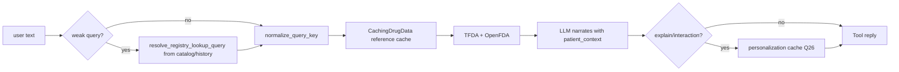

1. **`is_weak_grounding_query`** (`integrations/caching_drugs.py`) — rejects stopwords, "好", 1–2 char tokens before API/cache.  
2. **Reference cache** — `CachingDrugData` + `DrugCachesPort` / `supabase_drug_caches.py` (TTL read-through; keys from `drug_cache_keys.py` — today normalized **exact** user text; semantic keys are a [`TODO.md`](../TODO.md) item).  
3. **Grounding fetch** — TFDA + OpenFDA in parallel (`agents/tools/drug_lookup.py`).  
4. **Personalization cache** — per-patient composed replies; full behavior in **Q26**.  
5. **Compose** — `LLMPort.compose_reply` narrates around grounded text; interactions use `check_interactions_structured`.

### Q26. What is `drug_personalization_cache`? When does it hit, and how is it keyed?

**Answer.** MedBuddy uses **two** drug-related Postgres caches. They solve different problems:

| Cache | Table | Shared? | Stores |
|-------|--------|---------|--------|
| **Reference** | `drug_reference_cache` | All users | TFDA/OpenFDA label snippets (`CachingDrugData` read-through) |
| **Personalization** | `drug_personalization_cache` | Per `patient_id` | The **final patient-facing paragraph** after the LLM already composed an explain or interaction answer for **this** patient's de-identified context |

Personalization is **not** chat memory (**Q16**). It does not remember “what we talked about”; it reuses an expensive **explain / interaction** reply when the same patient asks again with the **same normalized words** and the **same med-list snapshot**.

**Only these tools use it:** `ExplainMedicationTool`, `InteractionCheckTool` (`agents/tools/drug_lookup.py`, `interaction_check.py`). Add/remove med, reminders, post-add compose, and health summary **do not** read or write this table.

---

#### Two-layer flow (reference + personalization)

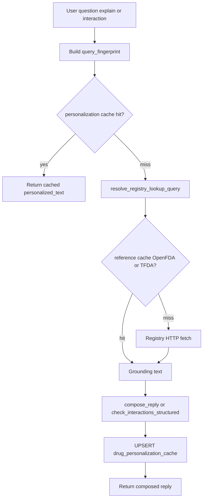

On a **hit**, the tool returns cached text immediately — no registry HTTP and no compose LLM for that tool (`metadata.cache_hit` in tests: `test_assistant_drug_cache.py`).

---

#### Cache key (`query_fingerprint`)

The DB column `query_fingerprint` is a **single string** built by `personalization_fingerprint` in `integrations/caching_drugs.py`. Lookup is **exact equality** on `(patient_id, query_fingerprint)` — Postgres does not re-hash at read time.

```text
{intent}:{normalized_query}:{ctx_hash}
```

Only the last segment is a cryptographic hash; the query segment is **normalized plaintext** (not hashed).

---

#### How hashing and normalization work (step by step)

**1. Intent prefix (plain text, not hashed)**

```python
intent.value   # e.g. "explain_medication" or "interaction_check"
```

**2. Query segment — `normalize_query_key` (not SHA-256)**

```python
def normalize_query_key(query: str) -> str:
    return " ".join(query.strip().casefold().split())
```

| Input | Output |
|-------|--------|
| `"  What is Metformin for?  "` | `"what is metformin for?"` |
| `"解釋　阿斯匹靈"` | lowercased/collapsed per Unicode `casefold` + whitespace rules |

Tools pass **`safe_text`** (PII redacted) into this step. The full question text remains readable in the fingerprint — only the **patient snapshot** is digested.

**3. Context segment — SHA-256 of `patient_context` (truncated)**

```python
med_h = hashlib.sha256(patient_context.encode("utf-8")).hexdigest()[:20]
return f"{intent.value}:{q}:{med_h}"
```

| Property | Value |
|----------|--------|
| Algorithm | SHA-256 over **UTF-8 bytes** of the entire `patient_context` string |
| Truncation | First **20 hex characters** (80 bits of digest) — keeps keys short; collision risk is negligible at pilot scale |
| Input string | Output of `patient_context_for_llm` → `build_patient_context_for_llm` for **this** tool call |

**What goes into `patient_context` (and therefore into the hash):**

| Block | Included when |
|-------|----------------|
| Preferred name directive | `preferred_name` set on profile |
| Profile signals | Age band, gender label, tokenized emergency-contact hints, condition summaries per tool |
| Profile gaps | Missing fields the model may ask about |
| Medication list | Names, dosage, schedule for every row on file |
| Upcoming doses (7-day window) | Materialized `dose_events` formatted in local time |
| Recent health-issue lines | Last N events when `include_recent_health_events=True` (default on `patient_context_for_llm`) |

**Tool difference (same meds, different hash):**

| Tool | `include_health_notes` on context | Effect on hash |
|------|-----------------------------------|----------------|
| `explain_medication` | `False` (default) | Coarse condition signals only |
| `interaction_check` | `True` | Full allergy/condition/history block in context string → **different `ctx_hash`** than explain for the same patient |

**Illustrative digest** (fake short context for readability; real contexts are longer):

```text
patient_context = "Address the user as May.\n\n…Medications:\n- metformin (500mg, BID)\n\n…"
utf8_bytes        = patient_context.encode("utf-8")
sha256_hex        = hashlib.sha256(utf8_bytes).hexdigest()
                  # e.g. "a3f91c2e8b4d1e90f6ab7c4e2d1f8e9b0c3a5d7e1f2a4b6c8d0e2f4a6b8c"
ctx_hash          = sha256_hex[:20]
                  # → "a3f91c2e8b4d1e90f6ab"

query_fingerprint = "explain_medication:what is metformin for?:a3f91c2e8b4d1e90f6ab"
```

**What is *not* in the fingerprint string:**

| Field | Behavior |
|-------|----------|
| `locale` | Not a separate fingerprint segment; may still change the hash indirectly because i18n **labels inside** `patient_context` differ by locale |
| Raw emergency phone numbers | Omitted from context (tokens like `[EMERGENCY_CONTACT_1]` only) |
| Conversation history | Not hashed — only current turn query text |
| Registry label text | Lives in `drug_reference_cache` under `normalize_query_key(drug_name)` only |

**Reference cache contrast** (`drug_reference_cache`): key is `(source, normalize_query_key(drug_name))` — **no SHA-256**, shared across all patients. Personalization adds the per-patient `ctx_hash` so two users asking the same words get different rows.

---

| Part | Mechanism | Example |
|------|-----------|---------|
| `intent` | Plain enum string | `explain_medication` vs `interaction_check` → different row |
| `normalized_query` | `normalize_query_key(safe_text)` | `"  Explain   Metformin  "` → `explain metformin` |
| `ctx_hash` | `sha256(patient_context_utf8).hexdigest()[:20]` | Any change to med list, doses block, or context blocks above → new hash |

**Code-shaped example** (illustrative hashes):

```text
# Patient on file: metformin 500mg BID only
patient_context ≈ "…Medications: metformin (500mg, BID)…Upcoming doses: …"

fp_explain = "explain_medication:what is metformin for?:a3f91c2e8b4d1e90f6ab"
fp_interact = "interaction_check:can i take metformin with aspirin?:a3f91c2e8b4d1e90f6ab"
#                                                                                    └── same ctx_hash, different intent prefix
```

**Privacy:** the fingerprint uses **redacted** `safe_text` (PII → `[…]`) and **de-identified** `patient_context_for_llm` (no raw emergency numbers in that block). Stored `personalized_text` can still echo the user's question — treat rows as sensitive ([`docs/privacy.md`](privacy.md)).

---

#### Example A — cache **hit** (second identical question)

**Setup:** User `U_line_abc` already has metformin on file. Three days ago they asked `What is metformin for?` — miss → LLM composed answer → row saved.

**Turn today — same words, same list:**

| Step | I/O |
|------|-----|
| User (raw) | `What is metformin for?` |
| `safe_text` | Same (no PII) |
| Fingerprint | `explain_medication:what is metformin for?:a3f91c2e8b4d1e90f6ab` (same `ctx_hash`) |
| DB lookup | `get_personalized_reply` → **hit**, `expires_at` still in future |
| Tool return | Cached paragraph verbatim — **no** OpenFDA fetch, **no** `compose_reply` |
| Chat | Orchestrator may still run one hop to wrap tone; explain tool did not call the LLM |

**Patient sees:** the same explanation as last time (until TTL expires or context hash changes).

---

#### Example B — cache **miss** (med list changed → automatic invalidation)

**Prior:** Cached answer for `explain metformin` with `ctx_hash` = `a3f91…` when only metformin was on file.

**User adds aspirin**, then asks again: `What is metformin for?`

| Step | Why |
|------|-----|
| `patient_context_for_llm` now includes **aspirin + metformin** | Full context string changes |
| New `ctx_hash` = `7c02e…` (≠ `a3f91…`) | Fingerprint mismatch |
| `get_personalized_reply` | **Miss** |
| Tool path | Fetch grounding → `compose_reply` → **upsert** new row |

The old row may still exist in Postgres until TTL, but it is never matched because the fingerprint includes the **current** context hash. No manual cache purge is required when meds change.

---

#### Example C — cache **miss** (paraphrase — limitation today)

| User message | Normalized key fragment | Hit? |
|--------------|-------------------------|------|
| `What is metformin for?` | `what is metformin for?` | — |
| `Explain metformin` | `explain metformin` | **No** — different normalized text |

Both can produce similar answers after an LLM call, but they are **two cache rows** today. Semantic / drug-entity keys are on the roadmap ([`TODO.md`](../TODO.md), [`docs/features.md`](features.md)).

---

#### Example D — `interaction_check` vs `explain_medication`

User on file: aspirin + metformin.

```text
User: "Can I take aspirin with metformin?"

Fingerprint: interaction_check:can i take aspirin with metformin?:<ctx_hash>
Tool:        check_interactions_structured (or compose_reply fallback)
Saved row:   intent = interaction_check, llm_meta.source = openfda | model id
```

A later `Explain aspirin` uses `explain_medication:explain aspirin:<ctx_hash>` — separate row even with the same `ctx_hash` tail.

---

#### Example E — PII in the question (redacted key, raw storage elsewhere)

```text
user_text (raw):     Explain metformin — my clinic number is 0912-345-678
safe_text (to LLM):  Explain metformin — my clinic number is […]
fingerprint uses:    explain_medication:explain metformin — my clinic number is […]:<ctx_hash>
conversation_turns:  stores the raw user line (Q15)
```

Two users with the same redacted question and identical de-identified context could theoretically share the same fingerprint shape, but rows are still **scoped by `patient_id`** — no cross-patient leakage.

---

#### What gets stored on upsert

`SupabaseDrugCaches.save_personalized_reply` (`integrations/persistence/supabase_drug_caches.py`):

| Column | Example |
|--------|---------|
| `patient_id` | UUID for `U_line_abc` |
| `query_fingerprint` | `explain_medication:what is metformin for?:a3f91c2e8b4d1e90f6ab` |
| `intent` | `explain_medication` |
| `personalized_text` | Full composed English/Zh reply |
| `locale` | `en` |
| `llm_meta` | `{"cached_turn": true, "source": "openfda"}` — or `tfda`, or model id when no registry hit |
| `medication_id` | Set when **exactly one** list name matches the query (`resolve_medication_id_for_personalization`); else `NULL` |
| `reference_cache_id` | Optional link to `drug_reference_cache.id` used for that compose |
| `expires_at` | `now + MEDBUDDY_DRUG_PERSONALIZATION_CACHE_TTL_HOURS` (default **72**; `0` = no expiry) |

**Weak queries** (`好`, `sure`, ≤2 ASCII chars) are rejected for **reference** lookup via `is_weak_grounding_query`; personalization still keys on whatever normalized text reaches the tool — orchestrator should not call explain with only stopwords.

---

#### Config and ops

| Env | Default | Effect |
|-----|---------|--------|
| `MEDBUDDY_DRUG_PERSONALIZATION_CACHE_TTL_HOURS` | `72` | Row ignored after `expires_at` |
| `MEDBUDDY_DRUG_REFERENCE_CACHE_TTL_HOURS` | `168` | Separate TTL for registry snippets |

`AppServices.drug_caches` is `None` in some mock-only setups — then tools skip cache I/O entirely. Production Supabase wiring sets `SupabaseDrugCaches`.

**Related:** reference cache and grounding policy **Q25**; post-add scan (not this table) **Q40**; per-call privacy **[`llm-context.md`](llm-context.md)** § Caching.

---

## Section 6b — Voice, LINE channel, adherence, and health records

### Q27. How do voice messages work (LINE and `/v1/app`)?

**Answer.** Both channels end on the **same text pipeline** (`run_assistant_text_turn` → `MedicationAgent.run`) — voice only changes how `user_text` is obtained and how the reply is rendered.

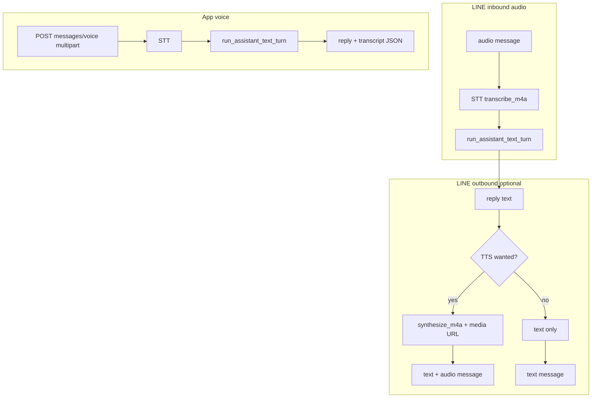

#### LINE inbound audio

| Step | What runs | LLM? |
|------|-----------|------|
| 1 | `handle_line_event` → `message.type == audio` | No |
| 2 | `send_chat_loading_indicator` (typing dots) | No |
| 3 | Download blob → `svc.stt.transcribe_m4a(..., language_code=locale)` | STT provider (Google or mock) |
| 4 | `_handle_user_message(..., user_text=transcript, inbound_was_audio=True)` | Same as text (**Q11**) |

STT failure → fixed `agent.generic_error` i18n (no assistant turn).

#### LINE outbound voice (optional)

Controlled by **`MEDBUDDY_LINE_VOICE_REPLIES`**:

| Value | Behavior |
|-------|----------|
| `off` | Text reply only |
| `audio_inbound` (default) | Text + **m4a** when user sent voice |
| `always` | Text + m4a on every reply |

When voice is wanted: `tts.synthesize_m4a` → store in `line_audio_blobs` → reply batch with text + `audio` message (`originalContentUrl` = `PUBLIC_BASE_URL` + `/v1/line/media/audio/{id}`). Requires **HTTPS** `PUBLIC_BASE_URL` so LINE can fetch the file. TTS failure → fall back to text only.

#### Mobile `/v1/app/messages/voice`

```http
POST /v1/app/messages/voice
Content-Type: multipart/form-data
file: <short recording>
```

**Out:** `{"reply":"…","transcript":"…","metadata":{}}` — STT on server, same assistant path; **no** server TTS (client may use expo-speech locally).

**Privacy:** transcript is stored as a normal user turn (raw in DB); classifier and orchestrator use **redacted** copies where applicable (**Q15**). `UPDATE_PROFILE` still pre-persists from raw text on voice turns (**Q32**).

---

### Q28. LINE follow, webhook delivery, and idempotency — what bypasses the assistant?

**Answer.** Not every LINE event runs `MedicationAgent`.

| Event | Path | Assistant? |
|-------|------|------------|
| **`follow`** | `get_or_create_user` → optional `get_user_profile` → map LINE `language` → `patch_user_profile({locale})` → i18n `line.follow_welcome` | **No** `run_assistant_text_turn` |
| **`message` text/audio** | Loading indicator → STT if needed → `run_assistant_text_turn` | **Yes** |
| **`postback`** | Logged; unhandled in prototype | No |
| Other types | Ignored | No |

**Webhook HTTP:** `POST /v1/line/webhook` verifies `X-Line-Signature` (skipped only when secret empty + mock integration). Handler parses events and schedules each on FastAPI **`BackgroundTasks`** so LINE gets a fast `200` while work continues async.

**Retry idempotency:** when **`REDIS_URL`** is set, `channels/line/idempotency.py` records `webhookEventId` with a short TTL — duplicate LINE retries for the same event are skipped. Without Redis, every retry is processed (risk of duplicate replies in dev).

**Contrast text path:** identical assistant logic to **`POST /v1/app/messages`** after `user_key` mapping (`LINE userId` vs `X-App-User-Id`).

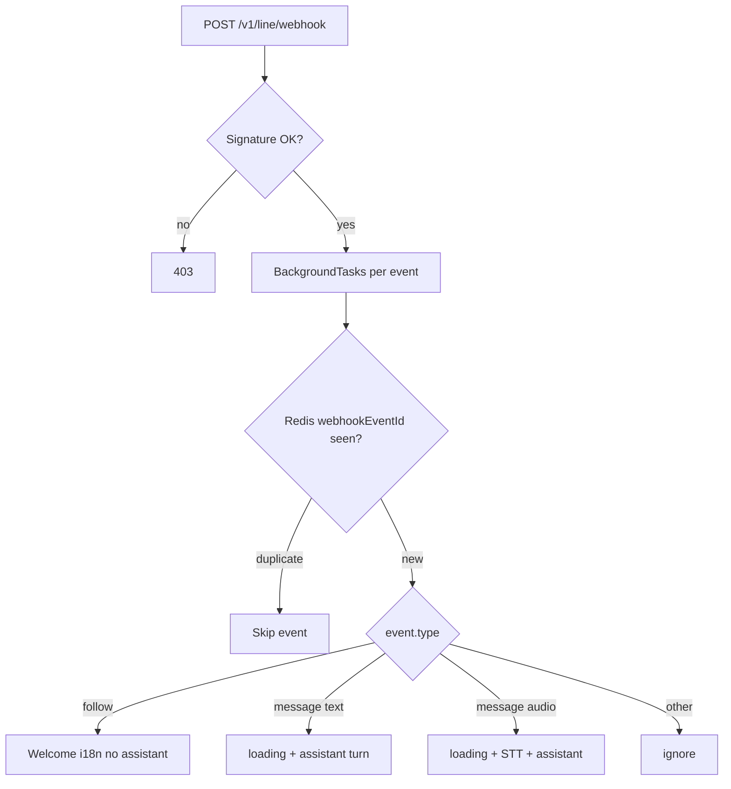

---

### Q29. How does dose adherence work — taken, missed, and pending clarification?

**Answer.** Adherence is **`dose_events` row state**, not chat memory. Tools update rows; reminders read them for idempotency (**Q21**).

#### `dose_events` fields (simplified)

| Field | Meaning |
|-------|---------|
| `scheduled_at` | When the dose was due |
| `reminder_sent_at` | Primary LINE push succeeded |
| `reminder_nudge_count` / `last_nudge_at` | Follow-up nudges (**Q18**) |
| `taken_at` | Patient marked taken |
| `missed_at` | Patient or reconcile marked missed |

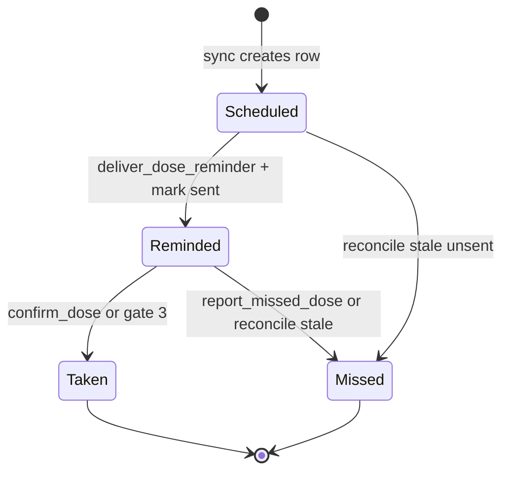

#### Tools

| Tool | Typical user line | Effect |
|------|-------------------|--------|
| **`confirm_dose`** | “I took it”, “吃了”, “mark morning meds done” | `mark_dose_events_taken` on pending candidates; optional **adherence note** on the row |
| **`report_missed_dose`** | “I forgot my pill” | `mark_pending_doses_missed` |
| **Gate #3** (pending clarification) | “1”, “all” after numbered dose list | Resolves `DoseClarificationPending` without orchestrator (**Q13**) |

**`confirm_dose` details** (`agents/tools/confirm_dose.py`):

- Lists **pending dose candidates** (unsent or recently reminded rows in a time window).
- If exactly one candidate was **nudged within the last 60 minutes**, auto-confirms that row (user said “ok” after reminder).
- If multiple candidates, sets `pending_agent_clarification` with numbered options → next turn hits gate **#3**.
- Classifier slots **`record_pending_dose_as_taken`** and **`dose_adherence_note`** are merged with planner JSON in **`_merge_confirm_dose_payload`** when the orchestrator calls `confirm_dose`.

**Example — “I took my morning aspirin”:**

```text
LLM #1 intent: confirm_dose, record_pending_dose_as_taken=true
Orchestrator: confirm_dose tool → taken_at set on matching dose_event(s)
Reply: localized confirmation (no new reminder)
```

**Example — reconcile stale row (**Q22**):** due row >48h, never sent → `missed_at` set; patient is **not** pushed days late.

---

### Q30. How is the doctor-ready health summary built?

**Answer.** Two entry points share **`GenerateHealthSummaryTool`** / `LLMPort.generate_health_summary`:

| Entry | Path |
|-------|------|
| Chat | Orchestrator calls tool `generate_health_summary` when user asks for a recap |
| Mobile | `GET /v1/app/summary` → same tool, returns structured JSON for the Expo screen |

#### Inputs assembled server-side

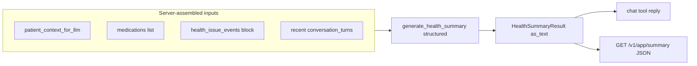

| Source | Cap | Redaction |
|--------|-----|-----------|
| `patient_context_for_llm` (`include_health_notes=True`) | De-identified profile + meds + upcoming doses | Yes — standard LLM context |
| `medications` list | All on file | Names/doses in prompt |
| `health_issue_events` | `MEDBUDDY_HEALTH_ISSUE_SUMMARY_EVENTS_LIMIT` (default **60**) | Formatted lines from DB (routing intent + message excerpt) |
| `conversation_turns` | Last **30** loaded; **last 20** in prompt | **Unredacted** in summary prompt today — see [`llm-context.md`](llm-context.md) |

**LLM output:** structured `HealthSummaryResult` (medications, concerns, suggested questions) → `summary.as_text()` for chat reply.

#### `export_health_journal` tool

Separate tool for a patient-visible **journal export** string (or file-oriented copy) — orchestrator-invoked; not the same HTTP route as `/v1/app/summary`. See `agents/orchestrator.py` `export_health_journal` arm.

#### `lookup_health_history` tool

Reads recent **`health_issue_events`** for in-chat Q&A without generating a full summary — lighter than `generate_health_summary`.

**Privacy note:** summary is the highest-risk LLM call for raw chat exposure; prompt instructs the model not to output PII, but operators should treat output as sensitive ([`docs/privacy.md`](privacy.md)).

---

### Q31. How do side-effect reports relate to dose logging?

**Answer.** Three related paths — different jobs:

| Path | When | What it does |
|------|------|----------------|
| **`report_side_effects` tool** | User describes symptoms they blame on a med | Grounding + empathetic compose (`side_effects.py`); may log **`health_issue_events`** if intent allowlisted |
| **`confirm_dose` tool** | User says they **took** a dose (or classifier sets adherence slots) | Updates `dose_events.taken_at` / notes |
| **Classifier combo** | “I took metformin and feel nauseous” | Intent often **`report_side_effects`** with **`record_pending_dose_as_taken=true`** and **`dose_adherence_note`** = symptom text — stores note on dose row **and** gives advice |

**Orchestrator merge:** when the planner calls `confirm_dose`, **`_merge_confirm_dose_payload`** ORs tool JSON with classifier adherence fields so either can supply `record_pending_dose_as_taken` / `dose_adherence_note`.

**Mechanical follow-up:** if the planner batch includes **`report_side_effects`** but **not** `confirm_dose`, while interpretation still has adherence slots, the loop may inject an extra `confirm_dose` tool message for the model (see `orchestrator.py`) — prefer explicit `confirm_dose` in the same turn when adherence matters.

**Not the same as:** **`emergency`** (fixed copy, **Q13**), **`explain_medication`** (hypothetical side-effect profile), **`check_drug_condition_interactions`** on post-add (condition list, **Q40**).

---

### Q32. How are health conditions and app onboarding stored vs chat profile updates?

**Answer.** Structured health data and demographics use **different tables and tools**.

#### `patient_health_conditions` + `manage_health_conditions` tool

| | |
|--|--|
| **Stores** | Allergies, chronic conditions, history (`category`, `name`, `severity`, `notes`, `action` add/remove) |
| **Tool** | `manage_health_conditions` — planner passes structured items; may call `extract_health_conditions` on free text |
| **Not via** | `update_profile` / `extract_profile_patch` (system prompt forbids diagnoses in profile patch) |

**Example:** “I’m allergic to penicillin” → orchestrator → `manage_health_conditions` → row in `patient_health_conditions` → appears in LLM context (coarse or full block depending on `include_health_notes`).

#### `POST /v1/app/onboarding` (Expo)

| | |
|--|--|
| **When** | First-run app wizard — **before** or alongside chat |
| **Writes** | `save_onboarding_profile`: `preferred_name`, age, gender, emergency contacts, optional `health_conditions[]`, `timezone`, `locale`, sets `onboarding_completed_at` |
| **Bypasses** | Assistant — direct `UserDataPort` |

#### Chat profile capture

| Mechanism | Fields |
|-----------|--------|
| **`UPDATE_PROFILE` intent** | Pre-orchestrator `extract_profile_patch` + `patch_user_profile` (name, age, gender, locale, timezone, emergency contacts) |
| **Gate #6** | Emergency-contact lines with phone patterns → profile before tools |
| **Locale gate #1** | “Speak English” → `locale` patch |

**Example contrast:**

```text
App onboarding:  POST /v1/app/onboarding { "preferred_name": "May", "health_conditions": [...] }
Chat:            "call me May, I'm 72" → UPDATE_PROFILE → same patients row, no onboarding flag required
```

**Profile-completion nudge (**Q33**)** reminds chat users to fill gaps onboarding may have skipped.

---

### Q33. What is the profile-completion nudge?

**Answer.** After the orchestrator returns, `append_profile_completion_nudge_if_due` may append a short i18n footer (`profile.completion_nudge_footer`) when:

1. **`MEDBUDDY_PROFILE_COMPLETION_NUDGE_EVERY_N_USER_TURNS`** > **0** (default **12**; **`0`** disables), and  
2. `format_profile_gaps` still lists missing dimensions (name, age, gender, emergency contact, or zero active health conditions), and  
3. User turn index matches cadence: `(turn_index - stable_phase(user_key)) % N == 0` where `stable_phase` is `sha256(user_key)[:8] mod N` — spreads nudges across users.

**Does not run** on early-exit paths that return before orchestrator (emergency, pending yes/no, etc.) unless those paths already returned a full reply — nudge is wired only on the main orchestrator path in `MedicationAgent.run`.

**Example:** User on turn 12 with no emergency contact saved gets the footer after an unrelated “what is aspirin for?” answer.

---

### Q34. How does the server choose which drug name to send to OpenFDA/TFDA?

**Answer.** Registry lookup uses **`resolve_registry_lookup_query`** (`application/drug_grounding_query.py`) — not raw user text when that text is weak.

**Resolution order (simplified):**

1. Tool args `medication_id` / `drug_query` if present and valid.  
2. If normalized user text is **not** weak (`is_weak_grounding_query`) — use it.  
3. Else match medication **catalog names** against recent **assistant** turns (last ~3), prefer latest mention.  
4. Else small regex fallbacks in assistant text (e.g. “vitamin c”).  
5. If still empty — no registry fetch (LLM-only reply).

**Weak queries blocked** (`integrations/caching_drugs.py`): empty, stopwords (`sure`, `好`, `thanks`, …), very short ASCII tokens (except digit-only like `500`).

**Example A — follow-up “sure” after explain:**

```text
Assistant (prior): "…aspirin is used for …"
User: "sure"
registry_q → "aspirin"   # from assistant history, not the word "sure"
```

**Example B — explicit ask:**

```text
User: "what are the side effects of metformin?"
registry_q → "metformin"   # normalized user text
```

Same resolved string feeds **`CachingDrugData`** reference cache keys (`normalize_query_key`) and explain/interaction tools (**Q25–Q26**).

---

### Q35. How are per-medication reminder preferences stored? What does `disable_reminders` do?

**Answer.** Schedule lives on each **`medications`** row under **`raw_metadata.reminder`** (`reminders/prefs.py`):

| Field (conceptual) | Role |
|------------------|------|
| `daily_local_hhmm` / `daily_local_hhmm_list` | Local times for daily materialization |
| `horizon_days` | How far ahead to build `dose_events` (finite meds) |
| `materialize_daily_reminders` | One-off vs recurring |
| `first_reminder_in_minutes` | One-shot offset (e.g. “in 5 minutes”) |

**`sync_upcoming_dose_events`** reads these prefs + `is_indefinite` (**Q19**) to create/replace future **`dose_events`**, then **`enqueue_reminder_jobs`** registers arq sends.

#### `disable_reminders` tool

| Planner arg | Effect |
|-------------|--------|
| `scope: "all"` | `bulk_disable_reminders` — clears reminder prefs on **all** meds for user |
| `scope: "single"` + `medication_id` | Disables one med |

Then **`sync_and_enqueue_reminders`** — future rows for disabled meds drop out; already-sent reminders are not unsent.

**Example:** “stop reminding me about aspirin” → orchestrator resolves catalog id → single-med disable → sync → no new jobs for aspirin doses.

---

### Q36. What are just-in-time medication education cues?

**Answer.** Short **purpose / refresher** copy so users understand *why* a med is on their list — without a separate “education mode” ([`features.md`](features.md) §4.13).

| Hook | Behavior |
|------|----------|
| **Post `add_medication` / `update_medication`** | Tool metadata may include purpose from `purpose_from_grounding`; reply can include one-line cue + optional CTA to ask for side effects / interactions |
| **`list_medications`** | Compact purpose tags when grounding summary exists |
| **Reminder delivery** | After primary `reminder.line_push`, optional **refresher CTA** only if cadence gate passes (`deliver.py` — sha256 day-bucket per `user_key` + med name, default every N days via settings) |

**Safety:** copy stays non-diagnostic; weak grounding → uncertainty language + “ask pharmacist/clinician.”

**Example reminder append (English):** “Need a quick refresher on what this medicine is for?” — user can reply and trigger **`explain_medication`** on the next turn.

---

### Q37. How do you switch between Gemini and OpenAI?

**Answer.** Single env **`LLM_PROVIDER`** (`gemini` | `openai`, default **`gemini`**) parsed in `config.py`. `container.build_app_services` constructs exactly one adapter:

| Provider | Module | API key env |
|----------|--------|-------------|
| `gemini` | `integrations/llm/gemini_llm.py` | `GEMINI_API_KEY` |
| `openai` | `integrations/llm/openai_llm.py` | `OPENAI_API_KEY` |

Both implement **`LLMPort`** — same method names, shared prompts (`intent_classification_prompt.py`), shared tool schemas (`AGENT_TOOLS_OPENAI` consumed by both). Agent code never branches on provider.

**Production:** `MEDBUDDY_INTEGRATION=production` requires the matching API key at startup (`ConfigError` if missing).

**Tests:** `integrations/mocks/llm.py` — `MockLLM` regardless of env unless integration tests opt into real provider.

**Example:** set `LLM_PROVIDER=openai` + `OPENAI_API_KEY=sk-…` → next deploy uses OpenAI for classify, orchestrator, compose, summary — no changes under `agents/`.

---

### Q38. What are intent hooks?

**Answer.** A small **pilot extension registry** (`extensibility/intent_hooks.py`) checked at gate **#7** in `MedicationAgent.run` — **after** emergency/off-topic, **before** orchestrator.

```python
register_intent_hook(async def my_hook(intent, svc, user_text) -> str | None: ...)
```

| | |
|--|--|
| **Returns** | Non-`None` str → that string becomes the assistant reply (early exit, same as other gates) |
| **Returns** | `None` → try next hook |
| **Production default** | Empty list — no hooks registered |

**Use case:** experiments or partner pilots that need a deterministic reply for a specific `Intent` without adding a full orchestrator tool. **Not** a replacement for tools — prefer `execute_agent_tool` for anything that mutates meds or dose rows.

**Tests:** `clear_intent_hooks()` between cases.

---

### Q39. What gets logged — and what is deliberately omitted?

**Answer.** Prototype logging favors **operational signals without PHI in log lines**.

| Logged (typical INFO) | Not logged by default |
|------------------------|------------------------|
| `user_key`, intent name, med count, cache hit/miss, tool name | Full user message text |
| Redacted **preview** (`redact_pii_text` + truncate) in some LINE/agent paths | Full LLM prompts / completions |
| `request_id` middleware correlation | Raw emergency contact values in debug |

**`LOG_LEVEL=DEBUG`:** may log patient context bodies in `build_patient_context_for_llm` — avoid in production ([`tdd-extended.md`](tdd-extended.md) §10.7).

**Retention jobs:** `POST /internal/conversations/purge` (cron secret) deletes old **`conversation_turns`** per **`MEDBUDDY_CONVERSATION_RETENTION_DAYS`** — does not purge meds, `dose_events`, or `health_issue_events` (**Q16**).

**Observability roadmap:** Prometheus/OTel mentioned in **Q55** / [`TODO.md`](../TODO.md) — not full metrics in prototype.

**Health issue logging policy:** `MEDBUDDY_HEALTH_ISSUE_LOG_INTENTS` controls which classifier intents create **`health_issue_events`** rows (`application/health_events/health_issue_event_log.py`); vitals use structured `log_vital` tool rows separately.

---

### Q40. What's the *post-add interaction crosscheck* and why is it separate from the chat tool?

**Answer.** Two prompts, two call sites:

* **Chat `interaction_check`** — user explicitly asks; tool composes and replies.  
* **Post-add crosscheck** — runs automatically in `application/post_add_medication_reply.build_post_add_patient_reply` when the user **already had ≥1 other medication** before this add (`LLMPort.post_add_interaction_crosscheck`, when implemented). Framing is supportive (user did not ask); appended via `medication.post_add_interaction_bridge` i18n. Separate from **`check_drug_condition_interactions`** in `persist_medication_add_from_draft`, which flags drug–condition concerns when active health conditions exist on file.

Splitting keeps each prompt focused and avoids overloading the chat tool schema.

---

## Section 7 — Privacy, Security, i18n, Testing

### Q41. What's the privacy boundary?

**Answer.** Three rules ([`docs/privacy.md`](privacy.md)):

1. **Storage may be raw** — turns stored as typed for product continuity.  
2. **Third-party LLM outbound is redacted** — `redact_pii_text` / `redact_conversation_turns_for_llm`.  
3. **Documented exceptions** — e.g. `patient_context_for_llm(include_health_notes=True)` only for specific tools (`add_medication` post-save, `interaction_check`, side effects, etc.) — see [`docs/llm-context.md`](llm-context.md).

**Logs:** `PhiRedactFilter` (`privacy/log_filter.py`); persona bodies gated to DEBUG. [`.cursor/rules/backend-standards.mdc`](../.cursor/rules/backend-standards.mdc): no secrets in source, no logging tokens or auth headers, LINE signature verification, no weakened auth for debug shortcuts.

### Q42. How is mobile auth done?

**Answer.** `channels/api/auth.require_mobile_auth`:

* `Authorization: Bearer <MEDBUDDY_MOBILE_BEARER_TOKEN>` — required when set; in real production integration, unset token → **503** (fail closed). `secrets.compare_digest` for the bearer.  
* `X-App-User-Id` — must match `^[a-zA-Z0-9:_.-]{4,128}$`; else 400 + structured `code`.

Mock dev mode may omit bearer when the token env is unset ([`apps/backend/README.md`](../apps/backend/README.md)).

### Q43. How are webhooks, cron routes, and media protected?

**Answer.**

* **LINE** — `X-Line-Signature` HMAC; 401 on failure.  
* **Cron** — `POST /internal/reminders/reconcile` and `POST /internal/conversations/purge` require `X-Cron-Secret` == `MEDBUDDY_CRON_SECRET` (`secrets.compare_digest`). Purge deletes turns older than `MEDBUDDY_CONVERSATION_RETENTION_DAYS` (default 90).  
* **LINE audio** — `GET /v1/line/media/audio/{id}` serves ephemeral m4a blobs (random ids, not patient identifiers).  
* **Tracing** — `RequestIdMiddleware` sets `X-Request-Id`; `request_id` contextvar propagates into arq jobs for log correlation.

### Q44. How is i18n handled?

**Answer.** **Backend:** `locales/{zh-TW,en}.json`, `core/i18n.t(key, locale, **fmt)`; zh-TW fallback. `Locale` enum in `config.py`. Per-user `patients.locale`; `effective_user_locale`; app hints via `X-MedBuddy-Locale` / `Accept-Language` on `GET /v1/app/me`. LLM `_common.language_lock` in prompts.

**Frontend:** i18next + `locales/{zh-TW,en}.json`; Settings tab persists choice to AsyncStorage; device locale seeds first run only.

### Q45. How do you test without hitting Gemini, OpenAI, LINE, Supabase, Redis, or Google?

**Answer.** Three layers:

1. **Mock adapters** — `integrations/mocks/` for every port (`MockLLM`, `MockUserData`, `MockLineClient`, …). `make be-dev-mock`.  
2. **`make_mock_settings(**overrides)`** — in `apps/backend/tests/helpers.py` for test `Settings`.  
3. **Layered tests** under `apps/backend/tests/medbuddy/` — mirrors `src` layout: `application/` (including `pending/`, `profile/`, `health_events/`), `agents/tools/`, `channels/`, `integrations/`, `reminders/`, `privacy/`, `config/`, `llm/`. `pytest-asyncio` (`asyncio_mode = auto`).

Run: `make be-test` or `make be-check` (ruff + black + tests). CI: [`.github/workflows/ci.yml`](../.github/workflows/ci.yml).

---

## Section 8 — Design Choices & Tradeoffs

### Q46. Why FastAPI now and Go later? Why not just start in Go?

**Answer.** Prototype job: validate product behavior — Python shortens the loop (google-genai, openai, linebot, supabase-py, arq). Once agent design is stable, **runtime** swaps via `protocols/` ([`docs/tdd.md`](tdd.md) §8.1, [`docs/go-port-mapping.md`](go-port-mapping.md): `Protocol → interface`, `@dataclass → struct`, `async def → context.Context`, etc.).

### Q47. Why an LLM tool-calling loop instead of intent → handler dispatch?

**Answer.** Both exist. `interpret_user_turn` drives **fast paths** (emergency, off-topic, pending, locale). The tool loop handles bundled requests ("add aspirin and remove tylenol"), shared patient context, and new behavior via new tools without retraining a classifier. Profile updates from chat go through **`update_profile` tool** (with `UPDATE_PROFILE` intent pre-patching demographics before the loop when the classifier fires that intent).

### Q48. Why structured outputs (Pydantic schemas) for so many LLM calls?

**Answer.** Type safety — `MedicationExtraction`, `IntentClassification`, `InteractionCheckResult`, `HealthSummaryResult`, `VitalLogExtraction`, etc. (`llm/schemas.py`) feed Gemini `response_schema=` and OpenAI `response_format`. Failed parses fall back safely (`turn_interpretation_on_parse_failure`) rather than crashing. `strip_json_fence` exists for fence-stripping edge cases only.

### Q49. Why a `core/` package separate from `models/`?

**Answer.** `models/domain.py` = product nouns (`Intent`, `MedicationDraft`, …). `core/` = mechanics (`i18n`, `locale`, `timezone`, `errors`, `logging`, `request_id`). Avoids circular imports: `core/i18n` must not depend on `models/`.

### Q50. Why split Supabase persistence into mixins?

**Answer.** Former monolith was unwieldy; split into `SupabaseProfileMixin`, `SupabaseMedicationMixin`, `SupabaseDoseEventMixin`, plus `SupabaseConversationStore` — re-exported as one `SupabaseUserData(..., UserDataPort)` from `supabase_stores.py`. Go port maps to **struct embedding** ([`docs/go-port-mapping.md`](go-port-mapping.md)).

### Q51. Why a separate `application/` layer between `channels/` and `agents/`?

**Answer.** Not everything is "let the LLM choose":

* **Pending resolvers** (`application/pending/`)  
* **Health events** (`application/health_events/`)  
* **Profile / emergency contacts** (`application/profile/`)  
* **Drug grounding helpers**, **patient LLM context**  
* **Post-add medication reply** — shared by `add_medication` and pending med-add confirm

In `agents/` → couples non-LLM logic to the loop; in `channels/` → duplicates LINE and API.

### Q52. What was a subtle bug you hardened against, and how?

**Answer.** Examples with explicit guards:

* **"sure" hitting OpenFDA** — `is_weak_grounding_query` + `resolve_registry_lookup_query` (**Q34**).  
* **Profile lost on voice turns** — `UPDATE_PROFILE` persists `extract_profile_patch` before orchestrator; tools omitted so the planner cannot skip the save.  
* **Stale dose rows after chat** — `patient_context_for_llm(sync_dose_events_first=False)` by default; only `list_upcoming_doses` re-syncs.  
* **Double emergency primaries** — post-write step forces single `is_primary` on latest `updated_at` contact.  
* **Double LINE reminder push** — `try_mark_reminder_sent` conditional update.

### Q53. If you had to add a new channel — say WhatsApp — what would change?

**Answer.** New `channels/whatsapp/` that: (1) verifies WhatsApp signature, (2) maps webhook → `user_key` + text, (3) calls `run_assistant_text_turn`, (4) sends `turn.reply` via a new `MessagingPort` (or generalized port family). Wire adapter in `container.build_app_services`. **No changes** to `agents/`, `application/`, prompts, tools, reminders, privacy — if the channel uses the shared entry point.

### Q54. What's on the production-readiness TODO?

**Answer.** From [`TODO.md`](../TODO.md) — **done:** shared assistant, Supabase, Redis/arq reminders, Expo ↔ `/v1/app`, doctor summary, post-add interaction scan, chronic resync, conversation purge cron, PHI log redaction, `request_id`, CI `make be-check`. **Open:** production integration flags, Prometheus/OTel dashboards and alerts, semantic drug-cache keys, JWT/session auth for mobile, EAS production builds, CORS/gateway tuning, Go/Fiber migration, pilot MAU cost gates. Observability foundation is in place; full metrics stack is gated on staging ([`TODO.md`](../TODO.md) §Observability).

### Q55. If you had to defend one architectural decision, which one and why?

**Answer.** **The `protocols/` ↔ `integrations/` seam plus `AppServices` DI.** Upfront ceremony (one Protocol per port, mock per integration) pays off across tests without API keys, one-line LLM provider swap, mechanical Python→Go port, net-additive channels, and domain code that never imports vendor SDKs. Most fixes stay in `application/` or `agents/` — the seam contains blast radius.
