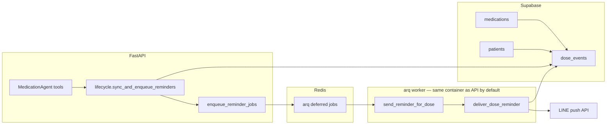

# MedBuddy — LINE dose reminders (prototype)

This document describes **proactive LINE push** reminders for scheduled medication doses: data model, job queue, configuration, and operations. It complements [`apps/backend/README.md`](../apps/backend/README.md) (env tables, deploy) and [`docs/use-cases.md`](use-cases.md) (assistant flows).

## What it does

- After a user **adds**, **updates**, **removes**, **clears all medications**, or **disables reminders** (bulk) via the assistant orchestrator tools, the backend **rebuilds** upcoming rows in **`dose_events`** and, when **`REDIS_URL`** is set, **enqueues** [arq](https://arq-docs.helpmanual.io/) jobs so each row triggers a **LINE Messaging API push** near **`scheduled_at`** (UTC).
- For **chronic / indefinite-duration** medications (`medications.is_indefinite = true` — hypertension, statins, thyroid replacement, etc.) the same rolling-window architecture is kept full forever by **two** refill paths: a daily arq cron (`resync_chronic_meds_cron`, default **03:15 UTC**) and a delivery-time safety net inside `deliver_dose_reminder` that fires when the just-pushed med has fewer than **`MEDBUDDY_CHRONIC_DELIVERY_TOPUP_THRESHOLD`** (default **3**) future doses left.
- The push text is localized under **`reminder.line_push`** in `apps/backend/src/medbuddy/locales/` (`zh-TW`, `en`).

## What it does *not* do (v1)

- `medications.schedule` itself is not parsed into clock times. Reminder timing comes from structured reminder metadata plus defaults: one or more local `HH:MM` times (when extracted) or `MEDBUDDY_REMINDER_DEFAULT_LOCAL_TIME` (`09:00` by default), interpreted in **`patients.timezone`**. The window depth is **`MEDBUDDY_REMINDER_HORIZON_DAYS`** (default **14**) calendar days per medication for finite meds; for `is_indefinite = true` meds the same horizon window is **continuously refilled** instead of expiring, so reminders run until the user explicitly removes the row or disables reminders.
- **Standalone HTTP app** local notifications are **not** implemented here; only **LINE push** when the user key is a LINE `userId` stored as `patients.external_user_id`. (A reference **Expo** client is documented in [`frontend-expo.md`](frontend-expo.md) — it does not change reminder delivery.)
- **Rich messages** (Flex) and **postback** “mark taken” are out of scope for this slice.

## Architecture



1. **`UserDataPort.sync_upcoming_dose_events`** deletes future **`dose_events`** for the patient and inserts new rows (one or more instants per medication per day depending on reminder metadata, skipping instants already in the past).
2. **`enqueue_reminder_jobs`** schedules **`send_reminder_for_dose`** with **`_defer_until = scheduled_at`** when arq is installed and **`REDIS_URL`** is non-empty.
3. The **worker** loads **`AppServices`** (same wiring as the API), runs **`get_dose_event_for_reminder`**, sends **`push_message_batch`**, then **`try_mark_reminder_sent`** so retries and orphans do not double-notify.

## Chat: “what’s next” without a push

The assistant **`upcoming_doses`** intent (`ListUpcomingDosesTool`) and the LLM **`patient_context_for_llm`** block read the **same** **`dose_events`** rows (after **`sync_upcoming_dose_events`**) to answer time-ordered questions (“later today,” “this week”) in **`patients.timezone`**. That is separate from LINE push delivery but uses one calendar source of truth.

## Pending reminder-horizon confirmation behavior

When a **finite** medication is saved with `needs_horizon_confirmation=true`, the assistant stores a pending follow-up in `patients.pending_agent_clarification` (`ReminderHorizonPending`). A later user message like `7 days` or `2 weeks` resolves that state and updates reminder metadata under `medications.raw_metadata.reminder`:

- `needs_horizon_confirmation=false`
- `materialize_daily=true`
- `horizon_days=<parsed_days>`

The resolver persists this metadata via `merge_medication_raw_metadata(...)` and only clears pending state after a successful write, then calls `sync_and_enqueue_reminders`. This ordering prevents false success messages where horizon appears confirmed but `dose_events` were not actually materialized.

**Chronic / indefinite medications skip this prompt entirely.** When the LLM extraction sets `MedicationExtraction.is_indefinite=true` (chronic phrasing such as *"long-term"*, *"every day from now on"*, *"長期"*, *"終身"*, *"慢性病用藥"*), `medication_draft_from_extraction` forces `needs_horizon_confirmation=false` and `materialize_daily_reminders=true`, drops `reminder_horizon_days`, and the post-save reply uses the dedicated `llm.added_indefinite` locale string instead of "I'll remind you for N days." The rolling-window refill mechanisms below take over from there.

## Chronic / indefinite-duration medications

`medications.is_indefinite = true` marks a lifelong medication. The materializer (`sync_upcoming_dose_events`) is unchanged — it always rebuilds the next **`MEDBUDDY_REMINDER_HORIZON_DAYS`** of `dose_events` for the patient. To keep that window full forever, two mechanisms top it up:

1. **Daily cron (primary path).** `medbuddy.reminders.worker.WorkerSettings.cron_jobs` registers `resync_chronic_meds_cron`, which calls `medbuddy.reminders.chronic_resync.resync_all_indefinite_patients(svc)`. The job:
   - reads **`UserDataPort.list_patients_with_indefinite_medications()`** (Supabase: `select external_user_id from medications where is_indefinite = true`, distinct; backed by the partial index `medications_is_indefinite_idx`);
   - calls `sync_and_enqueue_reminders(svc, user_key)` for each — the same hook used after a medication CRUD, so all materialization + enqueue logic stays in one place;
   - logs per-patient failures and continues to the next user (one patient's outage does not stall the batch).

   Schedule defaults to **03:15 UTC** and is configurable via `MEDBUDDY_CHRONIC_RESYNC_CRON_HOUR_UTC` / `MEDBUDDY_CHRONIC_RESYNC_CRON_MINUTE_UTC`.

2. **Delivery-time safety net.** Inside `reminders.deliver.deliver_dose_reminder`, after a successful push and `try_mark_reminder_sent`, the worker calls `_maybe_topup_chronic_med(svc, payload)` for indefinite meds. That helper invokes `count_future_dose_events(medication_id)` and, if the remaining count is **below `MEDBUDDY_CHRONIC_DELIVERY_TOPUP_THRESHOLD`** (default **3**), runs `sync_and_enqueue_reminders` for the user. This guarantees the window is refilled even if the cron has not yet fired (e.g. on a fresh deploy or after Redis downtime).

The `DoseEventReminderPayload` carries `medication_id` and `medication_is_indefinite` so the worker can make the top-up decision without an extra round trip. The same payload is constructed by both the Supabase and mock adapters of `get_dose_event_for_reminder` / `get_dose_event_for_nudge`.

## Schema (Supabase)

Defined and extended in [`apps/backend/supabase/schema.sql`](../apps/backend/supabase/schema.sql):

| Object | Purpose |
|--------|---------|
| **`patients.timezone`** | IANA name for daily reminder clock and LINE **`time_local`** in push copy (DB default `Asia/Taipei`). **Set by:** Postgres default on **`INSERT`** (LINE users without standalone onboarding); **`POST /v1/app/onboarding`** optional **`timezone`** (HTTP clients typically send device IANA); **`patch_user_profile`** with **`timezone`** for later changes (e.g. travel). |
| **`medications.is_indefinite`** | `boolean not null default false`. Marks chronic / lifelong meds; suppresses the "how many days?" follow-up at save time and opts the row into the daily cron + delivery-time top-up refill paths. Partial index **`medications_is_indefinite_idx`** (`where is_indefinite`) supports the cron's distinct-patient scan. |
| **`dose_events.scheduled_at`** | When the dose is due (timestamptz, stored in UTC). |
| **`dose_events.taken_at`** | Optional adherence field (not required by the reminder job). |
| **`dose_events.reminder_sent_at`** | Set after a successful push; idempotency / reconcile. |

Apply new columns on existing projects via the same file’s **`ALTER TABLE ... ADD COLUMN IF NOT EXISTS`** statements.

## Configuration

| Variable | Role |
|----------|------|
| **`REDIS_URL`** | Redis DSN for arq (API **enqueue** + worker **consume**; main **`Dockerfile`** runs both in one container when set). |
| **`MEDBUDDY_REMINDER_DEFAULT_LOCAL_TIME`** | `HH:MM` **local** time (default `09:00`) in each patient’s **`patients.timezone`**. |
| **`MEDBUDDY_REMINDER_HORIZON_DAYS`** | Days ahead to materialize (default **14**, max **90** in settings). Also the depth that the chronic resync cron keeps full for `is_indefinite` meds. |
| **`MEDBUDDY_CHRONIC_RESYNC_CRON_HOUR_UTC`** | Hour-of-day in UTC for the daily chronic-med resync cron (default **3**, range **0–23**). |
| **`MEDBUDDY_CHRONIC_RESYNC_CRON_MINUTE_UTC`** | Minute-of-hour in UTC for the chronic resync cron (default **15**, range **0–59**). |
| **`MEDBUDDY_CHRONIC_DELIVERY_TOPUP_THRESHOLD`** | Trigger threshold for the delivery-time safety net on indefinite meds — when fewer than this many future `dose_events` remain for the just-fired med, `deliver_dose_reminder` calls `sync_and_enqueue_reminders` (default **3**, range **0–100**; `0` disables the top-up). |
| **`MEDBUDDY_CRON_SECRET`** | Secret for **`POST /internal/reminders/reconcile`** (**`X-Cron-Secret`** header). |

There is **no** global reminder timezone env var — **`patients.timezone`** in Postgres is the source of truth for local clock and LINE push copy.

**Dependencies:** install **`[reminders]`** (`arq`), included in the repo-root **Dockerfile** (`pip install ".[llm,supabase,reminders]"`).

## Processes

| Process | Command / image |
|---------|-------------------|
| **API + reminder worker (default)** | Repo-root [`Dockerfile`](../Dockerfile) → [`docker-entrypoint-web.sh`](../docker-entrypoint-web.sh): **`uvicorn`** and, if **`REDIS_URL`** is set, **`arq medbuddy.reminders.worker.WorkerSettings`**. |
| **Worker only (optional scale-out)** | Same **`Dockerfile`** image; override start command to **`arq medbuddy.reminders.worker.WorkerSettings`** (API service must use **uvicorn-only** start command — do not run arq in both). |

The same container needs **Supabase** for **`UserDataPort`** and **`LINE_CHANNEL_ACCESS_TOKEN`** for push when **`MEDBUDDY_INTEGRATION=production`**.

## Render

The [**`render.yaml`**](../render.yaml) blueprint defines **`medbuddy-api`** (web **`Dockerfile`**). Set managed **`REDIS_URL`** (e.g. Render Key Value or Upstash) so the container runs **arq** alongside **uvicorn**. Optional **second** Background Worker from the **same** Docker image with **`arq ...` start command** is for scale-out only (same **`REDIS_URL`**; API must not also run arq). Details: [Deploy on Render](../apps/backend/README.md#deploy-on-render).

## Local Compose

From the repo root:

```bash
# API only (no Redis): default compose up
podman compose up --build

# API + Redis — entrypoint runs uvicorn + arq when REDIS_URL is set (no separate worker container).
REDIS_URL=redis://redis:6379 podman compose --profile reminders up --build
```

The **`reminders`** profile is defined in [`compose.yaml`](../compose.yaml).

## Reconciliation

If Redis or the **arq** process restarts, some due rows may never get a job. A low-frequency caller (e.g. external cron every 15–60 minutes) can **`POST /internal/reminders/reconcile`** with **`X-Cron-Secret: <MEDBUDDY_CRON_SECRET>`** to enqueue **immediate** jobs for rows with **`scheduled_at <= now()`**, **`reminder_sent_at` IS NULL**, **`taken_at` IS NULL**. This is a safety net; primary scheduling remains deferred arq jobs.

The **chronic resync cron** (above) is a complementary safety net for `is_indefinite = true` rows: reconcile fixes *missed pushes for already-materialized doses*, while the chronic cron fixes *missing future doses* by re-running `sync_and_enqueue_reminders`. Both can run in any order without duplicating pushes — `reminder_sent_at` is the idempotency anchor and `sync_upcoming_dose_events` only rebuilds **future** rows.

## Code map

| Area | Path |
|------|------|
| Schedule math (local → UTC) | `apps/backend/src/medbuddy/reminders/dose_schedule.py` |
| Enqueue / immediate jobs | `apps/backend/src/medbuddy/reminders/enqueue.py` |
| Push + mark sent + chronic delivery top-up | `apps/backend/src/medbuddy/reminders/deliver.py` |
| Worker entry (registers `resync_chronic_meds_cron`) | `apps/backend/src/medbuddy/reminders/worker.py` |
| Daily chronic resync logic | `apps/backend/src/medbuddy/reminders/chronic_resync.py` |
| Hook after medication changes | `apps/backend/src/medbuddy/reminders/lifecycle.py` (called from medication CRUD tools after successful add/update/remove and by both chronic refill paths) |
| Supabase persistence (incl. `list_patients_with_indefinite_medications`, `count_future_dose_events`) | `apps/backend/src/medbuddy/integrations/persistence/supabase_dose_events.py` · `supabase_medications.py` · `supabase_stores.py` |
| User IANA zone helpers | `apps/backend/src/medbuddy/core/timezone.py` |
| LINE push | `apps/backend/src/medbuddy/integrations/line_client.py` · `apps/backend/src/medbuddy/protocols/line.py` |
| Reconcile route | `apps/backend/src/medbuddy/channels/internal/routes.py` |

## LINE quotas

Push messages can count against LINE plan quotas; reminder copy is kept short. The reference **Expo** client (`apps/frontend/`) may note reply vs push differences in its locales — see [`frontend-expo.md`](frontend-expo.md) and `apps/frontend/locales/` if needed.

## Tests

- `apps/backend/tests/medbuddy/reminders/test_dose_schedule.py` — daily instant generation.
- `apps/backend/tests/medbuddy/reminders/test_dose_reminder_deliver.py` — mock LINE push and idempotency.
- `apps/backend/tests/medbuddy/reminders/test_chronic_resync.py` — daily cron only touches patients with at least one `is_indefinite` med, refills the rolling window after it empties, and is a no-op when no chronic users exist.
- `apps/backend/tests/medbuddy/reminders/test_chronic_delivery_topup.py` — delivery-time safety net fires below `MEDBUDDY_CHRONIC_DELIVERY_TOPUP_THRESHOLD`, is skipped for finite meds, and is skipped when the threshold is not crossed.
- `apps/backend/tests/medbuddy/llm/test_medication_draft_build.py` — `MedicationExtraction.is_indefinite` round-trip (en + zh-TW) and confirmation that finite meds still ask for a horizon.
- `apps/backend/tests/medbuddy/reminders/test_reminder_prefs.py` — `reminder_compose_appendix` uses `llm.added_indefinite` for chronic saves and never asks for a horizon.
- `apps/backend/tests/medbuddy/core/test_user_timezone.py` — IANA validation / defaults.

Run **`make be-test`** from the repository root.
