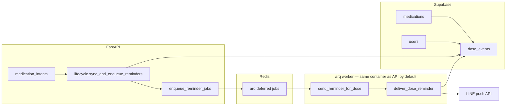

# MedBuddy — LINE dose reminders (prototype)

This document describes **proactive LINE push** reminders for scheduled medication doses: data model, job queue, configuration, and operations. It complements [`apps/backend/README.md`](../apps/backend/README.md) (env tables, deploy) and [`docs/use-cases.md`](use-cases.md) (assistant flows).

## What it does

- After a user **adds** or **removes** a medication via the assistant (LINE or any channel using `try_medication_intents`), the backend **rebuilds** upcoming rows in **`dose_events`** and, when **`REDIS_URL`** is set, **enqueues** [arq](https://arq-docs.helpmanual.io/) jobs so each row triggers a **LINE Messaging API push** near **`scheduled_at`** (UTC).
- The push text is localized under **`reminder.line_push`** in `apps/backend/src/medbuddy/locales/` (`zh-TW`, `en`).

## What it does *not* do (v1)

- **No NLP** on free-text `medications.schedule`: the prototype uses **one daily local time** per user (`MEDBUDDY_REMINDER_DEFAULT_LOCAL_TIME`, default `09:00`) in **`users.timezone`** (default `Asia/Taipei`) for **`MEDBUDDY_REMINDER_HORIZON_DAYS`** (default **14**) calendar days per medication.
- **Standalone / Expo** local notifications are **not** implemented here; only **LINE push** when the user key is a LINE `userId` stored as `users.external_user_id`.
- **Rich messages** (Flex) and **postback** “mark taken” are out of scope for this slice.

## Architecture



1. **`UserDataPort.sync_upcoming_dose_events`** deletes future **`dose_events`** for the user and inserts new rows (one instant per medication per day in the horizon, skipping instants already in the past).
2. **`enqueue_reminder_jobs`** schedules **`send_reminder_for_dose`** with **`_defer_until = scheduled_at`** when arq is installed and **`REDIS_URL`** is non-empty.
3. The **worker** loads **`AppServices`** (same wiring as the API), runs **`get_dose_event_for_reminder`**, sends **`push_message_batch`**, then **`try_mark_reminder_sent`** so retries and orphans do not double-notify.

## Schema (Supabase)

Defined and extended in [`apps/backend/supabase/schema.sql`](../apps/backend/supabase/schema.sql):

| Object | Purpose |
|--------|---------|
| **`users.timezone`** | IANA name for daily reminder clock (default `Asia/Taipei`). |
| **`dose_events.scheduled_at`** | When the dose is due (timestamptz, stored in UTC). |
| **`dose_events.taken_at`** | Optional adherence field (not required by the reminder job). |
| **`dose_events.reminder_sent_at`** | Set after a successful push; idempotency / reconcile. |

Apply new columns on existing projects via the same file’s **`ALTER TABLE ... ADD COLUMN IF NOT EXISTS`** statements.

## Configuration

| Variable | Role |
|----------|------|
| **`REDIS_URL`** | Redis DSN for arq (API **enqueue** + worker **consume**; main **`Dockerfile`** runs both in one container when set). |
| **`MEDBUDDY_REMINDER_DEFAULT_LOCAL_TIME`** | `HH:MM` local time (default `09:00`). |
| **`MEDBUDDY_REMINDER_HORIZON_DAYS`** | Days ahead to materialize (default **14**, max **90** in settings). |
| **`MEDBUDDY_CRON_SECRET`** | Secret for **`POST /internal/reminders/reconcile`** (**`X-Cron-Secret`** header). |

**Dependencies:** install **`[reminders]`** (`arq`), included in the repo-root **Dockerfile** (`pip install ".[llm,supabase,tts,reminders]"`).

## Processes

| Process | Command / image |
|---------|-------------------|
| **API + reminder worker (default)** | Repo-root [`Dockerfile`](../Dockerfile) → [`docker-entrypoint-web.sh`](../docker-entrypoint-web.sh): **`uvicorn`** and, if **`REDIS_URL`** is set, **`arq medbuddy.reminders.worker.WorkerSettings`**. |
| **Worker only (optional scale-out)** | Same **`Dockerfile`** image; override start command to **`arq medbuddy.reminders.worker.WorkerSettings`** (API service must use **uvicorn-only** start command — do not run arq in both). |

The same container needs **Supabase** for **`UserDataPort`** and **`LINE_CHANNEL_ACCESS_TOKEN`** for push when **`MOCK_EXTERNAL_SERVICES=false`**.

## Render

The [**`render.yaml`**](../render.yaml) blueprint defines **`medbuddy-api`** (web **`Dockerfile`**). Set managed **`REDIS_URL`** (e.g. Render Key Value or Upstash) so the container runs **arq** alongside **uvicorn**. Optional **second** Background Worker from the **same** Docker image with **`arq ...` start command** is for scale-out only (same **`REDIS_URL`**; API must not also run arq). Details: [Deploy on Render](../apps/backend/README.md#deploy-on-render).

## Local Compose

From the repo root:

```bash
# API only (no Redis): default compose up
podman compose up --build

# API + Redis — entrypoint runs uvicorn + arq when REDIS_URL is set (no separate worker container).
REDIS_URL=redis://redis:6379 podman compose --profile reminders up --build
```

The **`reminders`** profile is defined in [`compose.yaml`](../compose.yaml).

## Reconciliation

If Redis or the **arq** process restarts, some due rows may never get a job. A low-frequency caller (e.g. external cron every 15–60 minutes) can **`POST /internal/reminders/reconcile`** with **`X-Cron-Secret: <MEDBUDDY_CRON_SECRET>`** to enqueue **immediate** jobs for rows with **`scheduled_at <= now()`**, **`reminder_sent_at` IS NULL**, **`taken_at` IS NULL**. This is a safety net; primary scheduling remains deferred arq jobs.

## Code map

| Area | Path |
|------|------|
| Schedule math (local → UTC) | `apps/backend/src/medbuddy/reminders/dose_schedule.py` |
| Enqueue / immediate jobs | `apps/backend/src/medbuddy/reminders/enqueue.py` |
| Push + mark sent | `apps/backend/src/medbuddy/reminders/deliver.py` |
| Worker entry | `apps/backend/src/medbuddy/reminders/worker.py` |
| Hook after add/remove med | `apps/backend/src/medbuddy/reminders/lifecycle.py` · `medication_intents.py` |
| Supabase persistence | `apps/backend/src/medbuddy/integrations/supabase_stores.py` |
| LINE push | `apps/backend/src/medbuddy/integrations/line_client.py` · `protocols/ports.py` |
| Reconcile route | `apps/backend/src/medbuddy/http/shared_routes.py` |

## LINE quotas

Push messages can count against LINE plan quotas; reminder copy is kept short. Product copy in the Expo app also notes reply vs push differences for pilots — see frontend locales if needed.

## Tests

- `apps/backend/tests/test_dose_schedule.py` — daily instant generation.
- `apps/backend/tests/test_dose_reminder_deliver.py` — mock LINE push and idempotency.

Run **`make be-test`** from the repository root.
