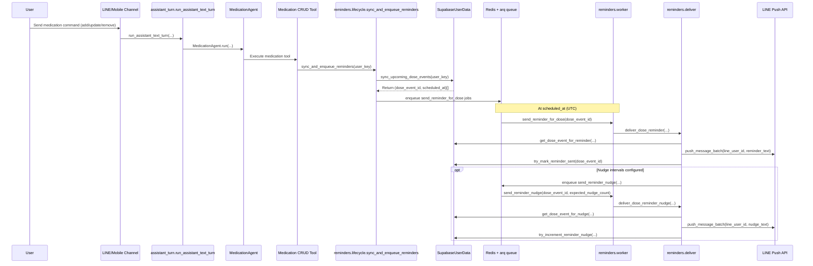

# MedBuddy — Technical Design Document (extended)

> **Disclaimer:** MedBuddy is a software prototype and is not a substitute for professional medical advice.
>
> **Brief TDD:** [`tdd.md`](tdd.md) (~2–3 pages) — architecture concepts and diagrams. **This file** is the full design (API, schema, config, 18 sections).
>
> **Documentation index:** [`docs/index.md`](index.md) — reading paths and quick lookup for all docs.

---

## Table of contents

1. [System overview](#1-system-overview)
2. [Architecture principles and decisions](#2-architecture-principles-and-decisions)
3. [Backend component map](#3-backend-component-map)
4. [Request flows](#4-request-flows)
5. [Agent layer](#5-agent-layer)
6. [Data model](#6-data-model)
7. [API reference](#7-api-reference)
8. [LLM integration](#8-llm-integration)
9. [Caching strategy](#9-caching-strategy)
10. [Privacy and security](#10-privacy-and-security)
11. [Error handling and resilience](#11-error-handling-and-resilience)
12. [Observability](#12-observability)
13. [Testing strategy](#13-testing-strategy)
14. [Deployment topology](#14-deployment-topology)
15. [Configuration reference](#15-configuration-reference)
16. [Extension points](#16-extension-points)
17. [Quality attributes and prototype SLOs](#17-quality-attributes-and-prototype-slos)
18. [Known limitations and future work](#18-known-limitations-and-future-work)

---

## 1. System overview

MedBuddy helps patients manage medications and ask medication-related questions. The **primary product** (this document's focus) is **LINE Messaging** plus the **FastAPI** backend — webhooks, dose reminder push, and an **HTTP API** for integrations and tests. A **reference Expo app** (`apps/frontend/`) exists as a future surface; it is not a co-equal channel in this phase (see [`frontend-expo.md`](frontend-expo.md)).

This TDD documents the **current prototype runtime** (Python/FastAPI). The MVP/Growth production target is a Go/Fiber runtime on the same hexagonal contracts; see [`go-port-mapping.md`](go-port-mapping.md) for the mechanical mapping plan.

**Prototype scope:** The deployment supports **text and voice** on LINE (STT → same assistant; outbound optional text+audio per `MEDBUDDY_LINE_VOICE_REPLIES`) and **HTTP** `POST /v1/app/messages/voice` (transcript + text reply). **§10** / **NG-1**: pilot **sign-off** does not require voice WER, TTS quality, or per-voice-turn cost targets until **OD-3**.

| Channel | Entry point | Role |
|---------|-------------|------|
| **LINE Messaging API** | `POST /v1/line/webhook` | Primary user channel: text chat, voice notes (STT), dose reminder push |
| **Standalone HTTP API** | `POST /v1/app/*` | Same assistant and persistence; no LINE dependency |
| **Expo app (reference)** | Uses `/v1/app/*` when API mode is on | Future product — see [`frontend-expo.md`](frontend-expo.md) |

### System context diagram

```
┌─────────────────────────────────────────────────────────────────┐
│                        Client layer                             │
│                                                                 │
│   LINE platform           HTTP clients (integrations, tests,    │
│   (webhook, push)         optional reference mobile app)        │
└──────────┬────────────────────────────┬─────────────────────────┘
           │                            │
           ▼                            ▼
┌─────────────────────────────────────────────────────────────────┐
│                      FastAPI backend                            │
│                                                                 │
│  /v1/line/webhook             /v1/app/*                         │
│  channels/line/               channels/api/                     │
│        │                            │                           │
│        └──────────────┬─────────────┘                           │
│                       ▼                                         │
│           application/assistant_turn.py                         │
│                       │                                         │
│                       ▼                                         │
│           agents/MedicationAgent + orchestrator                 │
│           (routing hints → prior redacted turns → tools loop)    │
│                       │                                         │
│          ┌────────────┼─────────────────┐                       │
│          ▼            ▼                 ▼                       │
│    medication     drug lookup      health summary               │
│    tools          tools            tools                        │
│          │            │                 │                       │
│          └────────────┴─────────────────┘                       │
│                       │                                         │
│              protocols/  ← hexagonal boundary                   │
│          ┌────────────┼─────────────────┐                       │
│          ▼            ▼                 ▼                       │
│   LLM (Gemini/OpenAI) Supabase     OpenFDA HTTP                 │
│   (or mock)           (or in-mem)   (or mock)                   │
└─────────────────────────────────────────────────────────────────┘
           │                            │
           ▼                            ▼
      Redis + arq                  LINE push API
   (dose reminders)                (reminder delivery)
```

---

## 2. Architecture principles and decisions

### 2.1 Hexagonal architecture (ports & adapters)

**Decision:** Business logic lives in `application/` and `agents/`. These layers depend only on `protocols/` interfaces (Python `Protocol` classes). `container.py` wires concrete adapters at startup.

```
application/  ──► protocols/  ◄──  integrations/
agents/          (per-port files)     (concrete or mock)
```

**Rationale:**
- Tests inject mock adapters without monkey-patching.
- Swapping an LLM provider (Gemini → OpenAI) requires only a new adapter implementing `LLMPort`.
- Adding a delivery channel (e.g. WhatsApp) requires a new channel module calling the same `run_assistant_text_turn` entry point — no changes to agent or tool code.

**Trade-off accepted:** Protocol interfaces add a layer of indirection that is extra overhead for simple operations. This cost is accepted because the integrations (LLM, Supabase, LINE, OpenFDA) are the most likely points of change.

### 2.2 LLM tool orchestration pattern

**Decision:** After **`interpret_user_turn`** (routing hints: emergency, off_topic, logging), **`run_tool_agent_loop`** calls **`LLMPort.complete_chat_with_tools`** so the model selects **registered tool names** (OpenAI tools API / Gemini structured steps). The **first** provider request includes **system**, **`orchestrator_prior_messages`** (redacted tail of **`conversation_turns`**, capped by **`agent_orchestrator_history_turns`** / env **`MEDBUDDY_AGENT_ORCHESTRATOR_HISTORY_TURNS`**, `0` = none), and the **current** redacted user line; subsequent rounds append **assistant** + **`tool`** messages for that turn. Server-side handlers execute **`AgentTool`** implementations and feed **tool messages** back until a final reply or step cap.

**Rationale:** Keeps `application/assistant_turn.py` thin — it delegates to **`MedicationAgent`**, which gates safety paths then runs the orchestrator. Tools remain small and testable; multi-step combinations (bulk ops + reply) stay explicit in logs.

**Trade-off accepted:** Orchestrator rounds add latency and token cost versus a single classify-and-dispatch hop; prior-thread injection adds more tokens on the first hop but improves follow-up understanding (“yes”, “the second one”). Gains natural multi-tool turns and clearer alignment between user language and tool arguments.

### 2.3 Mock-first development

**Decision:** Every external dependency has a mock adapter in `integrations/mocks/`. Default local dev mode (`MEDBUDDY_INTEGRATION=mock`) uses all mocks — no API keys or running databases required.

**Rationale:** CI and local development must be zero-friction. The mock adapters exercise real application logic (not stubs that always succeed), catching integration contract violations before they reach production.

### 2.4 Structured routing hint plus tool orchestration

**Decision:** **`interpret_user_turn`** is one structured call per turn for **`Intent`** (+ optional fields for logs). **`complete_chat_with_tools`** implements the assistant: multiple provider rounds and **registered tool** execution per user message.

**Rationale:** Routing hints keep emergency/off_topic cheap and deterministic; tool loops handle phrasing, arguments, and multi-step workflows without expanding an unconstrained ReAct surface — tools are **registered in code**.

### 2.5 Pilot sign-off vs deployed voice paths

**Decision:** **§10** success metrics and pilot **sign-off** do **not** include formal voice performance gates (WER, TTS intelligibility, latency/cost per voice turn) — **NG-1** / **OD-3**. Voice STT/TTS is **in** the prototype deployment when configured; engineering validates the path runs; product acceptance of **those** metrics waits for an explicit **OD-3** update.

**Rationale:** Keeps early pilot measurement tractable while still allowing real users to use voice in LINE and HTTP where enabled.

### 2.6 Engineering principles matrix (performance, availability, optimization, speed)

Use this matrix when evaluating architecture changes. Every significant design change should map to at least one row and keep the corresponding metric/guardrail intact.

| Principle | Decision | Impact | Metric | Guardrail |
|---|---|---|---|---|
| **Performance by boundary** | Runtime/framework changes happen at adapters (`channels/*`, infra wiring), not in domain or tool contracts. | Higher throughput and lower latency without logic drift. | Assistant-turn p95/p99, cold-start time, req/s under representative load. | Keep ports and use-case signatures stable so rollback is adapter-only. |
| **Availability by degradation** | Redundant providers where possible; idempotent reminder delivery; reconcile job for unsent due events. | Service continues in degraded-but-honest mode during dependency failures. | API uptime, reminder delivery success %, backlog age, replay success %. | Fixed safety replies, bounded retries, and no duplicate sends (`reminder_sent_at` semantics). |
| **Optimization by decomposition** | Sync chat path remains thin; heavy/temporal work goes through queue workers and caches. | Lower tail latency and lower unit cost per turn. | Cache hit %, LLM calls per turn, worker throughput, US$/MAU. | TTL limits, fallback when cache miss, and queue depth alarms before saturation. |
| **Speed by deterministic flow** | Single turn runner for all channels; pending/emergency gates execute before orchestration loop. | Fast acknowledgements and predictable response behavior. | Webhook ack p95, early-exit rate, orchestration round count distribution. | No channel-specific bypass of redaction/safety/persistence ordering. |

---

## 3. Backend component map

```
apps/backend/src/medbuddy/
│
├── main.py                      # FastAPI app; mounts routers; lifespan setup
├── config.py                    # load_settings() + frozen Settings dataclass; IntegrationMode/LlmProvider/Locale enums
├── container.py                 # build_app_services() — wires all adapters from config; raises ConfigError on missing keys
├── services.py                  # AppServices dataclass — dependency injection container
├── deps.py                      # FastAPI get_services() dependency injection
│
├── core/                        # Cross-cutting utilities
│   ├── errors.py                # Error base, MedBuddyError alias, ConfigError, LLMParseError
│   ├── i18n.py                  # t() — key lookup with zh-TW fallback
│   ├── locale.py                # effective_user_locale(), normalize_locale_patch(), locale_from_language_hints(), locale_from_client_language_headers()
│   ├── timezone.py              # IANA timezone helpers for scheduling
│   └── logging.py               # configure_logging() — structured logging setup
│
├── channels/                    # ← Inbound adapters (Layer: Driving/Primary)
│   ├── line/
│   │   ├── routes.py            # POST /v1/line/webhook, GET /v1/line/media/audio/:id
│   │   ├── orchestrator.py      # handle_line_event() — event dispatch and reply
│   │   └── signature.py         # X-Line-Signature HMAC-SHA256 verification
│   ├── api/
│   │   ├── routes.py            # GET/POST /v1/app/*
│   │   ├── auth.py              # MobileAuthContext, require_mobile_auth()
│   │   └── schemas.py           # Pydantic I/O models
│   └── internal/
│       └── routes.py            # /health, /internal/reminders/reconcile
│
├── application/                 # ← Application core (Layer: Use Cases)
│   ├── assistant_turn.py        # run_assistant_text_turn() — delegates to MedicationAgent
│   ├── patient_llm_context.py   # patient_context_for_llm() — dose sync + upcoming schedule blob
│   ├── vital_log_build.py       # parses BP/glucose/etc. into payloads for HealthIssueEventRecord
│   │
│   ├── pending/                 # Early-turn resolvers (run before the orchestrator)
│   │   ├── locale_intents.py    # try_locale_change_reply — quick locale switch from user text
│   │   ├── medication_add_confirm_resolve.py  # pending yes/no after add-medication preview
│   │   ├── dose_clarification_resolve.py      # pending dose / adherence clarification
│   │   └── reminder_horizon_resolve.py        # pending “how many days of reminders?” answer
│   │
│   ├── health_events/           # Doctor-summary timeline + classifier policy
│   │   ├── health_issue_event_log.py     # classifier-intent logging policy (allowlist + sentinel)
│   │   └── health_issue_events_format.py # chronological block for generate_health_summary
│   │
│   └── profile/                 # Profile patches and onboarding nudges
│       ├── profile_intents.py             # apply_profile_update_from_extracted_patch (orchestrator update_profile)
│       ├── emergency_contact_resolve.py   # capture TW-mobile + relationship lines pre-orchestrator
│       └── profile_completion_nudge.py    # optional post-reply footer when profile fields are missing
│
├── agents/                      # ← Domain logic (Layer: Domain)
│   ├── medication_agent.py      # MedicationAgent — routing gates + orchestrator entry
│   ├── orchestrator.py        # run_tool_agent_loop — complete_chat_with_tools
│   ├── base.py                  # AgentTool base class, ToolResult
│   └── tools/
│       ├── medication_crud.py   # List/Add/Update/RemoveMedicationTool
│       ├── drug_lookup.py       # ExplainMedicationTool
│       ├── interaction_check.py # InteractionCheckTool
│       ├── health_summary.py    # GenerateHealthSummaryTool
│       ├── report_missed_dose.py # ReportMissedDoseTool
│       ├── confirm_dose.py      # ConfirmDoseTool (adherence marking)
│       ├── log_vital.py         # LogVitalTool
│       ├── upcoming_doses.py    # ListUpcomingDosesTool
│       └── side_effects.py      # ReportSideEffectsTool
│
├── models/
│   └── domain.py                # Intent enum, MedicationDraft/Record, ConversationTurn
│
├── protocols/                   # ← Port interfaces (Layer: Ports) — one file per port
│   ├── llm.py                   # LLMPort, ProfilePatch
│   ├── user_data.py             # UserDataPort
│   ├── line.py                  # LineMessagingPort, LineAudioBlobStorePort
│   ├── speech.py                # SpeechToTextPort, TextToSpeechPort
│   ├── drugs.py                 # DrugDataPort
│   ├── conversation.py          # ConversationStorePort
│   └── drug_caches.py           # DrugCachesPort
│
├── integrations/                # ← Outbound adapters (Layer: Driven/Secondary)
│   ├── llm/
│   │   ├── _common.py           # language_lock(), strip_json_fence() — shared LLM helpers
│   │   ├── gemini_llm.py        # GeminiLLM (google-genai)
│   │   └── openai_llm.py        # OpenAILLM (Chat Completions)
│   ├── persistence/
│   │   ├── supabase_client.py       # create_supabase_client()
│   │   ├── supabase_profile.py      # SupabaseProfileMixin — profile/health_issue_events/pending state
│   │   ├── supabase_medications.py  # SupabaseMedicationMixin — medication CRUD
│   │   ├── supabase_dose_events.py  # SupabaseDoseEventMixin — dose events + nudges
│   │   ├── supabase_conversations.py # SupabaseConversationStore
│   │   ├── supabase_stores.py       # SupabaseUserData (combines mixins), re-export shim
│   │   └── supabase_drug_caches.py  # SupabaseDrugCaches
│   ├── line_client.py           # LineHttpClient (line-bot-sdk + httpx profile GET)
│   ├── line_audio_blob_store.py # LineAudioBlobStore (ephemeral m4a blobs for LINE)
│   ├── drugs_http.py            # HttpDrugData (OpenFDA + TFDA stub)
│   ├── caching_drugs.py         # CachingDrugData + drug cache key helpers
│   ├── stt/
│   │   └── stt_google.py        # GoogleSpeechToText (Speech-to-Text V2, ADC)
│   ├── tts/
│   │   └── tts_google.py        # GoogleTextToSpeech (m4a via ffmpeg)
│   └── mocks/                   # llm.py, stt.py, tts.py, line.py, drugs.py, users.py, conversation.py (MockLLM, MockLineClient, MockUserData, etc.)
│
├── privacy/
│   └── redact.py                # redact_pii_text(), redact_conversation_turns_for_llm()
│
├── llm/
│   ├── prompts/
│   │   └── persona.py           # get_system_persona()
│   ├── schemas.py               # Pydantic models for structured LLM outputs
│   ├── intent_classification_prompt.py  # Shared intent classification prompt
│   ├── intent_map.py            # classifier string labels → domain Intent
│   ├── medication_draft_build.py # MedicationExtraction → MedicationDraft
│   └── turn_interpretation.py   # IntentClassification → TurnInterpretation mapping
│
├── reminders/
│   ├── worker.py                # arq WorkerSettings
│   ├── deliver.py               # deliver_dose_reminder() → LINE push
│   ├── enqueue.py               # enqueue_reminder_jobs()
│   ├── dose_schedule.py         # iter_scheduled_dose_times_utc — local HH:MM → UTC instants
│   ├── upcoming_display.py      # upcoming window + user/LLM formatting for dose_events
│   ├── prefs.py                 # ReminderPrefs + nudge_window_allows()
│   └── lifecycle.py             # sync_and_enqueue_reminders() — called after add/update/remove
│
├── extensibility/
│   └── intent_hooks.py          # try_intent_hooks() — pilot feature hook registry
│
└── locales/
    ├── zh-TW.json               # Primary locale (Traditional Chinese, Taiwan)
    └── en.json                  # English
```

---

## 4. Request flows

### 4.1 LINE text message

**`follow` events** (new friend): `handle_line_event` → `get_or_create_user` → **`LineMessagingPort.get_user_profile`** (LINE `GET /v2/bot/profile/{userId}`) → if **`language`** maps to `en` / `zh-TW`, **`patch_user_profile`** → **`reply_text`** with **`line.follow_welcome`** (no `run_assistant_text_turn`). See [`use-cases.md`](use-cases.md) §1.1.

```
LINE platform
    │ POST /v1/line/webhook
    │ X-Line-Signature: <hmac>
    ▼
channels/line/routes.py
    │ verify_signature()  ← 400 if invalid in real mode
    │ parse_event()
    ▼
channels/line/orchestrator.py
    │ handle_line_event(event, services)
    ▼
application/assistant_turn.py
    │ run_assistant_text_turn → MedicationAgent.run (see §5.1)
    ▼
agents/medication_agent.py
    │   1. Load profile + medications + recent turns; redact_pii_text; interpret_user_turn
    │   2. Persist user turn (original text, not redacted)
    │   3. Dispatch order §5.1 (locale / pending / emergency / hooks / off_topic / orchestrator)
    │   4. Persist assistant turn (+ optional metadata on HTTP)
    ▼
channels/line/orchestrator.py
    │ line_client.reply_message(reply_token, reply_text)
    ▼
LINE platform (reply)
```

### 4.2 Standalone HTTP chat message (`POST /v1/app/messages`)

```
HTTP client
    │ POST /v1/app/messages
    │ Authorization: Bearer <token>
    │ X-App-User-Id: <stable-id>
    │ Body: {"text": "..."}
    ▼
channels/api/routes.py
    │ require_mobile_auth()  ← 401 if token mismatch or header missing
    │ validate body (1–8000 chars)
    ▼
application/assistant_turn.py
    │ run_assistant_text_turn → MedicationAgent.run
    │   (same pipeline as LINE text — §4.1)
    ▼
channels/api/routes.py
    │ return {"reply": reply_text, "metadata": {...}}
    ▼
HTTP client
```

#### 4.2b Standalone voice clip (`POST /v1/app/messages/voice`)

Multipart upload (field **`file`**: client recording, typically m4a from **expo-av**). Same auth as **`POST /v1/app/messages`**.

```
HTTP client
    │ POST /v1/app/messages/voice  (multipart file)
    │ X-App-User-Id, optional Bearer
    ▼
channels/api/routes.py
    │ read bytes (max 10 MiB)
    │ effective_user_locale(user profile)
    │ stt.transcribe_m4a(bytes, language_code=locale)
    ▼
application/assistant_turn.py
    │ run_assistant_text_turn(user_key, transcript)
    ▼
HTTP client
    │ {"reply": "…", "transcript": "…", "metadata": {}}
```

TTS for the reply is **client-side** (e.g. **expo-speech**) using profile/UI language — not returned as audio from this endpoint.

### 4.3 Dose reminder delivery (background)

```
AddMedicationTool / UpdateMedicationTool / RemoveMedicationTool success
    │ sync_and_enqueue_reminders()
    ▼
reminders/lifecycle.py
    │ sync_upcoming_dose_events(line_user_id)
    │   DELETE future dose_events for patient
    │   INSERT new rows (one per med per scheduled time per day in horizon)
    ▼
reminders/enqueue.py
    │ enqueue_reminder_jobs(dose_events)
    │   arq.enqueue("send_reminder_for_dose", dose_id, _defer_until=scheduled_at)
    ▼
Redis job queue

[at scheduled_at UTC]
    ▼
reminders/worker.py (arq consumer)
    │ send_reminder_for_dose(ctx, dose_id)
    ▼
reminders/deliver.py
    │ get_dose_event_for_reminder(dose_id)  ← skip if already sent or taken
    │ line_client.push_message(line_user_id, reminder_text)
    │ try_mark_reminder_sent(dose_id)        ← idempotency guard
```



**Reconcile safety net:** `POST /internal/reminders/reconcile` (cron-triggered) re-enqueues any `dose_events` where `scheduled_at <= now()`, `reminder_sent_at IS NULL`, and `taken_at IS NULL`. Covers cases where the arq worker was down when the job was due.

### 4.4 LINE audio message (STT → assistant)

```
LINE platform
    │ POST /v1/line/webhook  (audio message event)
    ▼
channels/line/orchestrator.py
    │ download_message_content(message_id)     # LINE blob API
    │ stt.transcribe(audio_bytes)              # Google Speech-to-Text or mock
    │ run_assistant_text_turn(user_key, transcript)
    │ LINE reply: text by default; optional text+audio by
    │ `MEDBUDDY_LINE_VOICE_REPLIES` mode
    ▼
LINE platform
```

> **§10** does not score WER/TTS/voice cost for pilot sign-off — see `prd-extended.md` §2 and §9 (**NG-1**). The flow is in **production** configuration when STT/TTS credentials and flags allow.

---

## 5. Agent layer

`MedicationAgent` (`agents/medication_agent.py`) applies **fast routing** using `TurnInterpretation` from `interpret_user_turn`, then **`run_tool_agent_loop`** (`agents/orchestrator.py`) for the main chat path.

### 5.1 Dispatch order

`MedicationAgent.run()` executes in this order after `interpret_user_turn` returns:

1. **`try_locale_change_reply`** — conversational locale switch without the orchestrator when the user text indicates a language change.
2. **`try_resolve_pending_medication_add_confirmation`** — user answering yes/no to a pending add-medication preview (state in `UserDataPort`, not a separate intent).
3. **`try_resolve_pending_dose_clarification`** — user answering a pending adherence/dose clarification.
4. **`try_resolve_pending_reminder_horizon`** — user supplying how many days ahead to materialize reminders (after `add_medication` requested it).
5. **`Intent.EMERGENCY`** — fixed i18n safety message (`agent.emergency`); **no** orchestrator. When `patients.emergency_contact` is **already saved**, the reply also appends the same simulated outreach line as the **`simulate_notify_emergency_contact`** tool and sets **`metadata.simulated_emergency_notification`** for the app banner (i18n key `agent.emergency_with_saved_contact`).
6. **`try_resolve_emergency_contact_from_message`** — when the turn carries a Taiwan mobile (`09xxxxxxxx`) plus clear family/emergency wording (or follows an assistant prompt asking for a contact), call **`extract_profile_patch`** and persist as **`emergency_contact`** before the medication tool loop. Prevents misclassified lines like “my son David, 0900111111” from hitting `add_medication` as a drug.
7. **`try_intent_hooks`** — registered pilot hooks may short-circuit any remaining path.
8. **`Intent.OFF_TOPIC`** — fixed i18n refusal (`agent.off_topic`); no orchestrator for the reply body.
9. **`run_tool_agent_loop`** — **`LLMPort.complete_chat_with_tools`**: prepends **redacted prior** user/assistant turns (cap **`MEDBUDDY_AGENT_ORCHESTRATOR_HISTORY_TURNS`**) where configured; model chooses among registered names (`llm/agent_tool_definitions.py`), e.g. `list_medications`, `add_medication`, `update_medication`, `remove_medication`, `remove_all_medications`, `disable_reminders`, `list_upcoming_doses`, `confirm_dose`, `report_missed_dose`, `explain_medication`, `report_side_effects`, `interaction_check`, `log_vital`, `generate_health_summary`, `export_health_journal`, `update_profile`, `simulate_notify_emergency_contact`, ... Handlers invoke **`AgentTool`** classes or inline orchestration (profile extract uses **`extract_profile_patch`**).
10. **`_maybe_append_pending_reminder`** — if add-confirmation or reminder-horizon is still pending, append a one-line nudge after the orchestrator reply.
11. **`append_profile_completion_nudge_if_due`** — when onboarding-style profile fields are still missing, append a short footer every **`MEDBUDDY_PROFILE_COMPLETION_NUDGE_EVERY_N_USER_TURNS`** user messages (default **12**, **`0`** disables); cadence is staggered per user via a stable hash so the reminder stays occasional.

Returns **`AgentTurnResult`** (`reply` + optional **`metadata`**, e.g. simulated caregiver notification).

```
TurnInterpretation (routing hint)
    │
    ├── locale / pending resolvers (steps 1–4) — may return early
    ├── emergency (step 5; saved-contact branch may simulate notify + set metadata)
    ├── emergency_contact_resolve (step 6; capture TW-mobile contact lines)
    ├── try_intent_hooks (step 7)
    ├── off_topic (step 8)
    └── run_tool_agent_loop (step 9)
            │
            └── complete_chat_with_tools (prior thread + current line) ⟷ registered tools (multi-step) → final reply
            │
            └── pending-state nudge (step 10) → profile-completion nudge (step 11)
```

### 5.2 Tool registry

Tools are exposed to the LLM by **name** in `AGENT_TOOLS_OPENAI` / Gemini equivalents; handlers map names to `AgentTool.run` or orchestrator branches.

| Tool class / name | Key operations |
|---------------------|----------------|
| `ListMedicationsTool` / `list_medications` | Load medication list → i18n formatted reply |
| `ListUpcomingDosesTool` / `list_upcoming_doses` | Sync dose_events → list pending rows in local-time window (~7 days) → i18n formatted schedule |
| `AddMedicationTool` / `add_medication` | LLM extract draft → persist → drug grounding → compose acknowledgment → reminder sync |
| `UpdateMedicationTool` / `update_medication` | LLM resolve patch → update → i18n **`medication.updated`** or **`medication.updated_with_note`** (by non-empty saved instructions) → optional **`medication.update_reminder_followup`** if dose/schedule changed → reminder sync |
| `RemoveMedicationTool` / `remove_medication` | LLM resolve target → delete → i18n confirm → reminder sync |
| `remove_all_medications` | Delete all medications + sync reminders |
| `disable_reminders` | Bulk or single-med reminder disable + sync |
| `ReportMissedDoseTool` / `report_missed_dose` | Mark latest pending dose window as missed (`missed_at`) |
| `ConfirmDoseTool` / `confirm_dose` | Apply structured **`record_pending_dose_as_taken`** / **`dose_adherence_note`** from **tool arguments** → i18n confirmation |
| `ExplainMedicationTool` / `explain_medication` | Personalization cache check → drug reference fetch → compose → cache save |
| `ReportSideEffectsTool` / `report_side_effects` | Side-effect oriented compose with optional drug grounding |
| `InteractionCheckTool` / `interaction_check` | Drug reference fetch → interaction-focused compose → cache save |
| `LogVitalTool` / `log_vital` | Structured vital extraction → persist vital log → i18n acknowledgment |
| `GenerateHealthSummaryTool` / `generate_health_summary` | Aggregate patient context + history → structured LLM summary output |
| `export_health_journal` | Structured journal export |
| `update_profile` | **`extract_profile_patch`** → **`patch_user_profile`** |
| `simulate_notify_emergency_contact` | Simulated caregiver notify + **metadata** for HTTP clients |

### 5.3 Tool interface

```python
# protocols/ (authoritative — per-port files)
class AgentTool(Protocol):
    name: str
    description: str

    async def run(self, **kwargs: Any) -> ToolResult: ...

@dataclass
class ToolResult:
    reply: str           # Localized reply text sent to user
    structured: Any = None  # Optional structured payload (e.g. summary JSON)
```

Tools receive `AppServices`, `user_key`, `user_text`, `user_row`, `medications`, `history`, `locale`, and intent-specific fields via keyword arguments.

---

## 6. Data model

Schema lives in `apps/backend/supabase/schema.sql`. All tables use UUIDs, UTC timestamps, and Supabase RLS for the `anon` role. Existing deployments need explicit migrations to match schema changes — the SQL file is greenfield DDL only.

### 6.1 Entity-relationship overview

```
patients (1) ──────────────────────── (many) medications
    │                                          │
    │ (many)                                   │ (many)
    ├── conversation_turns                     └── dose_events
    └── health_issue_events (many)

drug_personalization_cache (per-patient)
    │
    └── (optional FK) ──► drug_reference_cache (shared)
```

### 6.2 Table definitions

#### `patients`

End-user profile rows. `users` is reserved in Supabase; `patients` allows other actor types (staff, caregivers) to be modeled separately in future.

| Column | Type | Notes |
|--------|------|-------|
| `id` | `uuid` PK | Internal ID |
| `external_user_id` | `text` UNIQUE | LINE userId or mobile app user ID |
| `preferred_name` | `text` | Display name (not sent raw to LLM) |
| `age_years` | `int` | Optional |
| `gender` | `text` | `female` / `male` / `non_binary` / `prefer_not_say` / `other` |
| `emergency_contact` | `text` | Free text — not sent to LLM |
| `health_notes` | `text` | Patient-entered notes — not sent to LLM |
| `timezone` | `text` | IANA timezone; default `Asia/Taipei`; drives scheduling and push copy |
| `locale` | `text` | `en` or `zh-TW`; DB default `zh-TW`. **Seeded** before first scripted welcome: LINE **`follow`** uses LINE profile **`language`**; standalone **`GET /v1/app/me`** (pre-onboarding) uses **`X-MedBuddy-Locale`** / **`Accept-Language`** when present. |
| `onboarding_completed_at` | `timestamptz` | Set when onboarding is saved |
| `pending_agent_clarification` | `jsonb` | Optional persisted agent/UI state (`MedicationAddConfirmationPending`, `DoseClarificationPending`, `ReminderHorizonPending`); nullable |
| `created_at` | `timestamptz` | |
| `updated_at` | `timestamptz` | |

#### `medications`

| Column | Type | Notes |
|--------|------|-------|
| `id` | `uuid` PK | |
| `patient_id` | `uuid` FK → `patients` | |
| `name` | `text` | Drug name as user entered / LLM extracted |
| `dosage` | `text` | e.g. "100mg" |
| `schedule` | `text` | Free-text schedule (e.g. "after meals daily") |
| `instructions` | `text` | Optional instructions from LLM extraction |
| `raw_metadata` | `jsonb` | Full structured LLM extraction output (includes reminder prefs) |
| `created_at` | `timestamptz` | |
| `updated_at` | `timestamptz` | |

#### `conversation_turns`

| Column | Type | Notes |
|--------|------|-------|
| `id` | `bigserial` PK | |
| `patient_id` | `uuid` FK → `patients` | |
| `role` | `text` | `user` or `assistant` |
| `content` | `text` | **Original** (un-redacted) message text |
| `created_at` | `timestamptz` | Ordering key |

> Only the copy passed to the LLM adapter is redacted. The stored `content` is the original message.

#### `dose_events`

| Column | Type | Notes |
|--------|------|-------|
| `id` | `uuid` PK | |
| `patient_id` | `uuid` FK → `patients` | |
| `medication_id` | `uuid` FK → `medications` | |
| `scheduled_at` | `timestamptz` | When the dose is due (UTC) |
| `taken_at` | `timestamptz` | Set when user confirms dose taken |
| `missed_at` | `timestamptz` | Set when user reports missed dose |
| `reminder_sent_at` | `timestamptz` | Set after successful LINE push (idempotency guard) |
| `reminder_nudge_count` | `integer` | Follow-up nudge count |
| `last_nudge_at` | `timestamptz` | Last nudge push time (UTC) |
| `notes` | `text` | Optional note when marking taken |
| `created_at` | `timestamptz` | |

#### `health_issue_events`

Classifier-routed health turns and structured vitals. **`routing_intent`** matches **`Intent`** values (e.g. `general_question`, `emergency`) or **`log_vital`** for `LogVitalTool` rows. **`user_message`** stores the user line for intent-logged rows; vitals fill **`kind`**, **`display_summary`**, **`payload`**. Index: `health_issue_events_patient_created_at_idx` on `(patient_id, created_at desc)`.

| Column | Type | Notes |
|--------|------|-------|
| `id` | `uuid` PK | |
| `patient_id` | `uuid` FK → `patients` | |
| `routing_intent` | `text` | Intent string or `log_vital` for structured readings |
| `user_message` | `text` | User line when logged from routing policy; optional for vital-only rows |
| `locale` | `text` | Effective UI locale when recorded |
| `kind` | `text` | Vital subtype when `log_vital`; null for intent-only rows |
| `display_summary` | `text` | Locale summary for vitals; optional for intent rows |
| `payload` | `jsonb` | Structured vital fields or `{}` |
| `notes` | `text` | Optional note |
| `created_at` | `timestamptz` | Row time (defaults to insert time) |

#### `drug_reference_cache`

Shared across all users. Caches drug label data from OpenFDA / TFDA.

| Column | Type | Notes |
|--------|------|-------|
| `id` | `uuid` PK | |
| `source` | `text` | `openfda` / `tfda` / etc. |
| `query_key` | `text` | Normalized drug name |
| `title` | `text` | Drug display name |
| `usage_text` | `text` | Patient-facing usage summary |
| `indications_and_usage` | `text` | |
| `dosage_and_administration` | `text` | |
| `warnings` | `text` | |
| `raw_payload` | `jsonb` | Full FDA label object |
| `fetched_at` | `timestamptz` | When the row was written |
| `expires_at` | `timestamptz` | TTL — default 168h (7 days) |

#### `drug_personalization_cache`

Per-patient, per-query cached LLM reply for explain/interaction intents.

| Column | Type | Notes |
|--------|------|-------|
| `id` | `uuid` PK | |
| `patient_id` | `uuid` FK → `patients` | |
| `medication_id` | `uuid` FK → `medications` | Optional |
| `reference_cache_id` | `uuid` FK → `drug_reference_cache` | Optional |
| `query_fingerprint` | `text` | SHA-256 of (redacted query + de-identified med context + intent + locale) |
| `intent` | `text` | `explain_medication` or `interaction_check` |
| `personalized_text` | `text` | Cached LLM reply |
| `locale` | `text` | `zh-TW` / `en` |
| `llm_meta` | `jsonb` | `{"source": "openfda"\|"tfda"\|"<model-id>"\|"mock_llm"}` |
| `expires_at` | `timestamptz` | TTL — default 72h (3 days) |
| `created_at` | `timestamptz` | |
| `updated_at` | `timestamptz` | |

Unique constraint: `(patient_id, query_fingerprint)`.

Cache invalidates naturally when the patient's medication list changes, because the fingerprint input changes.

---

## 7. API reference

### 7.1 Shared / operations

#### `GET /health`

Liveness check. No auth required.

**Response:** `200 OK`, body `"ok"` (plain text). Used by Docker health checks and load balancers.

---

#### `POST /internal/reminders/reconcile`

**Auth:** `X-Cron-Secret: <MEDBUDDY_CRON_SECRET>` header.

Re-enqueues arq jobs for dose events that are due (`scheduled_at <= now()`), `reminder_sent_at IS NULL`, and `taken_at IS NULL`. Safety net after Redis or worker restarts.

**Recommended cron frequency:** every 15–60 minutes.

**Response:** `200 OK`
```json
{"enqueued": 3}
```

**Errors:**
- `401 Unauthorized` — missing or incorrect `X-Cron-Secret`.

---

### 7.2 LINE channel

#### `POST /v1/line/webhook`

**Auth:** `X-Line-Signature` HMAC-SHA256 header (verified with `LINE_CHANNEL_SECRET`). Skipped in mock mode when `LINE_CHANNEL_SECRET` is unset.

**Body:** Standard LINE webhook event object.

| Event type | Behavior |
|------------|---------|
| `follow` | Create user record; send localized welcome message with disclaimer |
| `message` (text) | Run assistant pipeline; reply with text |
| `message` (audio) | Download audio → Speech-to-Text → same assistant pipeline on the transcript. Reply is text by default; optional **text + m4a** when `MEDBUDDY_LINE_VOICE_REPLIES != off` (see §4.4). |

**Response:** `200 OK` (empty body — LINE requires a 200 ACK immediately; reply is sent asynchronously after acknowledgment).

**Errors:**
- `400 Bad Request` — invalid LINE signature in real mode.

---

### 7.3 Mobile app (`/v1/app`)

All authenticated endpoints require:
- `X-App-User-Id: <stable-id>` — 4–128 character string, stable per install or account.
- `Authorization: Bearer <MEDBUDDY_MOBILE_BEARER_TOKEN>` — required in production.

When `MEDBUDDY_MOBILE_BEARER_TOKEN` is unset and `MEDBUDDY_INTEGRATION=mock`, the Bearer header is optional (development mode only).

**Common error responses:**

| Status | Condition |
|--------|-----------|
| `401 Unauthorized` | Missing or incorrect Bearer token (in real mode) |
| `400 Bad Request` | Missing `X-App-User-Id`, or request body fails validation |
| `422 Unprocessable Entity` | FastAPI validation failure on request body |
| `500 Internal Server Error` | Unhandled exception — logged with `user_key` and request ID |

---

#### `GET /v1/app/health`

No auth required. JSON liveness check.

```json
{"status": "ok", "channel": "standalone"}
```

---

#### `GET /v1/app/info`

No auth required. Public service metadata.

```json
{"channel": "standalone", "api_version": "0.1.0"}
```

(`api_version` is the installed package version, or `"unknown"` when not installed as a package.)

---

#### `GET /v1/app/me`

Auth required. Returns the current user's profile.

**Optional request headers (pre-onboarding only):** When **`onboarding_completed_at`** is null, the server may update **`patients.locale`** from **`X-MedBuddy-Locale`** (BCP-47 tag, e.g. device language from Expo) or, if that is absent, the **first** value in **`Accept-Language`** (tag only, before `;`). Mapping matches the app: `en*` → `en`, `zh*` → `zh-TW`, other primaries → `zh-TW`. After onboarding completes, headers do **not** overwrite **`locale`**.

```json
{
  "app_user_id": "device-abc123",
  "preferred_name": "...",
  "age_years": 68,
  "gender": "female",
  "emergency_contact": "...",
  "health_notes": "...",
  "timezone": "Asia/Taipei",
  "locale": "zh-TW",
  "onboarding_completed_at": "2026-04-01T10:00:00Z"
}
```

---

#### `POST /v1/app/onboarding`

Auth required. Saves first-run profile. Idempotent — safe to call again to update.

**Request body:**
```json
{
  "preferred_name": "...",       // required
  "age_years": 68,               // optional
  "gender": "female",            // optional: female|male|non_binary|prefer_not_say|other
  "emergency_contact": "...",    // optional
  "health_notes": "...",         // optional
  "locale": "zh-TW",             // optional: en | zh-TW (default zh-TW)
  "timezone": "Asia/Taipei"      // optional IANA; omit → Asia/Taipei
}
```

**Response:** same shape as `GET /v1/app/me`.

---

#### `POST /v1/app/messages`

Auth required. Single assistant chat turn.

**Request body:**
```json
{"text": "阿斯匹靈可以跟抗凝血藥一起吃嗎？"}
```

`text` must be 1–8000 characters.

**Response:**
```json
{"reply": "...", "metadata": {}}
```

**Errors:**
- `400 Bad Request` — `text` is empty or exceeds 8000 characters.

---

#### `POST /v1/app/messages/voice`

Auth required. Multipart form with one part **`file`** (audio bytes; e.g. m4a). Runs **STT** with the user’s profile **`locale`**, then the same assistant turn as **`POST /v1/app/messages`** on the transcript.

**Response:**
```json
{"reply": "...", "transcript": "...", "metadata": {}}
```

**Errors:** `413` if upload too large; `422` empty audio or empty transcription; `503` if STT fails.

---

#### `GET /v1/app/summary`

Auth required. Returns a structured doctor-ready health summary (see `HealthSummaryResponse` in `channels/api/schemas.py`).

```json
{
  "generated_at": "2026-04-07T12:00:00Z",
  "summary_for_doctor": "...",
  "medications": [
    {
      "name": "...",
      "dosage": "...",
      "schedule": "...",
      "purpose": "...",
      "notes": null
    }
  ],
  "key_concerns": ["..."],
  "reported_symptoms": ["..."],
  "medication_adherence_notes": "...",
  "recommended_questions": ["..."],
  "plain_text": "..."
}
```

---

## 8. LLM integration

### 8.1 Providers

`container.py` selects an `LLMPort` implementation from `LLM_PROVIDER` (default `gemini`):

| Provider | Implementation | Dependencies |
|----------|----------------|--------------|
| **Gemini** | `integrations/llm/gemini_llm.py` — `google-genai` | `GEMINI_API_KEY`; default model `gemini-2.5-flash` (`GEMINI_MODEL`) |
| **OpenAI** | `integrations/llm/openai_llm.py` — Chat Completions | `OPENAI_API_KEY`; default model `gpt-4.1-mini` (`OPENAI_MODEL`) |
| **Mock** | `integrations/mocks/llm.py` | No keys; CI and local dev |

Both real providers implement the same `LLMPort` contract. Install: `pip install 'medbuddy-api[llm]'` (included in the Docker image).

### 8.2 `LLMPort` interface

Authoritative method signatures and return types are in **`apps/backend/src/medbuddy/protocols/llm.py`** (`LLMPort`). Do not duplicate them here — this table is a navigational index only:

| Area | Methods |
|------|---------|
| Identity | `drug_cache_provenance_id` (property) — stored on personalized cache rows |
| Intent / profile | `interpret_user_turn`, `extract_profile_patch(..., *, locale)`, `extract_locale_intent` |
| Chat / orchestration | `complete_chat_with_tools`, `compose_reply`, `simplify_drug_text_to_patient_zh` |
| Medications | `extract_medication_draft`, `resolve_medication_removal_id`, `resolve_medication_update`, `compose_medication_added_reply` (takes persisted `saved: MedicationRecord`, not a draft) |
| Vitals | `extract_vital_log` |
| Safety / summary | `check_interactions_structured` → `InteractionResult`; `generate_health_summary` → domain `HealthSummary` |

### 8.3 Prompt construction

All LLM calls follow the same layered structure:

| Layer | Source | Privacy treatment |
|-------|--------|------------------|
| **System persona** | `get_system_persona(locale)` — from `locales/*.json` `prompts.system_persona` | No PII; includes non-diagnostic instruction and `[…]` masking instruction |
| **Patient context** | `patient_context_for_llm(...)` → `build_patient_context_for_llm(..., upcoming_doses_context=…)` | De-identified profile signals, medication list, plus **materialized** pending **`dose_events`** lines for ~7 days from local midnight (soonest first) when sync is run |
| **Drug grounding** | OpenFDA label snippets (indications, dosage, warnings) or `None` | Registry data only; no patient PII |
| **Conversation history** | Recent `ConversationTurn` objects | Redacted via `redact_conversation_turns_for_llm()`; **`complete_chat_with_tools`** prepends a tail capped by **`MEDBUDDY_AGENT_ORCHESTRATOR_HISTORY_TURNS`** (see [`llm-context.md`](llm-context.md)) |
| **User message** | Current turn | Redacted via `redact_pii_text()` |
| **Extra system** | Intent-specific instructions (e.g. interaction-check companion, summary format) | No PII |

**Not included in any LLM call:** raw `preferred_name`, exact `age_years`, `health_notes`, `emergency_contact`.

### 8.4 Structured outputs

Pydantic models in `llm/schemas.py` back provider JSON extraction. Domain wrappers in `models/domain.py` are what tools and HTTP responses use where applicable.

| Schema | Used for |
|--------|---------|
| `IntentClassification` | `interpret_user_turn` → `TurnInterpretation` (intent + adherence slots) |
| `MedicationExtraction` | `extract_medication_draft` — name, dosage, schedule, reminder prefs |
| `RemovalResolution` | `resolve_medication_removal_id` — which medication ID to delete |
| `MedicationUpdateResolution` | `resolve_medication_update` |
| `VitalLogExtraction` | `extract_vital_log` |
| `HealthSummaryResult` | Parsed LLM output inside `generate_health_summary`; assembled into domain `HealthSummary` (`GenerateHealthSummaryTool` / `GET /v1/app/summary`) |

### 8.5 Mock LLM behavior

`integrations/mocks/llm.py` implements `LLMPort` for CI and local development:

- `interpret_user_turn` yields `general_question` by default with adherence fields off.
- `complete_chat_with_tools` runs a deterministic multi-step loop in tests (tool rounds then final text).
- Tests pass explicit `intent=`, `record_pending_dose_as_taken`, `dose_adherence_note`, `medication_draft`, `locale_intent`, `removal_medication_id`, etc. to mirror real structured outputs.
- `compose_reply` returns templated i18n strings.
- No external API calls; no API keys required.

---

## 9. Caching strategy

### 9.1 Drug reference cache (`drug_reference_cache`)

| Attribute | Value |
|-----------|-------|
| **Purpose** | Avoid repeated OpenFDA HTTP calls for the same drug name |
| **Scope** | Shared across all users |
| **Key** | `(source, query_key)` where `query_key` is normalized drug name |
| **TTL** | `MEDBUDDY_DRUG_REFERENCE_CACHE_TTL_HOURS` — default 168h (7 days) |
| **Fallback** | Cache miss → fetch from OpenFDA → store. Without Supabase, cache is bypassed. |
| **Wrapper** | `CachingDrugData` wraps `DrugDataPort` transparently |

### 9.2 Drug personalization cache (`drug_personalization_cache`)

| Attribute | Value |
|-----------|-------|
| **Purpose** | Avoid repeated LLM compose calls for the same patient context + query |
| **Scope** | Per patient |
| **Key** | SHA-256 of: redacted user query + de-identified med list + intent + locale |
| **TTL** | `MEDBUDDY_DRUG_PERSONALIZATION_CACHE_TTL_HOURS` — default 72h (3 days) |
| **Natural invalidation** | Medication list change → different hash → automatic cache miss |
| **Intents using it** | `explain_medication` and `interaction_check` only |

**`llm_meta.source` values:**
- `"openfda"` — reply grounded with OpenFDA label data
- `"tfda"` — reply grounded with TFDA data (not yet implemented)
- Active model ID (e.g. `gemini-2.5-flash`) — LLM-only, no registry data
- `"mock_llm"` — returned by mock adapter in tests

---

## 10. Privacy and security

### 10.1 PII handling before LLM calls

| Data | Treatment |
|------|-----------|
| Current user message | `redact_pii_text()` before `interpret_user_turn`, `compose_reply`, and all extraction calls |
| Conversation history | `redact_conversation_turns_for_llm()` — same patterns applied to all turns |
| Profile fields | Coarse signals only in `build_patient_context_for_llm`: no raw name, no exact age, no health notes, no emergency contact. Upcoming block repeats **medication names** and **local times** from `dose_events` (same data as reminder pushes). |
| Profile extracted from chat | `extract_profile_patch` structured output; persisted fields go to storage via `patch_user_profile` |

**Redaction patterns** (`privacy/redact.py`):
- Email addresses (RFC 5322-ish pattern)
- Taiwan mobile: `09xx-xxxxxx`, `09xxxxxxxx`, and CJK-adjacent digit runs
- Long digit runs (10+ consecutive digits — ID numbers, account numbers)

**Replacement token:** `[…]`. System prompt instructs the model that `[…]` represents masked content and never to invent values for it.

**Residual risk:** Names, addresses, free-form clinical details in user messages, and most international phone formats are not masked. Treat all LLM prompts as potentially containing sensitive free text. Full PHI scrubbing would require an NER-based approach — documented as future work in §18.

### 10.2 LINE webhook authentication

`channels/line/signature.py` implements HMAC-SHA256 verification of the `X-Line-Signature` header using `LINE_CHANNEL_SECRET`. Verification is bypassed **only** when `LINE_CHANNEL_SECRET` is empty and `MEDBUDDY_INTEGRATION=mock` (local development). In production (`RENDER=true`), mock mode is always forced off.

### 10.3 Mobile API authentication

Two-factor check on `/v1/app/*` protected routes:
1. `X-App-User-Id` header — 4–128 character stable string.
2. `Authorization: Bearer <MEDBUDDY_MOBILE_BEARER_TOKEN>` — shared constant token.

> **Limitation:** This is a single shared bearer token, not per-user credentials. For production beyond a controlled pilot, rotate to per-user tokens or OAuth (tracked in `prd-extended.md` §13 OD-2).

When `MEDBUDDY_MOBILE_BEARER_TOKEN` is unset and `MEDBUDDY_INTEGRATION=mock`, the Bearer header is optional (development mode only).

### 10.4 Supabase access

The backend uses `SUPABASE_PUBLISHABLE_KEY` (anon key) — never the `service_role` key. All tables have RLS policies restricting anon role access. Row-level isolation relies on `external_user_id` matching in application code; Supabase RLS is an additional defense layer.

### 10.5 Internal endpoints

`POST /internal/reminders/reconcile` is protected by `X-Cron-Secret` matching `MEDBUDDY_CRON_SECRET`. It is not intended for public client use — expose it on an internal network or behind a gateway in production.

### 10.6 Production safeguards

When `RENDER=true` (Render web service), `load_settings()` enforces:
- `MEDBUDDY_INTEGRATION` forced to `real`
- `DEBUG = false`

This prevents accidental mock mode in production regardless of dashboard environment variable mistakes.

### 10.7 Logging policy

- Raw user message text is **not** logged. Structured INFO logs record user key, intent, and medication count only.
- Full LLM prompts and response tokens are **not** logged by default.
- `LOG_LEVEL=DEBUG` may log additional diagnostic context — review carefully before enabling in production.

### 10.8 Rate limiting

No rate limiting is implemented in the current codebase. For a public-facing deployment:
- Add per-user rate limiting on `POST /v1/app/messages` (e.g. 60 requests/minute).
- Add IP-based rate limiting on the LINE webhook to prevent replay abuse.
- Render provides DDoS protection at the edge, but application-layer rate limiting remains the application's responsibility.

---

## 11. Error handling and resilience

### 11.1 Error hierarchy

```
MedBuddyError (base)
├── LLMParseError        — structured output could not be parsed; fallback to compose_reply
├── DrugDataError        — OpenFDA fetch failed; reply proceeds without grounding
└── ReminderError        — reminder enqueue failed; medication is still saved
```

Application exceptions are caught at the channel layer and produce user-visible error messages (i18n key `errors.general`) rather than raw stack traces.

### 11.2 LLM failure modes

| Failure | Behavior |
|---------|----------|
| `interpret_user_turn` parse error | Log warning; **`turn_interpretation_on_parse_failure()`** — safe default **`TurnInterpretation`**; orchestrator still runs |
| `compose_reply` error | Return i18n error string; persist empty assistant turn to maintain history integrity |
| Structured extraction error (add/remove) | Return i18n "couldn't understand" reply; no medication record written |

### 11.3 Drug data failure modes

| Failure | Behavior |
|---------|----------|
| OpenFDA request timeout | `CachingDrugData` returns `None`; tool proceeds with LLM-only reply; `llm_meta.source` records model ID |
| Cache miss + OpenFDA error | Same as above; no cache row written |
| TFDA stub (not implemented) | Always returns `None`; transparent to caller |

### 11.4 Reminder failure modes

| Failure | Behavior |
|---------|----------|
| Redis unavailable at enqueue time | Exception logged; medication save succeeds; reminders will not be scheduled until reconcile runs |
| arq job not delivered (worker down) | Reconcile endpoint re-enqueues on next cron run (15–60 min) |
| LINE push API error during delivery | Exception logged with `dose_id`; `reminder_sent_at` NOT set; reconcile will retry |
| Double-delivery attempt | `reminder_sent_at` already set → deliver.py skips silently (idempotency) |

### 11.5 Supabase failure modes

| Failure | Behavior |
|---------|----------|
| Query error (conversation save) | Logged; turn is still returned to user |
| Profile load error | Exception propagates; user sees i18n error string |
| In-memory mock mode | Full application runs without Supabase; state is lost on restart |

---

## 12. Observability

### 12.1 Current signals

| Signal | Source | Notes |
|--------|--------|-------|
| **Liveness** | `GET /health` (plain text) | Docker / Render health checks |
| **JSON health** | `GET /v1/app/health` | Mobile client and monitoring |
| **Structured logs** | `configure_logging()` in `core/logging.py` | `medbuddy.*` namespace; level from `LOG_LEVEL` |
| **Webhook logs** | `channels/line/orchestrator.py` | Event type, step, reply size — no raw text |
| **Turn logs** | `agents/medication_agent.py` | `user_key`, `intent`, `med_count` (no raw user text) |

`uvicorn.error` is configured at the same `LOG_LEVEL`. Access logs (`uvicorn.access`) can be enabled separately.

### 12.2 Recommended additions before production

| Gap | Recommendation |
|-----|---------------|
| No request ID propagation | Add a `X-Request-ID` middleware; include in all log records for correlated tracing |
| No error rate metrics | Instrument `interpret_user_turn` and `compose_reply` call latency and error counts (Prometheus or OTLP) |
| No LLM cost tracking | Log token usage from LLM responses; aggregate per user per day for cost control |
| No reminder delivery metrics | Track `enqueued`, `delivered`, `failed`, `retried` counts in reminder worker |
| No distributed tracing | Add OpenTelemetry instrumentation for cross-service traces (LLM calls, Supabase, LINE) |
| No alerting | Set up alerts on: webhook 4xx/5xx rate, turn error rate, reminder delivery lag |

---

## 13. Testing strategy

### 13.1 Test layers

Layouts under `apps/backend/tests/` (pytest, `asyncio_mode=auto`). The suite includes an `e2e/` area (for example, `tests/e2e/test_user_journeys.py`) in addition to channel, application, and tool coverage with `AsyncClient`/`ASGITransport` and mocks.

| Layer | What is tested | Typical location |
|-------|---------------|------------------|
| **Tools / application** | `MedicationAgent` dispatch, resolver flows, individual `AgentTool.run` paths | `tests/application/`, `tests/agents/tools/` |
| **Channels** | LINE webhook pipeline, API routes, signature verification | `tests/channels/` |
| **Integrations** | Supabase stores, drugs HTTP, optional OpenAI smoke tests | `tests/integrations/` |
| **Reminders** | Materialization, enqueue, deliver, nudges | `tests/reminders/` |
| **LLM / privacy** | Draft build, redaction, persona shaping | `tests/llm/`, `tests/privacy/`, `tests/prompts/` |

### 13.2 Mock adapter contract

Mock adapters must honor the same `Protocol` contract as their real counterparts. Tests that pass explicit intent overrides to `MockLLM` (e.g. `intent=add_medication`) mirror what structured outputs from real adapters produce — this is the primary mechanism for testing tool dispatch paths.

### 13.3 Test coverage targets (prototype)

- All intent dispatch paths: covered.
- All tool `run()` paths for happy-path inputs: covered.
- All reminder lifecycle paths (add → materialize → enqueue → deliver → idempotency): covered.
- All API endpoints with auth: covered.
- Error handling fallbacks (`LLMParseError`, drug data miss): covered.

### 13.4 CI pipeline

From the repo root (see root `Makefile`):

```bash
make be-test       # pytest (mock integration per project defaults)
make be-lint       # ruff + black --check
make be-check      # tests then lint (recommended before push)
```

**GitHub Actions** (`.github/workflows/ci.yml`): installs `apps/backend[dev]`, runs **Black** and **Ruff** on `apps/backend/src` and `apps/backend/tests`, then **`pytest -q`** from `apps/backend` with `MEDBUDDY_INTEGRATION=mock`.

---

## 14. Deployment topology

### 14.1 Single-container (default, Render)

`Dockerfile` (Python 3.12-slim-bookworm) installs all extras (`[llm,supabase,reminders]`). `docker-entrypoint-web.sh` starts:
- **uvicorn** — always.
- **arq worker** — only when `REDIS_URL` is non-empty.

Both processes share the same container and environment.

```
┌────────────────────────────────────────┐
│  Docker container (medbuddy-api)       │
│                                        │
│   uvicorn (port $PORT)                 │
│   arq worker (when REDIS_URL set)      │
│                                        │
│   shared env: LINE, LLM, Supabase,     │
│   REDIS_URL                            │
└────────────────────────────────────────┘
         │                    │
         ▼                    ▼
    Supabase               Redis
    (Postgres)             (managed)
```

### 14.2 Split-process (scale-out)

When reminder processing needs independent scaling, run two services from the same image with different CMD overrides. **Do not run arq in both containers** — it would double-deliver reminders.

```
┌─────────────────────────┐   ┌──────────────────────────┐
│  medbuddy-api (web)     │   │  medbuddy-worker          │
│  CMD: uvicorn only      │   │  CMD: arq worker only     │
└────────────┬────────────┘   └────────────┬─────────────┘
             │                             │
             └─────────────┬───────────────┘
                           ▼
                         Redis
```

### 14.3 Local Docker Compose

```bash
# API only (no Redis / reminders):
podman compose up --build

# API + Redis + arq worker:
REDIS_URL=redis://redis:6379 podman compose --profile reminders up --build
```

### 14.4 Render blueprint

`render.yaml` defines `medbuddy-api` as a web service.

**Setup steps:**
1. Dashboard → New → Blueprint → connect repo → apply `render.yaml`.
2. Create Render Key Value → set `REDIS_URL` on `medbuddy-api`.
3. Set environment secrets: `LINE_CHANNEL_SECRET`, `LINE_CHANNEL_ACCESS_TOKEN`, LLM keys (`LLM_PROVIDER`, `GEMINI_API_KEY` or `OPENAI_API_KEY`), `SUPABASE_URL`, `SUPABASE_PUBLISHABLE_KEY`, `MEDBUDDY_MOBILE_BEARER_TOKEN`, `PUBLIC_BASE_URL`, `MEDBUDDY_CRON_SECRET`.
4. Set LINE webhook URL: `{PUBLIC_BASE_URL}/v1/line/webhook`.

---

## 15. Configuration reference

All settings are in `config.py`. `load_settings(env)` reads a `Mapping[str, str]` (defaults to `os.environ`) and returns a frozen `Settings` dataclass. `get_settings()` is an `lru_cache`-wrapped singleton. Priority order: environment variables → `apps/backend/.env` → working directory `.env` (loaded via `python-dotenv`).

### 15.1 Integration mode

| Variable | Values | Default | Notes |
|----------|--------|---------|-------|
| `MEDBUDDY_INTEGRATION` | `mock` / `real` | `mock` | Aliases: `local`/`dev` → mock; `live`/`production` → real. Raises `ConfigError` on unrecognised values. |

### 15.2 LINE

| Variable | Required for | Notes |
|----------|-------------|-------|
| `LINE_CHANNEL_SECRET` | Webhook signature verification | Verification skipped if unset + mocks enabled |
| `LINE_CHANNEL_ACCESS_TOKEN` | Replies + push | |
| `MEDBUDDY_LINE_VOICE_REPLIES` | Voice-reply modality | `off` \| `audio_inbound` (default) \| `always` — when not `off`, TTS may attach m4a for LINE replies (requires GCP TTS + `PUBLIC_BASE_URL`); see [`features.md`](features.md) §1.1 |

### 15.3 LLM

| Variable | Default | Notes |
|----------|---------|-------|
| `LLM_PROVIDER` | `gemini` | `gemini` or `openai` |
| `GEMINI_API_KEY` | — | Required when `LLM_PROVIDER=gemini` |
| `GEMINI_MODEL` | `gemini-2.5-flash` | |
| `OPENAI_API_KEY` | — | Required when `LLM_PROVIDER=openai` |
| `OPENAI_MODEL` | `gpt-4.1-mini` | |
| `MEDBUDDY_AGENT_ORCHESTRATOR_HISTORY_TURNS` | `12` | Prior **redacted** user/assistant turns prepended to `complete_chat_with_tools`; `0` disables |
| `MEDBUDDY_PROFILE_COMPLETION_NUDGE_EVERY_N_USER_TURNS` | `12` | When onboarding-style profile fields (name, age, gender, emergency contact, health notes) are still missing, append a short footer every **N** user messages on the orchestrator reply path; `0` disables. Cadence is staggered per user via a stable hash. |
| `MEDBUDDY_HEALTH_ISSUE_LOG_INTENTS` | (built-in defaults) | Optional comma-separated **`Intent`** values to persist into **`health_issue_events`**; the sentinel **`all_non_off_topic`** logs every classifier outcome except **`off_topic`**. Structured vital rows are written separately by `LogVitalTool`. |
| `MEDBUDDY_HEALTH_ISSUE_SUMMARY_EVENTS_LIMIT` | `60` | Cap (max **200**) on rows pulled from **`health_issue_events`** into the doctor-summary prompt. |

### 15.4 Speech (STT) and public URL

| Variable | Default | Notes |
|----------|---------|-------|
| `PUBLIC_BASE_URL` | `http://localhost:8000` | Public origin of this API (webhooks, logging, future features) |
| `GOOGLE_APPLICATION_CREDENTIALS` | — | Path to Google service-account JSON for ADC (or use workload identity/metadata credentials) |
| `GOOGLE_SPEECH_PROJECT_ID` | — | Google Cloud project ID |
| `GOOGLE_SPEECH_LOCATION` | `global` | Speech-to-Text V2 location |

### 15.5 Supabase

| Variable | Notes |
|----------|-------|
| `SUPABASE_URL` | Supabase project URL |
| `SUPABASE_PUBLISHABLE_KEY` or `SUPABASE_ANON_KEY` | Anon key only — never `service_role` |

### 15.6 Reminders

| Variable | Default | Notes |
|----------|---------|-------|
| `REDIS_URL` | — | DSN for arq; enables worker when set |
| `MEDBUDDY_REMINDER_DEFAULT_LOCAL_TIME` | `09:00` | `HH:MM` local time for daily reminders — interpreted in `patients.timezone` (per-user), not a global timezone |
| `MEDBUDDY_REMINDER_HORIZON_DAYS` | `14` | Days ahead to materialize dose events (max 90) |
| `MEDBUDDY_REMINDER_NUDGE_INTERVALS_MINUTES` | (empty) | Comma-separated minutes after the prior push/nudge for optional LINE follow-up nudges (e.g. `15,30,60`); empty disables nudges |
| `MEDBUDDY_CRON_SECRET` | — | Header secret for reconcile endpoint |

### 15.7 Caching

| Variable | Default | Notes |
|----------|---------|-------|
| `MEDBUDDY_DRUG_REFERENCE_CACHE_TTL_HOURS` | `168` | 7 days; shared drug label cache |
| `MEDBUDDY_DRUG_PERSONALIZATION_CACHE_TTL_HOURS` | `72` | 3 days; per-patient LLM reply cache |

### 15.8 General

| Variable | Default | Notes |
|----------|---------|-------|
| `MEDBUDDY_LOCALE` | `zh-TW` | Server-default locale for i18n |
| `MEDBUDDY_MOBILE_BEARER_TOKEN` | — | Bearer token for `/v1/app` protected routes |
| `LOG_LEVEL` | `INFO` | `medbuddy.*` and `uvicorn.error` log level |
| `DEBUG` | `false` | FastAPI debug mode |
| `PORT` | `8000` | Injected by Render at runtime |
| `RENDER` | — | Set by Render; triggers production safety overrides |

---

## 16. Extension points

### 16.1 Intent hooks

`extensibility/intent_hooks.py` allows registering functions that intercept specific intents **after** pending-state resolvers and the **emergency** fast-path, but **before** `off_topic`, profile update, and tools. A hook returning a non-empty string short-circuits the remaining pipeline.

Use cases:
- Pilot features that need to intercept a specific intent without forking channel routing.
- A/B testing reply variants.
- Routing specific intents to specialized downstream services.

### 16.2 Adding a new LLM adapter

1. Implement `LLMPort` in a new file under `integrations/llm/`.
2. Register in `container.py`'s `build_app_services()` under the appropriate condition.
3. No changes to `application/` or `agents/`.

### 16.3 Adding a new delivery channel

1. Implement a channel module under `channels/<name>/`.
2. Mount it in `main.py`.
3. Call `run_assistant_text_turn(svc, user_key=..., user_text=...)` — same as LINE and the API channel.
4. Implement channel-specific auth and reply formatting in the channel module.

### 16.4 Adding a new agent tool

1. Add an OpenAI-compatible tool definition (name, description, parameters) in `llm/agent_tool_definitions.py` and the Gemini parallel if required.
2. Handle the tool **name** in `agents/orchestrator.py` — delegate to an `AgentTool` in `agents/tools/<name>.py` (`async def run(...) -> ToolResult`) or inline orchestration.
3. If the tool needs new persistence, add methods to `UserDataPort` and implement in `MockUserData` + `SupabaseUserData`.
4. Add i18n keys and tests (`tests/application/`). Optionally extend **`interpret_user_turn`** / **`Intent`** prompts **only** if you need the new label in logs or routing gates.

### 16.5 Adding a new locale

1. Add a `locales/<lang>.json` file following the same key structure as `zh-TW.json`.
2. Add the locale code to the allowed values in `config.py`.
3. Update `i18n.py` fallback chain if needed.

---

## 17. Quality attributes and prototype SLOs

These are best-effort targets for the prototype — not contractual SLAs.

### 17.1 Core KPI set (shared with docs deck)

| Attribute group | Prototype target | MVP/Growth direction | Where measured |
|-----------|--------|-------|---|
| **Performance** | Assistant-turn latency p90 < 5s (p95 monitored) | p95 < 3s and p99 < 6s at Growth target load | API traces + request timing dashboards |
| **Speed** | LINE webhook ack remains fast; reminder send lag < 5 min from `scheduled_at` in healthy conditions | Maintain fast ack under burst; queue lag autoscaled by depth/age | Edge request logs + queue depth/age metrics |
| **Availability** | Best effort uptime; reconcile coverage = 100% of overdue reminders re-enqueued within 60 min | SLO-based operation with explicit error budgets and burn alerts | Health checks, SLO dashboards, reconcile replay logs |
| **Optimization** | Cache-assisted drug lookups and bounded orchestrator rounds to limit cost | Improve cache hit %, reduce LLM calls per turn, track US$/MAU | Cache telemetry + LLM usage/cost dashboards |
| **Durability / correctness** | Supabase/Postgres managed backups; idempotent reminder sends | Multi-AZ/replication by phase and stronger replay controls | DB backup posture + idempotency/retry event logs |
| **Testability gate** | 100% pass rate required for any merge to `main` | Keep CI gate plus representative load checks | CI status + pre-release perf checks |

### 17.2 Decision -> impact -> metric -> guardrail checklist

Apply this checklist to major architecture changes:

1. **Decision:** what is changing (pipeline, adapter, queue, cache, provider route).
2. **Impact:** which of performance/availability/optimization/speed is expected to improve.
3. **Metric:** which KPI must move (and by how much) to call the change successful.
4. **Guardrail:** fallback/degradation rule if the new path fails.

### 17.3 Prototype instrumentation minimum

- Latency and error counters for `interpret_user_turn` and orchestrator rounds.
- Queue depth, queue age, and worker throughput for reminder paths.
- Fallback reason codes (provider failover, model-only drug fallback, reconcile replay).
- Cost counters split by model/provider to support US$/MAU tracking.

---

## 18. Known limitations and future work

### 18.1 Prototype limitations (scope decisions)

| Item | Status | Notes |
|------|--------|-------|
| Formal voice SLAs (WER, TTS, cost/turn) in §10 | Out until **OD-3** | Voice STT/TTS **is** in deployment when enabled; **NG-1**. See `prd-extended.md` §2, §9. |
| Rich LINE Flex messages / "mark taken" postback | Not implemented | Reminders are plain text. |
| Local push notifications for HTTP-only users | Not implemented | LINE push is the only reminder delivery channel. |
| TFDA live API integration | Stub | `fetch_tfda_snippet()` returns `None`; `source=tfda` rows are never created. |

### 18.2 Technical debt and known gaps

| Item | Status | Recommended path |
|------|--------|-----------------|
| Per-user bearer tokens | Single shared token | OAuth or per-user JWT for Growth phase — see `prd-extended.md` §13 OD-2. |
| Free-text `schedule` column | Echo / human context only | Reminder **materialization** uses structured prefs in `raw_metadata["reminder"]`: `daily_local_hhmm`, `daily_local_hhmm_list` (multiple times per day), `first_reminder_in_minutes`, `materialize_daily`, `horizon_days`, etc. — populated from LLM extraction on add/update, with `MEDBUDDY_REMINDER_DEFAULT_LOCAL_TIME` when no explicit clock time is set. |
| Full PHI scrubbing | Pattern-based only | Names, addresses, and clinical text are not masked. NER-based redaction recommended before wider deployment. |
| Distributed tracing / metrics | Not implemented | Add OpenTelemetry before production. See §12.2. |
| Rate limiting | Not implemented | Add per-user and per-IP limits before public-facing deploy. See §10.8. |
| API versioning strategy | No versioning | Add `Accept: application/vnd.medbuddy.v1+json` or path versioning before any breaking change. |
| `dose_events.taken_at` vs `missed_at` | `taken_at` exists; `missed_at` added for `ReportMissedDoseTool` | Adherence reporting UI or export not yet implemented. |
| Expo reference app voice → backend STT | Wired (`POST /v1/app/messages/voice`) | See [`frontend-expo.md`](frontend-expo.md); **§10** sign-off omits formal voice SLAs per [`prd.md`](prd.md) / [`prd-extended.md`](prd-extended.md) **NG-1**. |

---

## Related documentation

| Document | Purpose |
|----------|---------|
| [`tdd.md`](tdd.md) | **Primary** — condensed TDD (~2–3 pages): architecture concepts and diagrams. |
| [`prd.md`](prd.md) / [`prd-extended.md`](prd-extended.md) | Product requirements. |
| [`features.md`](features.md) | Capability catalog. |
| [`reminders.md`](reminders.md) | Dose reminder scheduling and workers. |
| [`privacy.md`](privacy.md) | PII and LLM boundaries. |
| [`../README.md`](../README.md) | Repo overview. |
