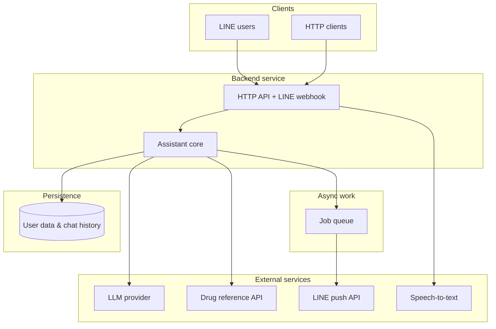
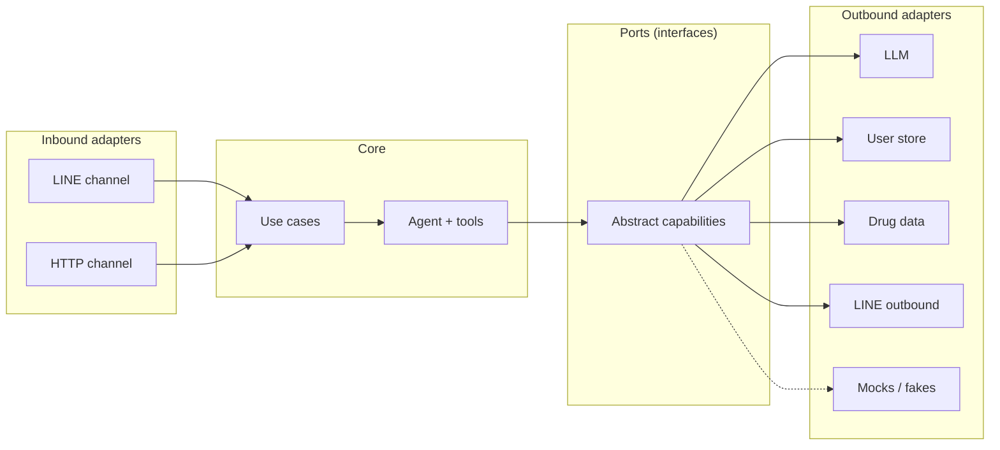
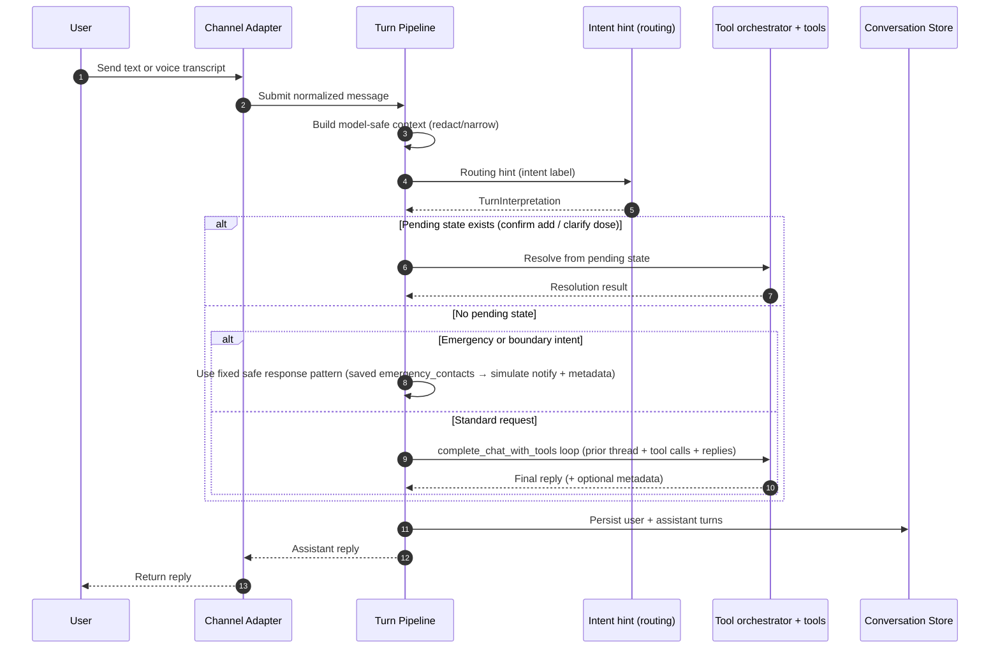
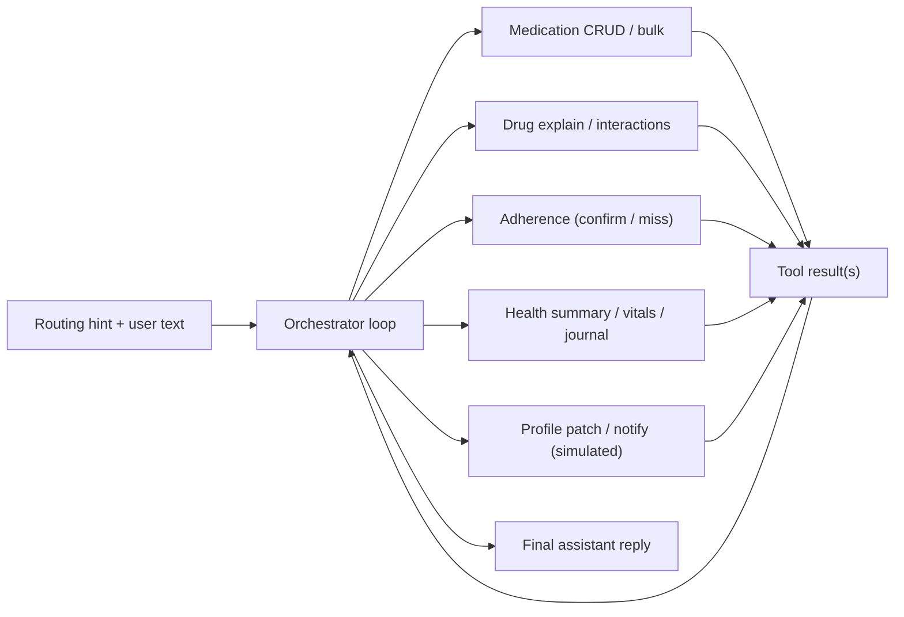
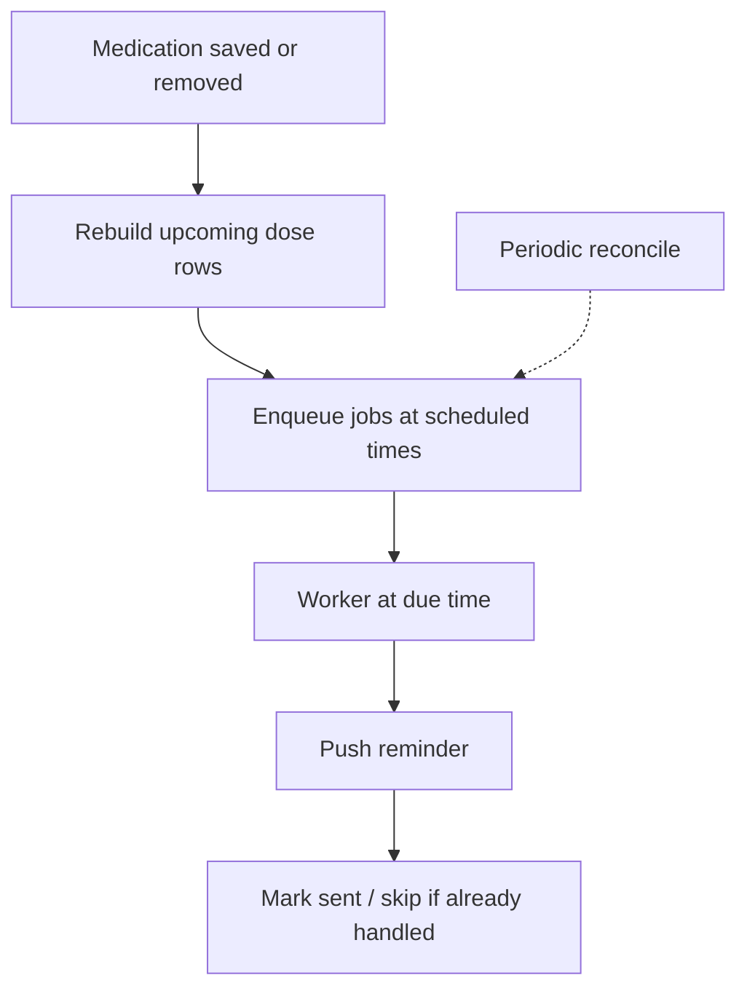
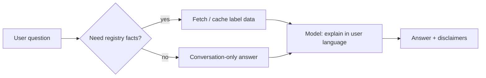
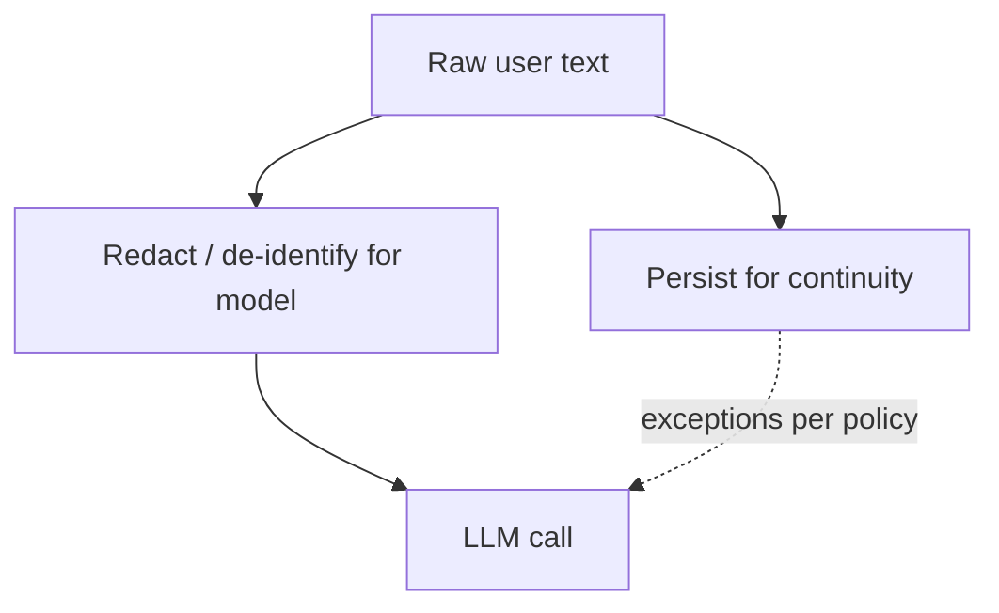
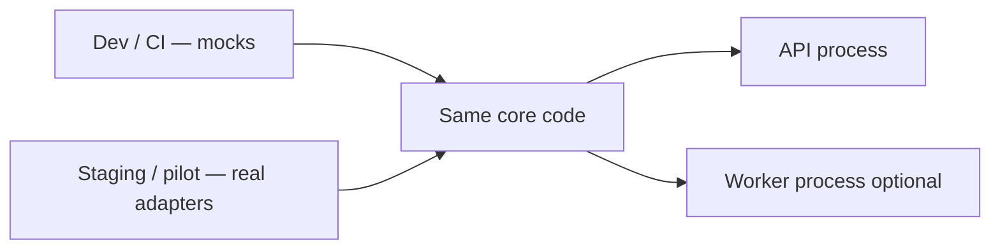

# MedBuddy — Technical Design Document

**Extended specification:** [tdd-extended.md](https://github.com/israkir/medbuddy/tree/main/docs/tdd-extended.md) — API tables, schema, config, and extension details.

This summary is the **architectural story**: **what** we built, **why** it is shaped this way, and **how** major flows connect. Favor **diagrams** over enumeration; the extended TDD is the drill-down.

---

## 1. System context

**Stage framing:**
- **Prototype (current):** Python + FastAPI validates product logic and pilot behavior quickly.
- **MVP/Growth target:** Go + Fiber runtime on the same ports/adapters boundary, so agent/tool/domain behavior stays unchanged while server/runtime adapters are swapped.

**Idea:** One **assistant core** serves **LINE** (primary UX) and an **HTTP API** (integrations, tests, reference app). **Voice** is “audio → text, then the same pipeline as typing” where enabled.

**Why:** Duplicate logic per channel would diverge; one pipeline keeps behavior and safety rules consistent.

---

## 2. Ports & Adapters

**Idea:** **Domain and use-case code** talk only to **interfaces** (ports). **Adapters** implement those interfaces for real vendors, mocks, or channels.

**Why:**

- **Tests** swap mocks without changing business rules.
- **Vendors** (LLM, DB, messaging) change behind one seam.
- **New inbound channel** = new adapter calling the same use-case entry point.

**Code layout:** The Python package lives under [`apps/backend/src/medbuddy/`](../apps/backend/src/medbuddy/) (import `medbuddy`). Automated tests mirror that tree under [`apps/backend/tests/medbuddy/`](../apps/backend/tests/medbuddy/) with shared fixtures at `apps/backend/tests/conftest.py` and `apps/backend/tests/helpers.py` — see [`apps/backend/README.md`](../apps/backend/README.md).

---

## 3. One conversation pipeline

**Idea:** Whether the user typed on LINE, spoke (after transcription), or called the HTTP API, the same **turn runner** loads context, applies **fast routing** (`interpret_user_turn`), then **`run_tool_agent_loop`** so the model can call **registered tools** (possibly several per turn). The first orchestrator hop includes a **redacted prior thread** (capped per **`MEDBUDDY_AGENT_ORCHESTRATOR_HISTORY_TURNS`**) plus the current line. The pipeline persists turns and returns **`AgentTurnResult`** (reply + optional metadata).

**Why:** Predictable ordering of safety checks, pending confirmations, and persistence; no “special HTTP path” that bypasses redaction or emergency handling.

---

## 4. Registered tools instead of a free-form agent loop

**Idea:** The LLM chooses **named tools** from a fixed registry (`complete_chat_with_tools`) — list meds, add, bulk remove, explain drug, confirm dose, summary, … — possibly **multiple calls** before the final natural-language reply. The **first** hop receives **system**, **redacted prior** user/assistant messages (when enabled), and the **current** user message; later hops add assistant/tool traffic from the same turn. Tools return structured results; many paths use deterministic i18n or **`compose_reply`** inside the tool. A single **user-visible tool outcome** can still entail **more than one** provider call: for example, saving a new medication via **`persist_medication_add_from_draft`** runs **`compose_medication_added_reply`**, then **`check_interactions_structured`** when the updated list contains **two or more** drugs (post-add cross-check; see [`features.md`](features.md) §4.3).

**Why:**

- **Safety and audit:** Each operation has a clear boundary in code.
- **Testing:** Tools are unit-testable without full chat simulation.
- **Flexibility vs chaos:** Multi-step **tool** loops are bounded by the registry and server-side execution — not arbitrary web/search ReAct.

---

## 5. Reminders: schedule materialization + async delivery

**Idea:** Schedule changes **rewrite future dose rows** in storage, **enqueue** send jobs at local times, **push** via LINE, and use **idempotency** + a **reconcile** path so missed worker ticks do not silently drop reminders.

**Why:** Chat turns stay fast; delivery and retries live in the background. Timezone correctness and “only one real push per due dose” matter for trust.

---

## 6. Drug grounding vs. generative language

**Idea:** **Reference data** (labels, registry lookups) **grounds** factual answers where possible; the **LLM** handles **language**, intent, and glue. **Caching** reduces duplicate lookups and cost.

**Why:** Reduces “confident hallucination” on dosing facts; separates **what we can cite** from **how we say it**.

---

## 7. Privacy and security at the boundary

**Idea:** **Storage** may keep full messages for product continuity; **model-facing** context is **reduced and redacted** on most paths, with **documented exceptions** (e.g. summaries or profile extraction) where richer text is required.

**Why:** Third-party LLMs and logs remain a **trust boundary**; the architecture makes that boundary **explicit** rather than “everything raw goes to the model.”

Operational complements (tokens, webhook signatures, cron secrets) are **standard edge hygiene** — detail in the extended TDD.

---

## 8. Run modes and deployment shape

**Idea:** **Mock integrations** run core logic in CI and local dev **without** vendor keys. **Production** uses real adapters driven by configuration. **Worker process** optional when a queue is configured (reminders); API can still run for chat.

**Why:** Fast feedback for engineers; safe path from prototype to staged pilot without forking the codebase.

### 8.1 Runtime migration boundary

The server-runtime migration is intentionally scoped: framework and I/O adapters can change (FastAPI prototype to Go/Fiber for MVP/Growth) while the assistant core, tool orchestration model, privacy boundary, and domain contracts remain stable.

---

## 9. Engineering principles for performance and reliability

This section turns architecture decisions into measurable non-functional outcomes. We use one repeated template: **Decision -> Impact -> Metric -> Guardrail**.

| Principle | Decision | Impact focus | Primary metrics | Guardrail |
|---|---|---|---|---|
| **Performance by boundary** | Keep domain logic stable behind ports/adapters; optimize runtime adapters (FastAPI prototype to Go/Fiber MVP/Growth). | **Performance**, **Speed** | API latency p95/p99 by phase; cold-start time; throughput headroom | Keep channel contracts and core pipeline unchanged during runtime migration; roll back by adapter. |
| **Availability by graceful degradation** | Use provider failover, idempotent reminders, and reconcile jobs instead of hard dependency on one path. | **Availability**, **Reliability** | API uptime; reminder delivery success; queue lag / backlog age | Safe fixed replies and model-only fallback when grounded data is unavailable; replay undelivered jobs. |
| **Response-speed under burst load** | Separate chat from reminder delivery with queue workers; keep chat path thin during reminder spikes. | **Speed**, **Performance** | Webhook ack latency; assistant-turn p95; queue lag | Autoscale workers and protect chat latency when reminder volume spikes. |
| **Always-on deterministic pipeline** | One conversation path for LINE/API/voice-text; early exits for pending states and emergency handling before full orchestration. | **Speed**, **Availability**, **Reliability** | Webhook ack latency; assistant-turn p95; early-exit rate; error-budget burn | No channel-specific bypasses for safety, redaction, or persistence ordering. |

### 9.1 KPI set used across docs and deck

- **Latency:** assistant-turn p95/p99 and LINE webhook ack time.
- **Delivery:** reminder success rate and scheduled-to-sent lag.
- **Availability:** API uptime by phase and error-budget/SLO burn.
- **Reliability:** reminder delivery success, queue lag/age, and reconcile recovery coverage.
- **Degradation quality:** fallback-path usage rate and reconcile recovery coverage.

### 9.2 Evidence map (where we prove claims)

- **CloudWatch / X-Ray:** end-to-end latency, dependency errors, trace outliers.
- **Queue and worker metrics:** backlog depth, age, retry rate, dead-letter events.
- **Application logs:** grounding gaps, fallback reason codes, reconcile replay counts.
- **Cost dashboards:** per-tenant/per-phase spend split (LLM, voice, compute, queue).

---

## Further reading

[tdd-extended.md](https://github.com/israkir/medbuddy/tree/main/docs/tdd-extended.md) · [reminders.md](https://github.com/israkir/medbuddy/tree/main/docs/reminders.md) · [privacy.md](https://github.com/israkir/medbuddy/tree/main/docs/privacy.md) · [llm-context.md](https://github.com/israkir/medbuddy/tree/main/docs/llm-context.md) · [use-cases.md](https://github.com/israkir/medbuddy/tree/main/docs/use-cases.md)
